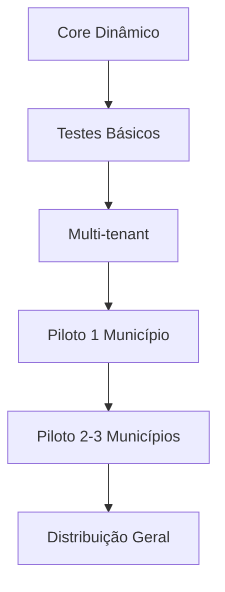

# 🎯 Considerações Finais sobre a Solução

## **✅ Análise da Simplificação**

### **Decisões Excelentes**

A simplificação foi **extremamente bem executada**. As principais decisões que considero acertadas:

1. **Remoção de Overengineering**: Eliminar engines complexas, múltiplos guards/pipes/interceptors foi essencial
2. **Foco no Core**: Manter apenas o essencial (`is_dynamic` + `beneficio_schemas` + validação JSON Schema)
3. **Aproveitamento do Existente**: Adaptar `DadosBeneficioFactoryService` em vez de recriar
4. **Pragmatismo**: Usar sistema de permissões/auditoria já existente

### **Pontos Críticos a Considerar**

**1. Versionamento de Schema**
```sql
-- Manter este campo é CRÍTICO
versao VARCHAR(10) NOT NULL DEFAULT '1.0',
```
**Por quê?** Solicitações em andamento não podem "quebrar" se o schema mudar. Mesmo na versão simples, isso é essencial.

**2. Rollback Mínimo**
```typescript
// Sugerir adicionar uma função básica de rollback
async rollbackBeneficio(beneficioId: string) {
  // Simplesmente marcar is_dynamic = false
  await this.beneficioRepository.update(beneficioId, { is_dynamic: false });
}
```

**Por quê?** Em produção, ter uma "válvula de escape" é fundamental.

## **🏢 Avaliação Multi-Tenant**

### **Adequação Perfeita**

A solução simplificada é **IDEAL** para multi-tenant porque:

1. **Flexibilidade Natural**: JSON Schema resolve 90% das diferenças entre municípios
2. **Isolamento Simples**: Adicionar `municipio_id` é suficiente
3. **Escalabilidade**: Funciona para 1 ou 100 prefeituras
4. **Manutenção Única**: Um código para todos os municípios

### **Ajustes Multi-Tenant Bem Planejados**

Os ajustes propostos são **mínimos e corretos**:

```sql
-- Essenciais e suficientes
ALTER TABLE beneficio_schemas ADD COLUMN municipio_id UUID NOT NULL;
ALTER TABLE criterios_elegibilidade ADD COLUMN municipio_id UUID NOT NULL;
ALTER TABLE configuracao_beneficio ADD COLUMN municipio_id UUID NOT NULL;
```

## **⚠️ Alertas Importantes**

### **1. Migração de Dados Existentes**

**Não esquecer** de criar strategy para dados já existentes:

```typescript
// Será necessário para migração
async migrarDadosExistentes(municipioId: string) {
  // Associar benefícios existentes ao município
  await this.beneficioRepository.update(
    { municipio_id: null },
    { municipio_id: municipioId }
  );
}
```

### **2. Performance com Crescimento**

Mesmo simplificado, **monitorar**:
- Consultas JSONB com muitos municípios
- Índices GIN por município se necessário
- Cache por município

### **3. Backup Simplificado**

**Mínimo necessário**:
```typescript
// Backup antes de ativar benefício dinâmico
async backupAntesAtivacao(beneficioId: string) {
  const config = await this.getConfiguracaoCompleta(beneficioId);
  await this.backupRepository.save({
    beneficio_id: beneficioId,
    configuracao: config,
    tipo: 'antes_ativacao'
  });
}
```

## **📋 Recomendações Finais**

### **1. Cronograma Realista**

**Fase 1: Core (3-4 semanas)**
- ✅ Implementação bem dimensionada
- ✅ Tempo suficiente para testes

**Fase 2: Multi-tenant (+1 semana)**
- ✅ Adicionar `municipio_id` é simples
- ✅ Contexto de usuário é direto

**Fase 3: Piloto (1 semana)**
- ✅ Fundamental para validar em produção

### **2. Ordem de Implementação**



### **3. Critérios de Sucesso**

**Técnicos**:
- [ ] Benefício dinâmico funciona igual ao estático
- [ ] Performance mantida (validações < 1s)
- [ ] Isolamento perfeito entre municípios
- [ ] Rollback simples funciona

**Negócio**:
- [ ] Admin consegue criar benefício sem código
- [ ] Diferenças entre municípios funcionam
- [ ] Migração zero downtime

## **🚀 Veredito Final**

### **A Solução é Excelente**

1. **Simplicidade**: Foca no essencial sem complexidade desnecessária
2. **Flexibilidade**: JSON Schema resolve o problema real
3. **Manutenibilidade**: Código limpo e direto
4. **Escalabilidade**: Funciona para N prefeituras
5. **Viabilidade**: Cronograma realista e implementação factível

### **Pontos de Atenção**

1. **Versionamento**: Manter para evitar quebras
2. **Rollback**: Implementar o mínimo necessário
3. **Migração**: Planejar para dados existentes
4. **Performance**: Monitorar crescimento

### **Implementações Críticas Mínimas**

```typescript
// 1. Versionamento obrigatório
interface BeneficioSchema {
  id: string;
  beneficio_id: string;
  municipio_id: string;
  schema_json: any;
  versao: string; // CRÍTICO
  ativo: boolean;
}

// 2. Rollback de emergência
@Injectable()
export class EmergencyService {
  async rollbackBeneficio(beneficioId: string) {
    await this.beneficioRepository.update(beneficioId, {
      is_dynamic: false
    });
  }
}

// 3. Backup antes de ativação
async ativarBeneficioDinamico(beneficioId: string) {
  // Backup obrigatório
  await this.backupAntesAtivacao(beneficioId);
  
  // Ativação
  await this.beneficioRepository.update(beneficioId, {
    is_dynamic: true
  });
}
```

## **📊 Resumo Executivo**

### **✅ Aprovação da Solução**

A solução simplificada de benefícios dinâmicos está **APROVADA** para implementação com as seguintes características:

- **Arquitetura**: Simples, pragmática e eficiente
- **Multi-tenant**: Perfeitamente adequada com ajustes mínimos
- **Cronograma**: Realista (5-6 semanas total)
- **Risco**: Baixo devido à simplicidade
- **ROI**: Alto - resolve o problema real sem overengineering

### **🎯 Próximos Passos Imediatos**

1. **Iniciar Fase 1**: Implementação do core dinâmico
2. **Preparar Migração**: Strategy para dados existentes
3. **Definir Piloto**: Escolher 1-2 municípios para teste
4. **Montar Equipe**: Desenvolvedores + 1 analista de negócio

**A solução está pronta para implementação. Excelente trabalho na simplificação!**