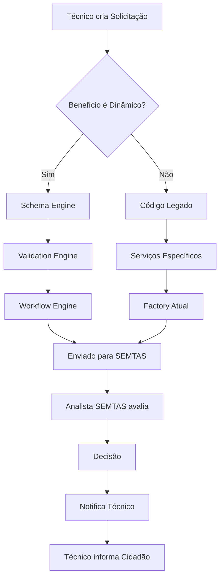
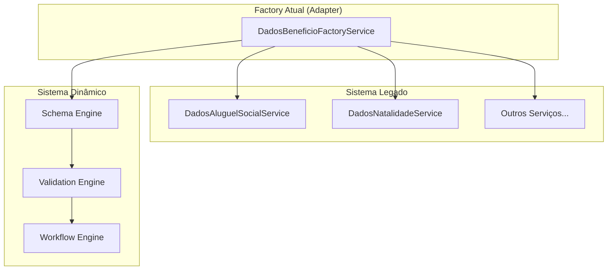
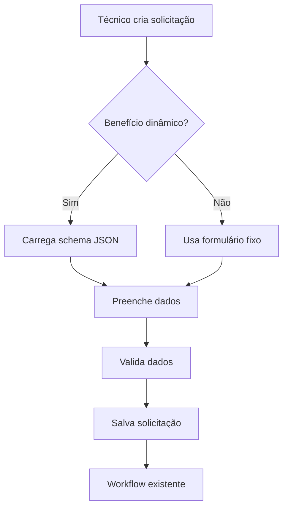
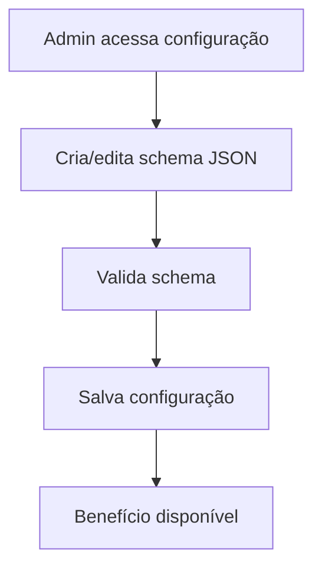

# 📋 Sistema de Benefícios Dinâmicos - Versão Simplificada

## **🎯 Contexto e Problema**

### **Situação Atual**
- Sistema de gestão de benefícios eventuais (SUAS) em NestJS/TypeScript + Vue.js
- Arquitetura DDD implementada com `DadosBeneficioFactoryService` existente
- Schemas fixos para cada benefício (Aluguel Social, Benefício Natalidade, etc.)
- **Problema**: Toda adição de novo benefício requer alteração de código
- **Objetivo**: Criar sistema 100% dinâmico sem necessidade de alteração de código

### **Fluxo Real do Sistema**

**Atores Corretos**:
- **Cidadão** → Procura atendimento presencial na unidade (não acessa sistema)
- **Técnico da Unidade** → Faz solicitação no sistema (CRAS, CREAS, UBS, etc.)
- **Analista SEMTAS** → Analisa e aprova na Gestão de Benefícios
- **Admin Sistema** → Configura benefícios (TI/Gestão)

**Fluxo Operacional**:
```
Cidadão (presencial) → Técnico da Unidade → Sistema → SEMTAS → Decisão → Técnico → Cidadão
```

### **Definições Importantes**

**Benefício Estático (Atual)**:
- Código específico para cada benefício
- DTOs fixos (ex: `CreateAluguelSocialDto`)
- Serviços específicos (ex: `DadosAluguelSocialService`)
- Schemas hardcoded no código
- Mudanças = alteração de código

**Benefício Dinâmico (Proposta)**:
- Configuração via JSON armazenada no banco
- Schema flexível definido por configuração
- Validações configuráveis sem código
- Campos e regras definidos via interface
- Mudanças = alteração de configuração

### **Requisitos Funcionais**
- CRUDs de benefícios com schemas dinâmicos
- Critérios de elegibilidade configuráveis
- Configuração de valores, prazos, periodicidade, renovação
- Workflow de aprovação dinâmico
- Validações específicas por tipo de benefício
- Interface de configuração para administradores
- Coexistência com sistema atual (migração gradual)
- Suporte ao fluxo técnico → analista → decisão

### **Requisitos Não-Funcionais**
'- Performance: Validações < 1 segundo
- Arquitetura: Manter DDD atual e estrutura existente
- Banco: PostgreSQL com JSONB + índices GIN
- Segurança: Usar sistema de permissões existente
- Migração gradual sem downtime
- Auditoria padrão do sistema existente

## **🏗️ Solução Arquitetural**

### **Estratégia Principal**
**Schema-Driven + Factory Pattern Existente + Migração Gradual + Simplicidade**



### **Arquitetura de Coexistência**



### **Estratégia de Decisão de Fluxo**

```typescript
// Lógica de decisão completa
async decidirFluxo(beneficio: Beneficio): Promise<FluxoType> {
  // Sempre verifica se é dinâmico primeiro
  if (!beneficio.is_dynamic) {
    return FluxoType.LEGADO;
  }
  
  // Se é dinâmico, verifica integridade
  if (!beneficio.schema || !beneficio.schema.ativo) {
    throw new Error('Benefício dinâmico mal configurado');
  }
  
  // Verifica se benefício está ativo
  if (beneficio.status !== 'ativo') {
    throw new Error('Benefício não está disponível');
  }
  
  return FluxoType.DINAMICO;
}
```

### **Tipos de Benefício (Baseados na Lei Art. 8º Natal/RN)**
```
I – Benefício por natalidade
II – Benefício por morte  
III – Benefício em situações de vulnerabilidade temporária:
    a) Cesta básica
    b) Aluguel social
    c) Documentação pessoal básica
    d) Passagem terrestre
IV – Benefício em situações de desastre e/ou calamidade pública
```

## **🗄️ Estrutura de Dados**

### **Modelo de Banco de Dados Simplificado**

```sql
-- Adicionar campo is_dynamic à tabela beneficios existente
ALTER TABLE beneficios ADD COLUMN is_dynamic BOOLEAN DEFAULT false;

-- Schemas dinâmicos dos formulários
CREATE TABLE beneficio_schemas (
    id UUID PRIMARY KEY DEFAULT gen_random_uuid(),
    beneficio_id UUID NOT NULL REFERENCES beneficios(id),
    schema_json JSONB NOT NULL,
    versao VARCHAR(10) NOT NULL DEFAULT '1.0',
    ativo BOOLEAN DEFAULT true,
    created_at TIMESTAMP DEFAULT NOW(),
    updated_at TIMESTAMP DEFAULT NOW(),
    
    UNIQUE(beneficio_id, versao)
);

-- Critérios de elegibilidade simplificados
CREATE TABLE criterios_elegibilidade (
    id UUID PRIMARY KEY DEFAULT gen_random_uuid(),
    beneficio_id UUID NOT NULL REFERENCES beneficios(id),
    criterios_json JSONB NOT NULL,
    ativo BOOLEAN DEFAULT true,
    created_at TIMESTAMP DEFAULT NOW()
    
    CONSTRAINT chk_tipo_validacao CHECK (tipo_validacao IN ('campo', 'calculo', 'consulta_externa')),
    CONSTRAINT chk_fallback CHECK (fallback_strategy IN ('aprovar', 'reprovar', 'manual'))
);

-- Configurações específicas do benefício
CREATE TABLE configuracao_beneficio (
    id UUID PRIMARY KEY DEFAULT gen_random_uuid(),
    beneficio_id UUID NOT NULL REFERENCES beneficios(id),
    valores_json JSONB,
    prazos_json JSONB,
    renovacao_json JSONB,
    periodicidade VARCHAR(50),
    permite_renovacao BOOLEAN DEFAULT false,
    limite_renovacoes INTEGER DEFAULT 0,
    created_at TIMESTAMP DEFAULT NOW()
);

-- Configuração de workflows
CREATE TABLE workflow_configuracao (
    id UUID PRIMARY KEY DEFAULT gen_random_uuid(),
    beneficio_id UUID NOT NULL REFERENCES beneficios(id),
    etapas_json JSONB NOT NULL,
    responsaveis_json JSONB,
    prazos_json JSONB,
    notificacoes_json JSONB,
    escalacao_json JSONB,
    aprovacao_configuracao BOOLEAN DEFAULT false,
    created_at TIMESTAMP DEFAULT NOW()
);

-- Usuários e permissões
CREATE TABLE usuarios (
    id UUID PRIMARY KEY DEFAULT gen_random_uuid(),
    nome VARCHAR(255) NOT NULL,
    email VARCHAR(255) UNIQUE NOT NULL,
    tipo_usuario VARCHAR(50) NOT NULL,
    unidade_id UUID,
    secretaria_id UUID,
    ativo BOOLEAN DEFAULT true,
    created_at TIMESTAMP DEFAULT NOW(),
    
    CONSTRAINT chk_tipo_usuario CHECK (tipo_usuario IN ('tecnico_unidade', 'analista_semtas', 'admin_sistema'))
);

-- Unidades (CRAS, CREAS, etc.)
CREATE TABLE unidades (
    id UUID PRIMARY KEY DEFAULT gen_random_uuid(),
    nome VARCHAR(255) NOT NULL,
    tipo_unidade VARCHAR(50) NOT NULL,
    secretaria_id UUID,
    endereco_json JSONB,
    contato_json JSONB,
    ativo BOOLEAN DEFAULT true,
    created_at TIMESTAMP DEFAULT NOW(),
    
    CONSTRAINT chk_tipo_unidade CHECK (tipo_unidade IN ('cras', 'creas', 'ubs', 'outro'))
);

-- Solicitações (dados dinâmicos)
CREATE TABLE solicitacoes (
    id UUID PRIMARY KEY DEFAULT gen_random_uuid(),
    beneficio_id UUID NOT NULL REFERENCES beneficios(id),
    cidadao_id UUID NOT NULL,
    tecnico_solicitante_id UUID NOT NULL REFERENCES usuarios(id),
    unidade_origem_id UUID NOT NULL REFERENCES unidades(id),
    analista_responsavel_id UUID REFERENCES usuarios(id),
    dados_formulario JSONB NOT NULL,
    parecer_tecnico TEXT,
    documentos_apresentados TEXT[],
    recomendacao_tecnica VARCHAR(50),
    schema_version VARCHAR(10) NOT NULL, -- Congela versão do schema
    fluxo_tipo VARCHAR(20) NOT NULL, -- 'legado' ou 'dinamico'
    status VARCHAR(50) NOT NULL DEFAULT 'aguardando_analise',
    created_at TIMESTAMP DEFAULT NOW(),
    updated_at TIMESTAMP DEFAULT NOW(),
    
    CONSTRAINT chk_recomendacao CHECK (recomendacao_tecnica IN ('favoravel', 'desfavoravel', 'condicional')),
    CONSTRAINT chk_fluxo_tipo CHECK (fluxo_tipo IN ('legado', 'dinamico')),
    CONSTRAINT chk_status CHECK (status IN ('aguardando_analise', 'em_analise', 'documentos_pendentes', 'aprovada', 'rejeitada', 'cancelada', 'concedida'))
);

-- Análises das solicitações
CREATE TABLE analises_solicitacao (
    id UUID PRIMARY KEY DEFAULT gen_random_uuid(),
    solicitacao_id UUID NOT NULL REFERENCES solicitacoes(id),
    etapa VARCHAR(100) NOT NULL,
    resultado VARCHAR(50) NOT NULL,
    resultado_automatico JSONB, -- Resultado das validações automáticas
    observacoes TEXT,
    responsavel_id UUID NOT NULL REFERENCES usuarios(id),
    tempo_analise_segundos INTEGER,
    created_at TIMESTAMP DEFAULT NOW(),
    
    CONSTRAINT chk_resultado CHECK (resultado IN ('aprovado', 'rejeitado', 'pendente', 'em_analise'))
);

-- Histórico de mudanças
CREATE TABLE historico_solicitacao (
    id UUID PRIMARY KEY DEFAULT gen_random_uuid(),
    solicitacao_id UUID NOT NULL REFERENCES solicitacoes(id),
    status_anterior VARCHAR(50),
    status_novo VARCHAR(50) NOT NULL,
    observacoes TEXT,
    responsavel_id UUID NOT NULL REFERENCES usuarios(id),
    dados_alterados JSONB,
    created_at TIMESTAMP DEFAULT NOW()
);

-- Auditoria de configurações
CREATE TABLE auditoria_configuracao (
    id UUID PRIMARY KEY DEFAULT gen_random_uuid(),
    beneficio_id UUID NOT NULL REFERENCES beneficios(id),
    acao VARCHAR(50) NOT NULL,
    entidade_tipo VARCHAR(50) NOT NULL,
    dados_anteriores JSONB,
    dados_novos JSONB,
    usuario_id UUID NOT NULL REFERENCES usuarios(id),
    ip_address INET,
    user_agent TEXT,
    created_at TIMESTAMP DEFAULT NOW(),
    
    CONSTRAINT chk_acao CHECK (acao IN ('create', 'update', 'delete', 'activate', 'deactivate', 'approve', 'reject', 'access')),
    CONSTRAINT chk_entidade CHECK (entidade_tipo IN ('beneficio', 'schema', 'criterio', 'configuracao', 'workflow'))
);

-- Backup de configurações
CREATE TABLE backup_configuracao (
    id UUID PRIMARY KEY DEFAULT gen_random_uuid(),
    beneficio_id UUID NOT NULL REFERENCES beneficios(id),
    backup_tipo VARCHAR(50) NOT NULL,
    configuracao_completa JSONB NOT NULL,
    checksum VARCHAR(64),
    usuario_id UUID NOT NULL REFERENCES usuarios(id),
    created_at TIMESTAMP DEFAULT NOW(),
    
    CONSTRAINT chk_backup_tipo CHECK (backup_tipo IN ('antes_ativacao', 'agendado', 'manual', 'pre_rollback'))
);

-- Permissões granulares
CREATE TABLE permissoes_usuario (
    id UUID PRIMARY KEY DEFAULT gen_random_uuid(),
    usuario_id UUID NOT NULL REFERENCES usuarios(id),
    beneficio_tipo VARCHAR(100),
    operacoes VARCHAR(50)[] NOT NULL,
    campos_restritos VARCHAR(100)[],
    workflow_etapas VARCHAR(100)[],
    created_at TIMESTAMP DEFAULT NOW(),
    
    CONSTRAINT chk_operacoes CHECK (operacoes <@ ARRAY['create', 'read', 'update', 'delete', 'approve', 'reject', 'configure'])
);

-- Índices GIN para Performance (OBRIGATÓRIOS)
CREATE INDEX CONCURRENTLY idx_beneficio_schemas_campos 
ON beneficio_schemas USING GIN (schema_json);

CREATE INDEX CONCURRENTLY idx_schema_versions_schema 
ON schema_versions USING GIN (schema_json);

CREATE INDEX CONCURRENTLY idx_solicitacoes_dados_formulario 
ON solicitacoes USING GIN (dados_formulario);

CREATE INDEX CONCURRENTLY idx_criterios_elegibilidade_regras 
ON criterios_elegibilidade USING GIN (criterios_json);

CREATE INDEX CONCURRENTLY idx_configuracao_beneficio_valores 
ON configuracao_beneficio USING GIN (valores_json);

CREATE INDEX CONCURRENTLY idx_workflow_configuracao_etapas 
ON workflow_configuracao USING GIN (etapas_json);

CREATE INDEX CONCURRENTLY idx_analises_resultado_automatico 
ON analises_solicitacao USING GIN (resultado_automatico);

-- Índices adicionais para consultas frequentes
CREATE INDEX idx_beneficios_tipo_ativo ON beneficios(tipo_beneficio, ativo);
CREATE INDEX idx_beneficios_is_dynamic ON beneficios(is_dynamic);
CREATE INDEX idx_beneficios_status ON beneficios(status);
CREATE INDEX idx_solicitacoes_status ON solicitacoes(status);
CREATE INDEX idx_solicitacoes_beneficio_status ON solicitacoes(beneficio_id, status);
CREATE INDEX idx_solicitacoes_tecnico ON solicitacoes(tecnico_solicitante_id);
CREATE INDEX idx_solicitacoes_unidade ON solicitacoes(unidade_origem_id);
CREATE INDEX idx_solicitacoes_analista ON solicitacoes(analista_responsavel_id);
CREATE INDEX idx_solicitacoes_fluxo_tipo ON solicitacoes(fluxo_tipo);
CREATE INDEX idx_usuarios_tipo_ativo ON usuarios(tipo_usuario, ativo);
CREATE INDEX idx_historico_solicitacao_id ON historico_solicitacao(solicitacao_id);
CREATE INDEX idx_auditoria_beneficio ON auditoria_configuracao(beneficio_id);
CREATE INDEX idx_auditoria_usuario ON auditoria_configuracao(usuario_id);
CREATE INDEX idx_auditoria_created_at ON auditoria_configuracao(created_at);
```

## **📁 Estrutura de Código Simplificada**

### **Módulo Benefício (Adaptação Mínima)**

```
src/modules/beneficio/
├── controllers/
│   ├── beneficio.controller.ts              # CRUD + endpoints dinâmicos
│   └── admin-configuracao.controller.ts     # Configuração de schemas
├── dto/
│   ├── create-beneficio.dto.ts              # Mantido
│   ├── update-beneficio.dto.ts              # Mantido
│   ├── schema-beneficio.dto.ts              # Schema dinâmico
│   └── configuracao-beneficio.dto.ts        # Configuração
├── interfaces/
│   ├── dados-beneficio.interface.ts         # Mantido
│   └── dynamic-benefit.interface.ts         # Interface para dinâmicos
├── repositories/
│   ├── tipo-beneficio.repository.ts         # Mantido
│   ├── dados-*.repository.ts                # Mantidos
│   └── schema.repository.ts                 # Novo: schemas dinâmicos
├── services/
│   ├── beneficio.service.ts                 # Mantido
│   ├── dados-beneficio-factory.service.ts   # ADAPTADO: detecta dinâmicos
│   ├── dynamic-benefit.service.ts           # Engine única para dinâmicos
│   ├── dados-*.service.ts                   # Mantidos (legado)
│   └── schema-validation.service.ts         # Validação de schemas
├── entities/
│   ├── *.entity.ts                          # Mantidas (legado)
│   └── beneficio-schema.entity.ts           # Nova: schema dinâmico
└── beneficio.module.ts                      # Adaptado
```

### **Módulo Solicitação (Adaptação Mínima)**

```
src/modules/solicitacao/
├── controllers/
│   ├── solicitacao.controller.ts            # Mantido
│   ├── workflow-solicitacao.controller.ts   # Mantido
│   ├── pendencia.controller.ts              # Mantido
│   └── exportacao.controller.ts             # Mantido
├── dto/
│   ├── create-solicitacao.dto.ts            # Mantido
│   ├── update-solicitacao.dto.ts            # Mantido
│   ├── dados-dinamicos.dto.ts               # Novo: para benefícios dinâmicos
│   └── pendencia/*.dto.ts                   # Mantidos
├── services/
│   ├── solicitacao.service.ts               # ADAPTADO: suporte a dinâmicos
│   ├── workflow-solicitacao.service.ts      # Mantido
│   ├── validacao-dinamica.service.ts        # Novo: validação dinâmica
│   ├── pendencia.service.ts                 # Mantido
│   └── exportacao.service.ts                # Mantido
├── entities/
│   ├── *.entity.ts                          # Mantidas
├── events/
│   └── solicitacao-events.ts                # Mantido
├── listeners/
│   └── solicitacao-event.listener.ts        # Mantido
└── solicitacao.module.ts                    # Adaptado
```

### **Módulo Usuário**

**Não será criado** - Usar sistema de usuários existente.

## **🔄 Fluxos de Processo (Simplificados)**

### **1. Fluxo Principal**



### **2. Fluxo de Configuração Admin**



## **⚙️ Implementação Simplificada**

### **Serviço Principal**

```typescript
@Injectable()
export class DynamicBenefitService {
  constructor(
    private readonly beneficioRepository: BeneficioRepository,
    private readonly schemaRepository: BeneficioSchemaRepository
  ) {}

  async processarSolicitacao(tipoBeneficio: string, dados: any) {
    const beneficio = await this.beneficioRepository.findByTipo(tipoBeneficio);
    
    if (beneficio.is_dynamic) {
      const schema = await this.schemaRepository.findByBeneficioId(beneficio.id);
      return this.validarComSchema(dados, schema.schema_json);
    }
    
    // Usa factory existente para benefícios estáticos
    return this.dadosBeneficioFactory.criarDadosBeneficio(tipoBeneficio, dados);
  }

  private validarComSchema(dados: any, schema: any): ValidationResult {
    // Validação simples usando class-validator ou similar
    // Sem engines complexas
  }
}
```

## **📋 Estratégia de Implementação Simplificada**

### **Fases de Implementação**

**Fase 1: Core Dinâmico (1-2 semanas)**
- Adicionar campo `is_dynamic` na tabela `beneficios`
- Criar tabela `beneficio_schemas` simples
- Adaptar `DadosBeneficioFactoryService` existente
- Implementar `DynamicBenefitService` básico

**Fase 2: Interface Admin (1 semana)**
- Criar endpoint para configurar schemas JSON
- Interface simples para editar schemas

**Fase 3: Migração Gradual (conforme necessário)**
- Migrar benefícios existentes um por vez
- Manter coexistência com sistema atual

## **🔧 Validação Simplificada**

### **Validação Básica com JSON Schema**

```typescript
// Validação simples usando JSON Schema
const validarDadosBeneficio = (dados: any, schema: any) => {
  const ajv = new Ajv();
  const validate = ajv.compile(schema);
  const valid = validate(dados);
  
  return {
    isValid: valid,
    errors: validate.errors || []
  };
};
```

## **👤 Permissões Simples**

### **Sistema de Permissões Existente**

- Usar sistema de permissões já implementado
- Adicionar apenas permissão para "configurar benefícios dinâmicos"
- Manter estrutura atual de perfis (técnico, analista, admin)


## **🏢 Contexto Multi-Tenant (Múltiplas Prefeituras)**

### **Adequação da Solução**

**✅ A solução simplificada É PERFEITAMENTE ADEQUADA** para distribuição em múltiplas prefeituras porque:

1. **JSON Schema Dinâmico**: Cada prefeitura define seus próprios critérios, campos e validações
2. **Flexibilidade Total**: Diferentes fluxos, processos e documentações sem alteração de código
3. **Isolamento Natural**: Com ajustes mínimos (+1 semana), garante separação completa entre municípios
4. **Customização Independente**: Cada prefeitura evolui conforme suas necessidades

### **Ajustes Necessários para Multi-Tenant**

**Consulte o documento detalhado**: `ajustes-multi-tenant.md`

**Resumo dos ajustes**:
- Adicionar `municipio_id` em tabelas de configuração
- Filtrar dados por município do usuário logado
- Interface admin com isolamento por prefeitura
- Row-Level Security para garantir isolamento

**Tempo adicional**: +1 semana ao cronograma

## **✅ Conclusão**

### **Resumo da Simplificação**

Este plano foi **drasticamente simplificado** para evitar overengineering:

**❌ Removido (Overengineering)**:
- Múltiplas engines especializadas
- Sistema complexo de versionamento
- Backup/rollback específico
- Múltiplos guards/pipes/interceptors
- Estratégias por tipo de benefício
- Sistema de auditoria complexo
- Dashboard de monitoramento detalhado
- Fluxos de aprovação complexos

**✅ Mantido (Essencial)**:
- Campo `is_dynamic` em benefícios
- Tabela `beneficio_schemas` simples
- `DynamicBenefitService` único
- Validação JSON Schema básica
- Interface admin minimalista
- Coexistência com sistema atual
- Migração gradual
- **Suporte multi-tenant com ajustes mínimos**

### **Próximos Passos**

1. **Implementar o mínimo viável** (3-4 semanas)
2. **Adicionar ajustes multi-tenant** (+1 semana)
3. **Testar com 2-3 municípios piloto** (1 semana)
4. **Distribuir para demais prefeituras**

**Princípio**: Começar simples e evoluir apenas quando necessário.