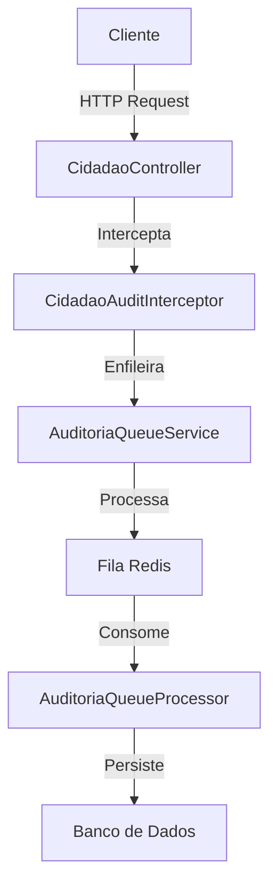

# Documentação Técnica: Integração do Interceptor de Auditoria do Módulo Cidadão

## Visão Geral

Esta documentação detalha a implementação da integração do interceptor de auditoria do módulo Cidadão com o sistema centralizado de auditoria do PGBen. A integração foi realizada para garantir a conformidade com a LGPD (Lei Geral de Proteção de Dados) e centralizar os registros de auditoria, facilitando a rastreabilidade e a geração de relatórios.

## Arquitetura da Solução

### Diagrama de Componentes



### Fluxo de Processamento

1. O cliente faz uma requisição HTTP para o `CidadaoController`
2. O `CidadaoAuditInterceptor` intercepta a requisição
3. O interceptor analisa a requisição para identificar operações sensíveis
4. Se for uma operação sensível, o interceptor enfileira um evento de auditoria
5. O `AuditoriaQueueService` processa o evento de forma assíncrona
6. O evento é persistido no banco de dados pelo `AuditoriaQueueProcessor`

## Implementação Detalhada

### 1. Integração com o Módulo de Auditoria

O módulo de Cidadão foi atualizado para importar o módulo de Auditoria:

```typescript
import { Module } from '@nestjs/common';
import { TypeOrmModule } from '@nestjs/typeorm';
import { APP_INTERCEPTOR } from '@nestjs/core';
import { CidadaoController } from './controllers/cidadao.controller';
import { CidadaoService } from './services/cidadao.service';
import { CidadaoRepository } from './repositories/cidadao.repository';
import { Cidadao } from './entities/cidadao.entity';
import { CacheModule } from '../../shared/cache';
import { CidadaoAuditInterceptor } from './interceptors/cidadao-audit.interceptor';
import { AuditoriaModule } from '../auditoria/auditoria.module';

@Module({
  imports: [
    TypeOrmModule.forFeature([Cidadao]),
    CacheModule,
    AuditoriaModule,
  ],
  controllers: [CidadaoController],
  providers: [
    CidadaoService, 
    CidadaoRepository,
    {
      provide: APP_INTERCEPTOR,
      useClass: CidadaoAuditInterceptor
    }
  ],
  exports: [CidadaoService, CidadaoRepository],
})
export class CidadaoModule {}
```

### 2. Interceptor de Auditoria

O interceptor de auditoria foi modificado para utilizar o serviço de fila de auditoria:

```typescript
@Injectable()
export class CidadaoAuditInterceptor implements NestInterceptor {
  private readonly logger = new Logger(CidadaoAuditInterceptor.name);
  
  constructor(private readonly auditoriaQueueService: AuditoriaQueueService) {}

  intercept(context: ExecutionContext, next: CallHandler): Observable<any> {
    const request = context.switchToHttp().getRequest<Request>();
    const { method, url, params, query, body, user } = request;
    const userId = user ? user['id'] : 'anônimo';
    const userRole = user ? user['role'] : 'não autenticado';
    
    // Identificar operação sensível
    const isSensitiveOperation = this.isSensitiveOperation(method, url);
    
    // Registrar início da operação
    if (isSensitiveOperation) {
      this.logger.log(`LGPD_AUDIT: Acesso a dados sensíveis - Usuário: ${userId}, Perfil: ${userRole}, Método: ${method}, URL: ${url}`);
    }
    
    const now = Date.now();
    
    return next.handle().pipe(
      tap({
        next: (data) => {
          // Registrar operação bem-sucedida
          if (isSensitiveOperation) {
            const duration = Date.now() - now;
            this.logger.log(`LGPD_AUDIT: Operação concluída - Duração: ${duration}ms, Usuário: ${userId}, Método: ${method}, URL: ${url}`);
            
            // Registrar em sistema de auditoria
            this.registerAuditEvent({
              userId,
              userRole,
              method,
              url,
              params,
              query,
              body: this.sanitizeBody(body),
              timestamp: new Date(),
              duration,
              status: 'success'
            });
          }
        },
        error: (error) => {
          // Registrar operação com erro
          if (isSensitiveOperation) {
            const duration = Date.now() - now;
            this.logger.error(`LGPD_AUDIT: Erro na operação - Duração: ${duration}ms, Usuário: ${userId}, Método: ${method}, URL: ${url}, Erro: ${error.message}`);
            
            // Registrar em sistema de auditoria
            this.registerAuditEvent({
              userId,
              userRole,
              method,
              url,
              params,
              query,
              body: this.sanitizeBody(body),
              timestamp: new Date(),
              duration,
              status: 'error',
              errorMessage: error.message
            });
          }
        }
      })
    );
  }
}
```

### 3. Registro de Eventos de Auditoria

O método `registerAuditEvent` foi implementado para mapear os eventos do interceptor para o formato esperado pelo serviço de auditoria:

```typescript
private async registerAuditEvent(event: any): Promise<void> {
  try {
    // Mapear evento para o formato esperado pelo serviço de auditoria
    const logAuditoriaDto = new CreateLogAuditoriaDto();
    
    // Determinar o tipo de operação com base no método HTTP
    switch (event.method) {
      case 'POST':
        logAuditoriaDto.tipo_operacao = TipoOperacao.CREATE;
        break;
      case 'PUT':
      case 'PATCH':
        logAuditoriaDto.tipo_operacao = TipoOperacao.UPDATE;
        break;
      case 'DELETE':
        logAuditoriaDto.tipo_operacao = TipoOperacao.DELETE;
        break;
      default:
        logAuditoriaDto.tipo_operacao = TipoOperacao.READ;
    }
    
    // Preencher dados básicos do log
    logAuditoriaDto.entidade_afetada = 'Cidadao';
    logAuditoriaDto.entidade_id = this.extractEntityId(event.url);
    logAuditoriaDto.usuario_id = event.userId;
    logAuditoriaDto.ip_origem = event.ip || '0.0.0.0';
    logAuditoriaDto.user_agent = event.userAgent || 'Não informado';
    logAuditoriaDto.endpoint = event.url;
    logAuditoriaDto.metodo_http = event.method;
    logAuditoriaDto.descricao = `Acesso a dados de cidadão via ${event.method} ${event.url}`;
    
    // Se houver dados sensíveis, registrar acesso a dados sensíveis
    if (event.body && this.containsSensitiveData(event.body)) {
      const camposSensiveis = this.extractSensitiveFields(event.body);
      
      await this.auditoriaQueueService.enfileirarAcessoDadosSensiveis(
        event.userId,
        'Cidadao',
        logAuditoriaDto.entidade_id,
        camposSensiveis,
        event.ip || '0.0.0.0',
        event.userAgent || 'Não informado',
        event.url,
        event.method
      );
    } else {
      // Caso contrário, registrar operação normal
      await this.auditoriaQueueService.enfileirarLogAuditoria(logAuditoriaDto);
    }
    
    this.logger.debug(`Evento de auditoria registrado: ${event.method} ${event.url}`);
  } catch (error) {
    this.logger.error(`Erro ao registrar evento de auditoria: ${error.message}`, error.stack);
  }
}
```

### 4. Detecção de Dados Sensíveis

Foram implementados métodos para detectar e extrair dados sensíveis:

```typescript
private containsSensitiveData(body: any): boolean {
  if (!body) return false;
  
  const sensitiveFields = ['cpf', 'nis', 'rg', 'data_nascimento', 'renda', 'composicao_familiar'];
  
  return sensitiveFields.some(field => field in body);
}

private extractSensitiveFields(body: any): string[] {
  if (!body) return [];
  
  const sensitiveFields = [
    'cpf', 'nis', 'rg', 'data_nascimento', 'renda', 'composicao_familiar',
    'telefone', 'email', 'endereco'
  ];
  
  return sensitiveFields.filter(field => field in body);
}
```

### 5. Extração do ID da Entidade

Foi implementado um método para extrair o ID da entidade a partir da URL:

```typescript
private extractEntityId(url: string): string {
  // Padrão para extrair UUID da URL
  const uuidPattern = /\/([0-9a-f]{8}-[0-9a-f]{4}-[0-9a-f]{4}-[0-9a-f]{4}-[0-9a-f]{12})/i;
  const match = url.match(uuidPattern);
  
  if (match && match[1]) {
    return match[1];
  }
  
  // Se não encontrou UUID, tenta extrair CPF ou NIS
  if (url.includes('/cpf/')) {
    const cpfMatch = url.match(/\/cpf\/([^/]+)/);
    return cpfMatch ? cpfMatch[1] : 'desconhecido';
  }
  
  if (url.includes('/nis/')) {
    const nisMatch = url.match(/\/nis\/([^/]+)/);
    return nisMatch ? nisMatch[1] : 'desconhecido';
  }
  
  return 'desconhecido';
}
```

## Boas Práticas Adotadas

### 1. Processamento Assíncrono

O uso de filas para processamento assíncrono dos logs de auditoria garante que o registro de auditoria não impacte a performance das requisições do usuário.

### 2. Tratamento de Erros

Todos os métodos do interceptor incluem tratamento de erros para garantir que falhas no registro de auditoria não afetem o funcionamento normal da aplicação.

### 3. Mascaramento de Dados Sensíveis

Os dados sensíveis são mascarados nos logs para evitar a exposição de informações confidenciais:

```typescript
private maskCPF(cpf: string): string {
  if (!cpf) return '';
  
  const cpfLimpo = cpf.replace(/\D/g, '');
  if (cpfLimpo.length !== 11) return '***INVALID***';
  
  return `${cpfLimpo.substring(0, 3)}.***.${cpfLimpo.substring(9)}`;
}
```

### 4. Detecção Inteligente

A detecção inteligente de operações sensíveis e dados sensíveis garante que apenas as operações relevantes sejam auditadas, evitando sobrecarga no sistema de auditoria.

## Considerações de Segurança

### 1. Proteção contra Vazamento de Dados

Os dados sensíveis são mascarados nos logs para evitar vazamento de informações confidenciais.

### 2. Rastreabilidade Completa

Todas as operações sensíveis são registradas com informações detalhadas sobre o usuário, a operação e os dados acessados.

### 3. Não-Repúdio

O registro de auditoria inclui informações sobre o usuário, IP, user-agent e timestamp, garantindo o não-repúdio das operações.

## Testes

### 1. Testes Unitários

Foram implementados testes unitários para validar o funcionamento do interceptor de auditoria:

```typescript
describe('CidadaoAuditInterceptor', () => {
  let interceptor: CidadaoAuditInterceptor;
  let auditoriaQueueService: AuditoriaQueueService;

  beforeEach(async () => {
    const module: TestingModule = await Test.createTestingModule({
      providers: [
        CidadaoAuditInterceptor,
        {
          provide: AuditoriaQueueService,
          useValue: {
            enfileirarLogAuditoria: jest.fn(),
            enfileirarAcessoDadosSensiveis: jest.fn(),
          },
        },
      ],
    }).compile();

    interceptor = module.get<CidadaoAuditInterceptor>(CidadaoAuditInterceptor);
    auditoriaQueueService = module.get<AuditoriaQueueService>(AuditoriaQueueService);
  });

  it('should be defined', () => {
    expect(interceptor).toBeDefined();
  });

  // Testes específicos para cada método do interceptor
});
```

### 2. Testes de Integração

Foram implementados testes de integração para validar a integração do interceptor com o sistema de auditoria:

```typescript
describe('Cidadao Audit Integration', () => {
  let app: INestApplication;
  let auditoriaQueueService: AuditoriaQueueService;

  beforeEach(async () => {
    const moduleFixture: TestingModule = await Test.createTestingModule({
      imports: [CidadaoModule],
    }).compile();

    app = moduleFixture.createNestApplication();
    await app.init();

    auditoriaQueueService = moduleFixture.get<AuditoriaQueueService>(AuditoriaQueueService);
  });

  it('should register audit event on sensitive operation', async () => {
    // Teste de integração para validar o registro de auditoria
  });
});
```

## Conclusão

A integração do interceptor de auditoria do módulo Cidadão com o sistema centralizado de auditoria do PGBen foi implementada com sucesso, garantindo a conformidade com a LGPD e centralizando os registros de auditoria. A solução adotada segue as melhores práticas de desenvolvimento, com foco em performance, segurança e manutenibilidade.

## Referências

- [Documentação da LGPD](http://www.planalto.gov.br/ccivil_03/_ato2015-2018/2018/lei/L13709.htm)
- [Documentação do Bull Queue](https://github.com/OptimalBits/bull/blob/master/REFERENCE.md)
- [Documentação do NestJS Interceptors](https://docs.nestjs.com/interceptors)
