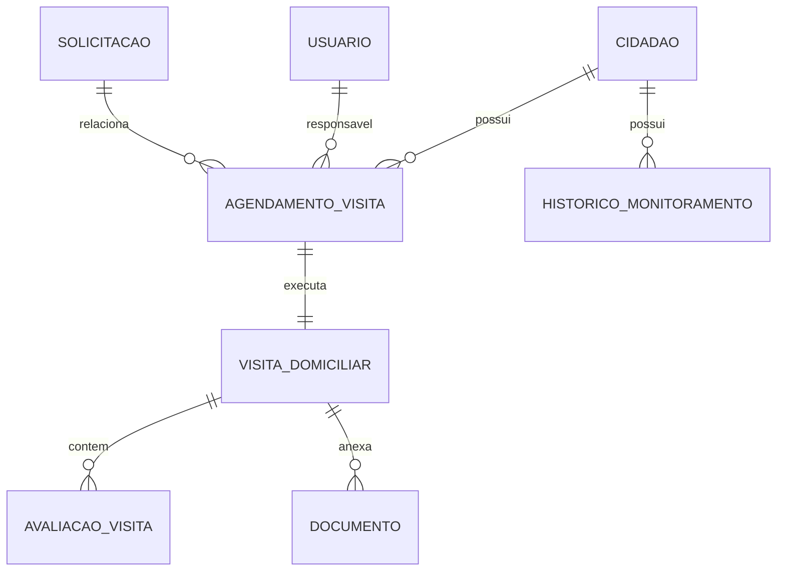

# ADR 001: Módulo de Monitoramento e Visitas Domiciliares

**Data**: 15/01/2025  
**Status**: Proposto  
**Autores**: Arquiteto de Software  
**Revisores**: Equipe Técnica SEMTAS  

---

## 1. Contexto e Motivação

### 1.1 Problema

O setor de monitoramento social da SEMTAS possui a responsabilidade legal e técnica de realizar acompanhamento presencial periódico dos beneficiários que recebem benefícios recorrentes (como Aluguel Social, que pode durar até 6 meses). Conforme estabelecido na **Lei Municipal 7.205/2021**, é necessário:

- Verificar a manutenção das condições que justificaram a concessão do benefício
- Avaliar a evolução da situação socioeconômica da família
- Identificar necessidades de encaminhamentos para outros serviços
- Validar o cumprimento dos requisitos para possível renovação do benefício
- Detectar situações que possam indicar cessação ou suspensão do benefício

### 1.2 Situação Atual

Atualmente, o acompanhamento social é realizado de forma manual e descentralizada, sem integração com o sistema principal, resultando em:

- Falta de sistematização do processo de agendamento
- Ausência de rastreabilidade das visitas realizadas
- Dificuldade na geração de relatórios de conformidade
- Perda de informações críticas para renovação de benefícios
- Impossibilidade de otimização de rotas e recursos

### 1.3 Requisitos Legais

- **Lei Municipal 7.205/2021**: Estabelece obrigatoriedade de acompanhamento social
- **LGPD**: Proteção de dados pessoais coletados durante as visitas
- **Normas do SUAS**: Diretrizes para acompanhamento familiar

---

## 2. Decisão Arquitetural

### 2.1 Abordagem Escolhida

Implementar um **módulo integrado de Monitoramento e Visitas Domiciliares** que permita:

1. **Gestão de Agendamentos**: Sistema completo para agendar, reagendar e cancelar visitas
2. **Execução de Visitas**: Interface para registro de informações coletadas durante as visitas
3. **Análise e Relatórios**: Geração de pareceres técnicos e relatórios de conformidade
4. **Integração com Benefícios**: Conexão direta com o módulo de solicitações para subsidiar renovações

### 2.2 Princípios Arquiteturais

- **Simplicidade**: Evitar overengineering, focando nas funcionalidades essenciais
- **Integração**: Reutilizar entidades e serviços existentes (Cidadao, Usuario, Solicitacao)
- **Rastreabilidade**: Manter histórico completo de todas as interações
- **Flexibilidade**: Permitir diferentes tipos de visitas e formulários de avaliação
- **Segurança**: Proteger dados sensíveis coletados durante as visitas

---

## 3. Arquitetura do Módulo

### 3.1 Estrutura de Diretórios

```
src/modules/monitoramento/
├── monitoramento.module.ts
├── controllers/
│   ├── visita.controller.ts
│   ├── agendamento.controller.ts
│   └── relatorio-monitoramento.controller.ts
├── services/
│   ├── visita.service.ts
│   ├── agendamento.service.ts
│   └── relatorio-monitoramento.service.ts
├── entities/
│   ├── visita-domiciliar.entity.ts
│   ├── agendamento-visita.entity.ts
│   ├── avaliacao-visita.entity.ts
│   └── historico-monitoramento.entity.ts
├── dtos/
│   ├── criar-agendamento.dto.ts
│   ├── registrar-visita.dto.ts
│   ├── avaliar-conformidade.dto.ts
│   └── filtros-relatorio.dto.ts
├── enums/
│   ├── status-agendamento.enum.ts
│   ├── resultado-visita.enum.ts
│   ├── tipo-visita.enum.ts
│   └── prioridade-visita.enum.ts
└── interfaces/
    ├── dados-visita.interface.ts
    └── criterios-avaliacao.interface.ts
```

### 3.2 Entidades Principais

#### 3.2.1 AgendamentoVisita
- **Responsabilidade**: Gerenciar agendamentos de visitas domiciliares
- **Relacionamentos**: 
  - `Cidadao` (muitos-para-um)
  - `Usuario` (técnico responsável)
  - `Solicitacao` (opcional, para visitas relacionadas a benefícios específicos)

#### 3.2.2 VisitaDomiciliar
- **Responsabilidade**: Registrar execução e resultados das visitas
- **Relacionamentos**:
  - `AgendamentoVisita` (um-para-um)
  - `AvaliacaoVisita` (um-para-muitos)
  - `Documento` (para anexos de fotos e documentos)

#### 3.2.3 AvaliacaoVisita
- **Responsabilidade**: Armazenar avaliações específicas realizadas durante a visita
- **Características**: Estrutura flexível para diferentes tipos de avaliação

#### 3.2.4 HistoricoMonitoramento
- **Responsabilidade**: Manter histórico consolidado de acompanhamento por beneficiário
- **Características**: View materializada para consultas otimizadas

### 3.3 Fluxos Principais

#### 3.3.1 Fluxo de Agendamento
1. Técnico seleciona beneficiários para visita
2. Sistema sugere datas baseado em periodicidade configurada
3. Agendamento é criado com status AGENDADO
4. Notificações são enviadas para técnico e beneficiário (opcional)

#### 3.3.2 Fluxo de Execução
1. Técnico acessa agendamento no dia da visita
2. Registra presença/ausência do beneficiário
3. Preenche formulário de avaliação
4. Anexa fotos e documentos
5. Finaliza visita com parecer técnico

#### 3.3.3 Fluxo de Análise
1. Sistema consolida dados das visitas
2. Gera alertas para situações críticas
3. Produz relatórios de conformidade
4. Integra com módulo de solicitações para renovações

---

## 4. Modelo de Dados

### 4.1 Relacionamentos



### 4.2 Campos Principais

#### AgendamentoVisita
- `id`, `cidadao_id`, `usuario_id`, `solicitacao_id`
- `data_agendada`, `hora_agendada`, `endereco_visita`
- `tipo_visita`, `prioridade`, `status`
- `observacoes_agendamento`, `created_at`, `updated_at`

#### VisitaDomiciliar
- `id`, `agendamento_id`, `data_execucao`
- `beneficiario_presente`, `pessoas_presentes`
- `condicoes_habitacionais`, `situacao_familiar`
- `observacoes_tecnico`, `parecer_tecnico`
- `resultado_visita`, `requer_acao_imediata`

---

## 5. Integrações

### 5.1 Módulos Integrados

- **CidadaoModule**: Acesso aos dados dos beneficiários
- **UsuarioModule**: Gestão de técnicos responsáveis
- **SolicitacaoModule**: Integração com benefícios ativos
- **DocumentoModule**: Armazenamento de anexos
- **NotificacaoModule**: Comunicação com beneficiários
- **AuditoriaModule**: Registro de ações sensíveis

### 5.2 APIs Externas

- **Serviços de Geolocalização**: Para otimização de rotas
- **Sistema de Notificações**: SMS/WhatsApp para beneficiários

---

## 6. Considerações de Segurança

### 6.1 Proteção de Dados

- Criptografia de dados sensíveis coletados durante visitas
- Controle de acesso baseado em perfis (RBAC)
- Auditoria completa de acessos e modificações
- Anonimização de dados para relatórios estatísticos

### 6.2 Conformidade LGPD

- Consentimento explícito para coleta de dados durante visitas
- Direito de acesso e retificação de dados
- Retenção limitada de dados conforme política institucional

---

## 7. Performance e Escalabilidade

### 7.1 Otimizações

- Índices otimizados para consultas por período e técnico
- Cache de relatórios frequentemente acessados
- Paginação para listagens de agendamentos
- Compressão de imagens anexadas

### 7.2 Monitoramento

- Métricas de tempo de resposta das APIs
- Alertas para falhas no agendamento automático
- Monitoramento de uso de storage para anexos

---

## 8. Estratégia de Testes

### 8.1 Testes Unitários

- Validação de regras de negócio para agendamento
- Testes de cálculo de periodicidade
- Validação de formulários de avaliação

### 8.2 Testes de Integração

- Fluxo completo de agendamento → execução → relatório
- Integração com módulos de Cidadao e Solicitacao
- Testes de upload e armazenamento de anexos

### 8.3 Testes E2E

- Cenários completos de uso por técnicos
- Validação de notificações e alertas
- Testes de geração de relatórios

---

## 9. Plano de Implementação

### 9.1 Fase 1: Fundação (Sprint 1-2)

- Criação das entidades básicas
- Implementação do CRUD de agendamentos
- Integração com módulos existentes

### 9.2 Fase 2: Execução (Sprint 3-4)

- Implementação do registro de visitas
- Sistema de anexos e documentos
- Formulários de avaliação

### 9.3 Fase 3: Análise (Sprint 5-6)

- Relatórios e dashboards
- Sistema de alertas
- Integração com renovação de benefícios

### 9.4 Fase 4: Otimização (Sprint 7-8)

- Otimização de rotas
- Agendamento automático
- Melhorias de UX

---

## 10. Riscos e Mitigações

### 10.1 Riscos Técnicos

| Risco | Probabilidade | Impacto | Mitigação |
|-------|---------------|---------|----------|
| Complexidade de integração | Média | Alto | Implementação incremental |
| Performance de consultas | Baixa | Médio | Índices otimizados |
| Falhas no upload de anexos | Média | Médio | Retry automático |

### 10.2 Riscos de Negócio

| Risco | Probabilidade | Impacto | Mitigação |
|-------|---------------|---------|----------|
| Resistência dos técnicos | Alta | Alto | Treinamento e UX intuitivo |
| Sobrecarga de dados | Média | Médio | Formulários simplificados |
| Não conformidade legal | Baixa | Alto | Revisão jurídica |

---

## 11. Métricas de Sucesso

### 11.1 Métricas Técnicas

- Tempo de resposta < 2s para consultas
- Disponibilidade > 99.5%
- Taxa de erro < 1%

### 11.2 Métricas de Negócio

- Redução de 50% no tempo de agendamento
- Aumento de 30% na taxa de visitas realizadas
- 100% de rastreabilidade das visitas
- Redução de 40% no tempo de geração de relatórios

---

## 12. Conclusão

O módulo de Monitoramento e Visitas Domiciliares representa uma evolução significativa na capacidade da SEMTAS de realizar acompanhamento social sistemático e efetivo. A arquitetura proposta equilibra simplicidade e funcionalidade, garantindo que o sistema seja robusto, seguro e fácil de usar.

A implementação incremental permitirá validação contínua com os usuários finais, assegurando que o produto final atenda às necessidades reais do setor de monitoramento social.

---

**Próximos Passos**:
1. Aprovação do ADR pela equipe técnica
2. Refinamento dos requisitos com stakeholders
3. Criação do plano detalhado de implementação
4. Início da Fase 1 de desenvolvimento