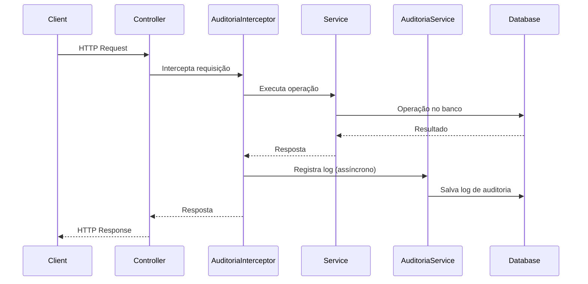

# Implementação de Auditoria no Módulo de Pagamento

## Visão Geral

Este documento descreve a implementação do sistema de auditoria automática no módulo de pagamento do sistema SEMTAS. A auditoria foi implementada usando interceptors e decorators para capturar automaticamente todas as operações realizadas nos endpoints de pagamento.

## Arquitetura da Solução

### Componentes Implementados

1. **AuditoriaInterceptor** (`src/modules/pagamento/interceptors/auditoria.interceptor.ts`)
   - Interceptor que captura automaticamente todas as requisições
   - Registra logs de auditoria de forma assíncrona
   - Trata tanto operações bem-sucedidas quanto erros

2. **Decorator de Auditoria** (`src/modules/pagamento/decorators/auditoria.decorator.ts`)
   - Decorators específicos para cada tipo de operação
   - Permite configuração granular de metadados de auditoria
   - Suporte a mascaramento de dados sensíveis

3. **DataMaskingInterceptor** (`src/modules/pagamento/interceptors/data-masking.interceptor.ts`)
   - Interceptor para mascaramento de dados sensíveis
   - Protege informações bancárias e CPF nas respostas da API
   - Baseado no perfil e permissões do usuário

4. **Utilitários de Mascaramento** (`src/modules/pagamento/utils/data-masking.util.ts`)
   - Funções utilitárias para mascarar diferentes tipos de dados
   - Suporte a contas bancárias, chaves PIX, CPF, etc.

### Fluxo de Auditoria



## Configuração e Uso

### 1. Aplicação do Interceptor

O interceptor é aplicado no nível do controller:

```typescript
@Controller('pagamentos')
@UseInterceptors(AuditoriaInterceptor, DataMaskingInterceptor)
export class PagamentoController {
  // ...
}
```

### 2. Decorators de Auditoria

Cada método do controller é decorado com metadados específicos:

```typescript
@Post()
@AuditoriaPagamento.Criacao()
async create(@Body() createPagamentoDto: CreatePagamentoDto) {
  // ...
}

@Get()
@AuditoriaPagamento.Consulta()
async findAll(@Query() query: any) {
  // ...
}

@Put(':id/status')
@AuditoriaPagamento.AtualizacaoStatus()
async updateStatus(
  @Param('id') id: string,
  @Body() updateStatusDto: UpdateStatusPagamentoDto
) {
  // ...
}

@Delete(':id/cancel')
@AuditoriaPagamento.Cancelamento()
async cancel(
  @Param('id') id: string,
  @Body() cancelDto: CancelPagamentoDto
) {
  // ...
}
```

### 3. Metadados de Auditoria

Cada decorator define metadados específicos:

```typescript
export const AuditoriaPagamento = {
  Criacao: () => SetMetadata(AUDITORIA_METADATA_KEY, {
    entidade: 'Pagamento',
    operacao: TipoOperacao.CREATE,
    descricao: 'Criação de pagamento',
    mascarDados: true,
  }),
  
  Consulta: () => SetMetadata(AUDITORIA_METADATA_KEY, {
    entidade: 'Pagamento',
    operacao: TipoOperacao.READ,
    descricao: 'Consulta de pagamentos',
    mascarDados: true,
  }),
  
  // ...
};
```

## Dados Capturados

O sistema de auditoria captura os seguintes dados:

### Informações da Requisição
- **Endpoint**: URL da requisição
- **Método HTTP**: GET, POST, PUT, DELETE
- **IP de Origem**: IP do cliente (com suporte a X-Forwarded-For)
- **User Agent**: Navegador/cliente utilizado
- **Usuário**: ID e informações do usuário autenticado

### Informações da Operação
- **Tipo de Operação**: CREATE, READ, UPDATE, DELETE
- **Entidade Afetada**: Nome da entidade (ex: "Pagamento")
- **ID da Entidade**: Identificador único do registro
- **Descrição**: Descrição da operação realizada

### Dados da Operação
- **Dados Novos**: Dados enviados na requisição (mascarados se necessário)
- **Status HTTP**: Código de resposta HTTP
- **Sucesso**: Indica se a operação foi bem-sucedida
- **Detalhes do Erro**: Informações do erro (se houver)

### Metadados Temporais
- **Data/Hora**: Timestamp da operação
- **Duração**: Tempo de execução da operação

## Mascaramento de Dados Sensíveis

### Dados Mascarados Automaticamente

1. **Dados Bancários**:
   - Número da conta
   - Chave PIX
   - Dados do cartão (se aplicável)

2. **Dados Pessoais**:
   - CPF (parcial)
   - Informações sensíveis do cidadão

### Configuração do Mascaramento

O mascaramento é configurado através do parâmetro `mascarDados` nos metadados:

```typescript
{
  entidade: 'Pagamento',
  operacao: TipoOperacao.CREATE,
  descricao: 'Criação de pagamento',
  mascarDados: true, // Ativa o mascaramento
}
```

### Funções de Mascaramento

```typescript
// Exemplos de mascaramento
mascararConta('12345678') // '****5678'
mascararChavePix('12345678901') // '***.***.***-**'
mascararCpf('12345678901') // '123.***.***-01'
```

## Tratamento de Erros

### Captura de Erros

O interceptor captura automaticamente erros e registra:

```typescript
{
  sucesso: false,
  status_http: 400,
  detalhes_erro: {
    message: 'Mensagem do erro',
    name: 'TipoDoErro',
    stack: 'Stack trace (se disponível)'
  }
}
```

### Continuidade do Serviço

- Falhas na auditoria não afetam a operação principal
- Logs de erro são registrados para debugging
- Sistema continua funcionando mesmo se auditoria falhar

## Configuração no Módulo

### Providers Necessários

```typescript
@Module({
  // ...
  providers: [
    // ...
    AuditoriaInterceptor,
    Reflector,
  ],
})
export class PagamentoModule {}
```

### Dependências

- `AuditoriaService`: Serviço para persistir logs
- `Reflector`: Para acessar metadados dos decorators
- `DataMaskingUtil`: Utilitários de mascaramento

## Testes

### Testes Unitários

- **AuditoriaInterceptor**: Testa captura de dados e registro de logs
- **DataMaskingUtil**: Testa funções de mascaramento
- **Decorators**: Testa aplicação de metadados

### Testes de Integração

- **Fluxo Completo**: Testa auditoria end-to-end
- **Mascaramento**: Verifica se dados sensíveis são mascarados
- **Tratamento de Erros**: Testa registro de erros

### Execução dos Testes

```bash
# Testes unitários
npx jest --testPathPattern=auditoria.interceptor
npx jest --testPathPattern=data-masking

# Testes de integração
npx jest --testPathPattern=auditoria-integration
```

## Benefícios da Implementação

### 1. **Automação Completa**
- Não requer modificações manuais nos serviços
- Captura automática de todas as operações
- Configuração declarativa via decorators

### 2. **Segurança e Compliance**
- Mascaramento automático de dados sensíveis
- Conformidade com LGPD
- Rastreabilidade completa das operações

### 3. **Performance**
- Registro assíncrono não bloqueia operações
- Impacto mínimo na performance
- Tratamento eficiente de erros

### 4. **Manutenibilidade**
- Código limpo e desacoplado
- Fácil extensão para novos tipos de operação
- Testes abrangentes

### 5. **Monitoramento**
- Visibilidade completa das operações
- Detecção de padrões suspeitos
- Suporte a análises de segurança

## Próximos Passos

1. **Extensão para Outros Módulos**
   - Aplicar padrão similar em outros módulos
   - Criar decorators específicos por domínio

2. **Melhorias de Performance**
   - Implementar batching de logs
   - Otimizar consultas de auditoria

3. **Dashboard de Auditoria**
   - Interface para visualização de logs
   - Relatórios de auditoria
   - Alertas de segurança

4. **Integração com SIEM**
   - Exportação de logs para sistemas externos
   - Correlação com outros eventos de segurança

## Conclusão

A implementação de auditoria no módulo de pagamento estabelece um padrão robusto e reutilizável para rastreabilidade de operações no sistema SEMTAS. A solução garante compliance com requisitos de segurança e LGPD, mantendo alta performance e facilidade de manutenção.