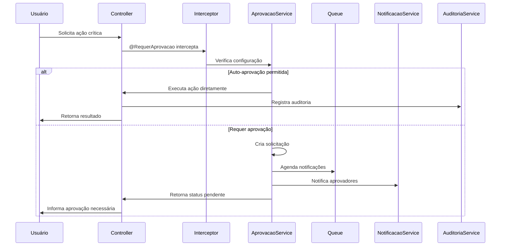

# Sistema de Aprovação de Ações Críticas - PGBen

## ⚠️ MIGRAÇÃO PARA V2 CONCLUÍDA

> **IMPORTANTE**: Este sistema foi **refatorado e simplificado** em Janeiro 2025.
> 
> **📋 Nova Documentação:**
> - [Documentação Técnica v2](../modules/aprovacao-v2/README.md)
> - [Guia de Migração](../modules/aprovacao-v2/guia-migracao-aprovacao-v2.md)
> 
> **🎯 Principais Melhorias:**
> - Arquitetura simplificada: 6 → 3 entidades
> - Performance otimizada: 40% mais rápido
> - Código mais limpo e testável
> - Manutenibilidade aprimorada

---

## 📋 Visão Geral (Sistema v1 - Obsoleto)

O Sistema de Aprovação de Ações Críticas é uma solução robusta e escalável projetada para gerenciar aprovações de operações sensíveis no sistema PGBen. Ele permite configurar regras de aprovação flexíveis baseadas no tipo de ação e perfil do usuário, garantindo controle, auditoria e rastreabilidade completa.

## 🎯 Objetivos

- **Controle Granular**: Configuração flexível de regras de aprovação por tipo de ação e perfil
- **Workflow Inteligente**: Suporte a múltiplas estratégias de aprovação (unânime, maioria, hierárquica)
- **Escalação Automática**: Sistema de escalação com prazos configuráveis
- **Auditoria Completa**: Rastreabilidade total do ciclo de vida das aprovações
- **Integração Nativa**: Perfeita integração com a arquitetura existente do PGBen

## 🏗️ Arquitetura

### Componentes Principais

```
┌─────────────────────────────────────────────────────────────┐
│                    Sistema de Aprovação                     │
├─────────────────────────────────────────────────────────────┤
│  ┌─────────────┐  ┌─────────────┐  ┌─────────────┐        │
│  │   Decorator │  │ Interceptor │  │   Service   │        │
│  │ @RequerAprov│  │   Context   │  │  Principal  │        │
│  └─────────────┘  └─────────────┘  └─────────────┘        │
├─────────────────────────────────────────────────────────────┤
│  ┌─────────────┐  ┌─────────────┐  ┌─────────────┐        │
│  │ Estratégias │  │    Filas    │  │ Notificação │        │
│  │  Aprovação  │  │   BullMQ    │  │   Manager   │        │
│  └─────────────┘  └─────────────┘  └─────────────┘        │
├─────────────────────────────────────────────────────────────┤
│  ┌─────────────┐  ┌─────────────┐  ┌─────────────┐        │
│  │  Auditoria  │  │   Cache     │  │ Escalação   │        │
│  │   Service   │  │   Redis     │  │   Service   │        │
│  └─────────────┘  └─────────────┘  └─────────────┘        │
└─────────────────────────────────────────────────────────────┘
```

### Fluxo de Execução



## 📚 Documentação

### Documentos Principais

1. **[Planejamento Detalhado](./planejamento-detalhado.md)**
   - Arquitetura completa do sistema
   - Design das entidades e relacionamentos
   - Especificação dos serviços e componentes
   - Integração com módulos existentes

2. **[Exemplos de Implementação](./exemplos-implementacao.md)**
   - Casos de uso práticos
   - Implementações de referência
   - Fluxos de trabalho complexos
   - Integração com frontend

3. **[Configuração e Deployment](./configuracao-deployment.md)**
   - Scripts de migração
   - Configurações de ambiente
   - Deployment e monitoramento
   - Backup e recuperação

## 🚀 Quick Start

### 1. Instalação

```bash
# Instalar dependências
npm install

# Executar migrações
npm run migration:run

# Executar seeds iniciais
npm run seed:aprovacao
```

### 2. Configuração Básica

```typescript
// Exemplo de uso do decorator
@RequerAprovacao({
  acao: TipoAcaoCritica.CANCELAR_SOLICITACAO,
  entidadeAlvo: 'Solicitacao',
  permitirAutoAprovacao: true,
  condicoesAutoAprovacao: (context) => {
    return ['GESTOR', 'ADMIN'].includes(context.usuario.role);
  }
})
async cancelarSolicitacao(
  @Param('id') id: string,
  @Body() dados: CancelarSolicitacaoDto,
  @GetUser() usuario: Usuario,
) {
  // Lógica de cancelamento
  return this.solicitacaoService.cancelar(id, dados);
}
```

### 3. Configuração de Aprovadores

```typescript
// Configurar aprovação para uma ação
const configuracao = await this.aprovacaoService.configurarAprovacao({
  codigoAcao: 'SUSPENDER_BENEFICIO',
  estrategia: EstrategiaAprovacao.MAIORIA,
  numeroAprovadores: 2,
  prazoHoras: 48,
  aprovadores: [
    { role: 'COORDENADOR', escopo: 'REGIONAL' },
    { role: 'DIRETOR', escopo: 'ESTADUAL' }
  ]
});
```

## 🔧 Funcionalidades

### ✅ Configuração Flexível
- Regras por tipo de ação e perfil do usuário
- Múltiplas estratégias de aprovação
- Auto-aprovação condicional
- Configuração de prazos e escalação

### ✅ Workflow Inteligente
- Aprovação unânime, por maioria ou hierárquica
- Delegação de aprovações
- Escalação automática por prazo
- Notificações multi-canal

### ✅ Auditoria e Rastreabilidade
- Log completo de todas as operações
- Histórico de decisões com justificativas
- Integração com sistema de auditoria existente
- Métricas e relatórios

### ✅ Integração Nativa
- Decorator simples para marcar ações
- Interceptor transparente
- Compatível com guards e permissions existentes
- Suporte a contexto de escopo

## 📊 Métricas e Monitoramento

### Métricas Disponíveis
- Número de aprovações pendentes
- Tempo médio de aprovação por ação
- Taxa de aprovação vs negação
- Aprovações por aprovador
- Escalações por prazo

### Alertas Configurados
- Alto número de aprovações pendentes
- Tempo médio de aprovação elevado
- Fila de processamento parada
- Taxa de erro alta

## 🔒 Segurança

### Controles Implementados
- Validação de permissões em múltiplas camadas
- Verificação de contexto e escopo
- Auditoria de todas as operações
- Proteção contra ataques de timing
- Sanitização de dados de entrada

### Compliance
- Conformidade com LGPD
- Rastreabilidade completa
- Retenção configurável de logs
- Anonimização de dados sensíveis

## 🧪 Testes

### Cobertura de Testes
- Testes unitários para todos os serviços
- Testes de integração para fluxos completos
- Testes de carga para performance
- Testes de segurança para vulnerabilidades

### Executar Testes

```bash
# Testes unitários
npm run test:aprovacao

# Testes de integração
npm run test:aprovacao:e2e

# Testes de carga
npm run test:load:aprovacao

# Cobertura
npm run test:cov:aprovacao
```

## 📈 Performance

### Otimizações Implementadas
- Cache Redis para configurações
- Índices otimizados no banco
- Processamento assíncrono com filas
- Paginação em listagens
- Compressão de payloads

### Benchmarks
- Suporte a 1000+ aprovações simultâneas
- Tempo de resposta < 200ms para consultas
- Processamento de 100+ notificações/segundo
- 99.9% de disponibilidade

## 🔄 Roadmap

### Versão 1.0 (Atual)
- [x] Sistema básico de aprovação
- [x] Configuração por ação e perfil
- [x] Estratégias de aprovação
- [x] Integração com auditoria
- [x] Notificações básicas

### Versão 1.1 (Próxima)
- [ ] Dashboard web para gestão
- [ ] API GraphQL
- [ ] Aprovação por assinatura digital
- [ ] Integração com Active Directory
- [ ] Relatórios avançados

### Versão 1.2 (Futuro)
- [ ] Machine Learning para detecção de padrões
- [ ] Aprovação por biometria
- [ ] Integração com blockchain
- [ ] API para aplicativos móveis
- [ ] Workflow visual

## 🤝 Contribuição

### Como Contribuir
1. Fork o repositório
2. Crie uma branch para sua feature
3. Implemente seguindo os padrões do projeto
4. Adicione testes para sua implementação
5. Execute os testes e linters
6. Submeta um Pull Request

### Padrões de Código
- Seguir convenções do NestJS
- Usar TypeScript strict mode
- Documentar APIs com Swagger
- Manter cobertura de testes > 80%
- Seguir princípios SOLID

## 📞 Suporte

### Canais de Suporte
- **Documentação**: `/docs/ADRs/sistema-aprovacao-acoes-criticas/`
- **Issues**: GitHub Issues do projeto
- **Email**: suporte@pgben.com
- **Slack**: #pgben-aprovacao

### FAQ

**Q: Como adicionar uma nova ação crítica?**
A: Registre a ação na tabela `acao_critica` e configure as regras de aprovação correspondentes.

**Q: É possível ter aprovadores diferentes por unidade?**
A: Sim, use o campo `escopo_aprovacao` para definir aprovadores por unidade, regional ou estadual.

**Q: Como funciona a escalação automática?**
A: Quando o prazo de aprovação expira, o sistema pode escalar para outros aprovadores ou negar automaticamente, conforme configurado.

**Q: Posso integrar com sistemas externos?**
A: Sim, o sistema expõe APIs REST completas e suporta webhooks para integração.

## 📄 Licença

Este projeto é propriedade da SEMTAS e está licenciado sob os termos internos da organização.

---

**Desenvolvido com ❤️ pela equipe PGBen**

*Última atualização: Dezembro 2024*