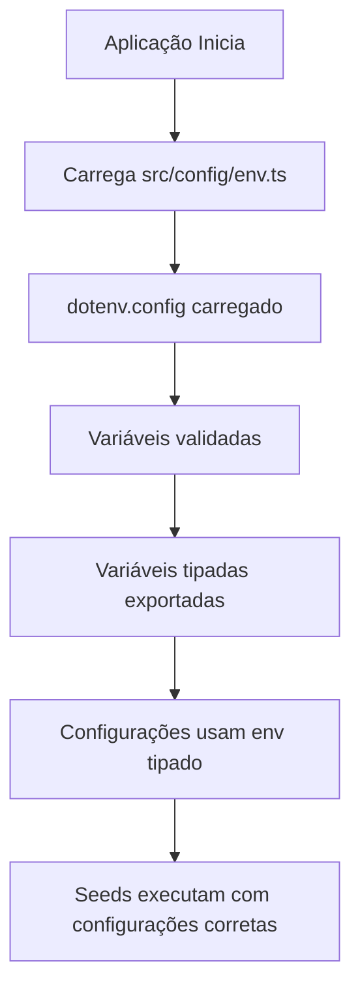

# Configuração de Ambiente - Sistema Centralizado de Dotenv

## Problema Identificado

O sistema de seeds (`src/database/seeds/run-seeds.ts`) não estava carregando as variáveis de ambiente do arquivo `.env`, utilizando sempre os valores padrão definidos no código.

## Causa Raiz

O problema ocorria porque as variáveis de ambiente não eram carregadas antes da importação dos arquivos de configuração. O fluxo problemático era:

```
run-seeds.ts → seed-source.ts → src/config/index.ts → database.config.ts → process.env
```

Como o `database.config.ts` era importado e executado antes do carregamento do dotenv, as variáveis `process.env` retornavam `undefined`, fazendo com que os valores padrão fossem utilizados.

## Solução Implementada

### 1. Arquivo Centralizador de Ambiente (`src/config/env.ts`)

Criado um arquivo centralizador que:
- Carrega o dotenv automaticamente na importação
- Valida variáveis obrigatórias
- Exporta variáveis tipadas
- Fornece funções de parsing (string para number/boolean)
- Inclui logs de debug para desenvolvimento

### 2. Atualização dos Arquivos de Configuração

**Arquivos atualizados:**
- `src/config/database.config.ts` - Agora importa de `env.ts`
- `src/config/index.ts` - Mantido para compatibilidade
- `src/main.ts` - Carrega env antes de qualquer importação
- `src/data-source.ts` - Carrega env e usa variáveis tipadas
- `src/database/seeds/run-seeds.ts` - Carrega env antes das importações
- `ormconfig.ts` - Atualizado para usar o novo sistema
- `ormconfig.seed.js` - Garantido carregamento do dotenv

### 3. Estrutura do Sistema



## Benefícios da Solução

1. **Carregamento Consistente**: Variáveis de ambiente carregadas de forma uniforme em toda a aplicação
2. **Validação Centralizada**: Verificação de variáveis obrigatórias em um local
3. **Tipagem**: Variáveis de ambiente tipadas, reduzindo erros
4. **Debug**: Logs informativos para desenvolvimento
5. **Manutenibilidade**: Configuração centralizada facilita manutenção

## Variáveis de Ambiente Suportadas

### Banco de Dados (Obrigatórias)
- `DB_HOST` - Host do banco de dados
- `DB_PORT` - Porta do banco de dados
- `DB_USER` - Usuário do banco de dados
- `DB_PASS` - Senha do banco de dados
- `DB_NAME` - Nome do banco de dados
- `DB_LOGGING` - Habilitar logging do TypeORM

### Aplicação
- `NODE_ENV` - Ambiente de execução
- `APP_PORT` - Porta da aplicação
- `API_PREFIX` - Prefixo da API

### JWT e Segurança
- `JWT_SECRET` - Chave secreta JWT
- `JWT_REFRESH_SECRET` - Chave secreta para refresh tokens
- `JWT_PRIVATE_KEY_PATH` - Caminho para chave privada RSA
- `JWT_PUBLIC_KEY_PATH` - Caminho para chave pública RSA
- E outras configurações de segurança...

## Como Usar

### 1. Para Novos Arquivos
```typescript
// IMPORTANTE: Carregar env antes de qualquer importação
import '../config/env';

// Agora pode importar configurações
import { config } from '../config';
```

### 2. Para Acessar Variáveis Diretamente
```typescript
import { env } from '../config/env';

console.log(env.DB_HOST); // Tipado e validado
```

### 3. Para Validação Manual
```typescript
import { validateRequiredEnvVars } from '../config/env';

// Validar variáveis obrigatórias
validateRequiredEnvVars();
```

## Arquivos de Configuração

### Pontos de Entrada que Carregam o Env
- `src/main.ts` - Aplicação principal
- `src/data-source.ts` - DataSource do TypeORM
- `src/database/seeds/run-seeds.ts` - Script de seeds
- `ormconfig.ts` - Configuração do TypeORM CLI

### Arquivos de Configuração
- `src/config/env.ts` - **Centralizador principal**
- `src/config/database.config.ts` - Configuração do banco
- `src/config/index.ts` - Exportador de configurações

## Debugging

### Logs de Debug
Para habilitar logs de debug, defina:
```bash
DEBUG=true
# ou
NODE_ENV=development
```

### Verificação de Carregamento
O sistema exibe logs informativos sobre:
- Carregamento do arquivo .env
- Variáveis de ambiente carregadas
- Validação de variáveis obrigatórias

### Exemplo de Log
```
✅ Arquivo .env carregado com sucesso de: /projeto/.env
🔧 Configurações de ambiente carregadas:
   - DB_HOST: localhost
   - DB_PORT: 5432
   - DB_NAME: pgben_dev
   - DB_USER: postgres
   - NODE_ENV: development
   - APP_PORT: 3000
```

## Resolução de Problemas

### Problema: Seeds ainda usam valores padrão
**Solução**: Verificar se o arquivo `.env` existe na raiz do projeto e contém as variáveis necessárias.

### Problema: Erro de variáveis obrigatórias
**Solução**: Verificar se todas as variáveis listadas como obrigatórias estão definidas no `.env`.

### Problema: Configuração não carregada
**Solução**: Verificar se a importação do `env.ts` está sendo feita antes de qualquer outra importação.

## Testes

Para testar se a configuração está funcionando:

```bash
# Executar seeds
npm run seed

# Verificar logs de carregamento
DEBUG=true npm run seed

# Testar aplicação
npm run start:dev
```

## Migração de Código Existente

Para migrar código existente:

1. Substitua `process.env.VARIAVEL` por `env.VARIAVEL`
2. Adicione import do env no início do arquivo
3. Verifique se a variável está definida na interface `EnvironmentVariables`

### Antes
```typescript
const host = process.env.DB_HOST || 'localhost';
```

### Depois
```typescript
import { env } from './config/env';
const host = env.DB_HOST; // Já tem fallback definido
