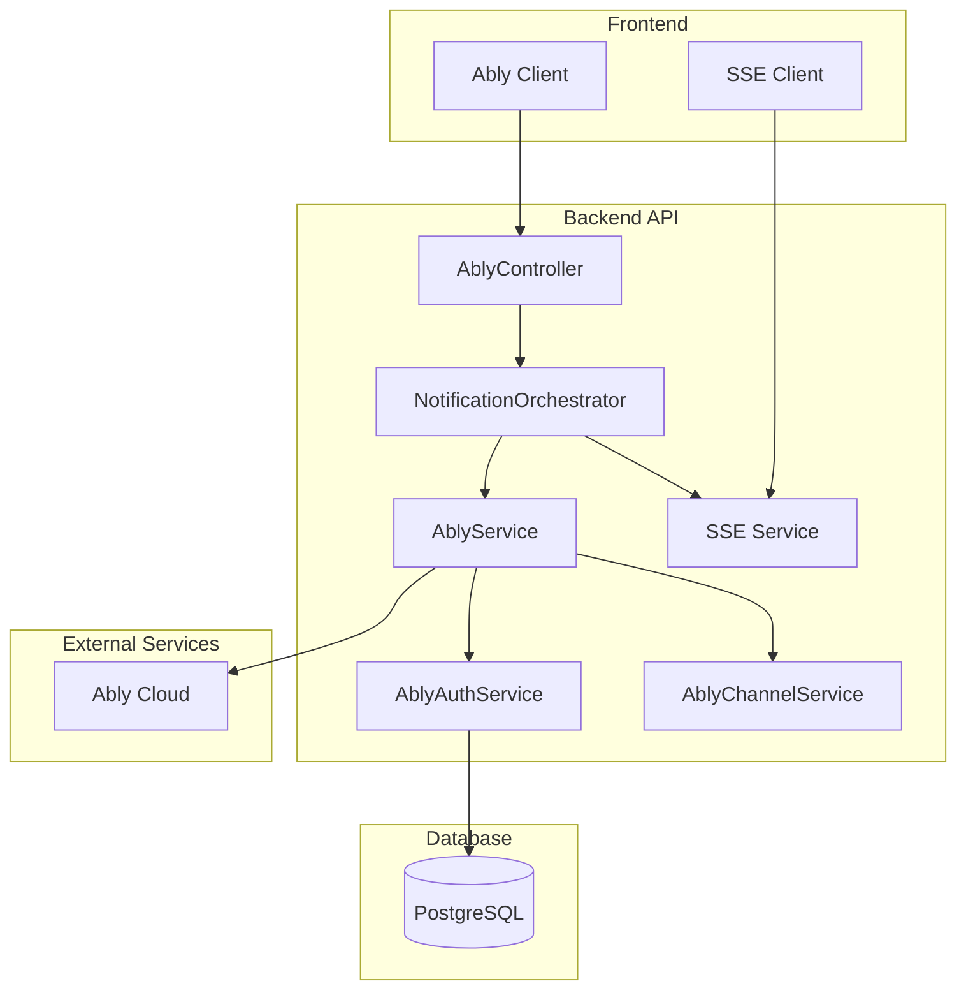
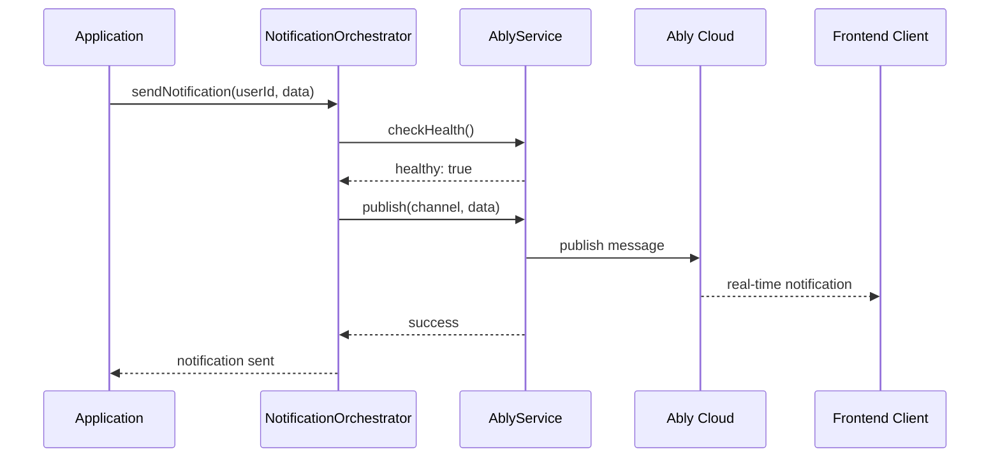
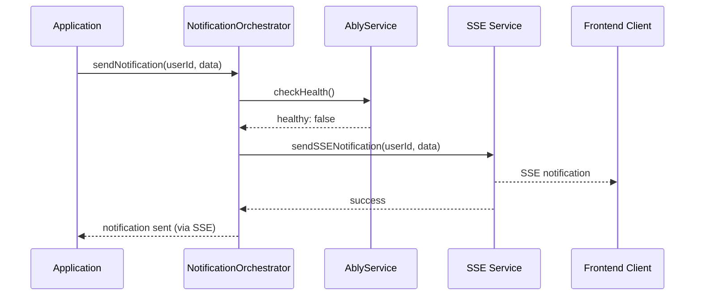
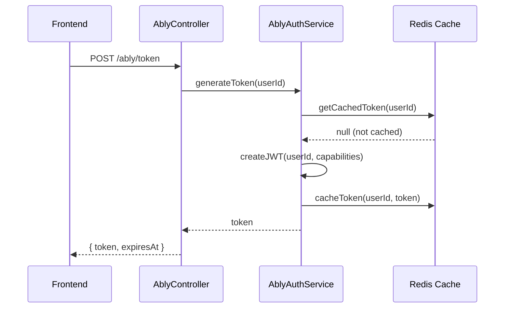

# Arquitetura da Integração Ably - Sistema SEMTAS

## 📋 Visão Geral

Este documento descreve a arquitetura da integração do Ably no Sistema SEMTAS, detalhando os componentes, fluxos de dados e padrões de design utilizados para implementar notificações em tempo real.

## 🏗️ Arquitetura Geral

### Diagrama de Alto Nível



## 🎯 Componentes Principais

### 1. NotificationOrchestratorService

**Responsabilidade:** Orquestração inteligente entre Ably e SSE

```typescript
@Injectable()
export class NotificationOrchestratorService {
  // Determina automaticamente o melhor método de entrega
  async sendNotification(userId: string, data: any): Promise<void>
  
  // Implementa fallback automático
  async sendWithFallback(userId: string, data: any): Promise<void>
  
  // Circuit breaker para resiliência
  async checkAblyHealth(): Promise<boolean>
}
```

**Características:**
- ✅ Fallback automático SSE quando Ably falha
- ✅ Circuit breaker para evitar cascata de falhas
- ✅ Retry automático com backoff exponencial
- ✅ Métricas de performance e confiabilidade

### 2. AblyService

**Responsabilidade:** Gerenciamento da conexão principal com Ably

```typescript
@Injectable()
export class AblyService {
  // Inicialização e configuração
  async initialize(): Promise<void>
  
  // Publicação de mensagens
  async publish(channel: string, data: any): Promise<void>
  
  // Gerenciamento de conexão
  async getConnectionState(): Promise<ConnectionState>
  
  // Métricas e monitoramento
  async getMetrics(): Promise<AblyMetrics>
}
```

**Características:**
- ✅ Conexão persistente com reconexão automática
- ✅ Pool de conexões para alta performance
- ✅ Monitoramento de saúde em tempo real
- ✅ Métricas detalhadas de uso

### 3. AblyAuthService

**Responsabilidade:** Autenticação segura e geração de tokens

```typescript
@Injectable()
export class AblyAuthService {
  // Geração de tokens JWT
  async generateToken(userId: string, capabilities?: string[]): Promise<string>
  
  // Validação de tokens
  async validateToken(token: string): Promise<boolean>
  
  // Revogação de tokens
  async revokeToken(tokenId: string): Promise<void>
  
  // Cache de tokens
  async getCachedToken(userId: string): Promise<string | null>
}
```

**Características:**
- ✅ Tokens JWT com TTL configurável
- ✅ Cache inteligente de tokens válidos
- ✅ Revogação imediata quando necessário
- ✅ Capacidades granulares por usuário

### 4. AblyChannelService

**Responsabilidade:** Gerenciamento avançado de canais

```typescript
@Injectable()
export class AblyChannelService {
  // Criação e configuração de canais
  async createChannel(name: string, config?: ChannelConfig): Promise<Channel>
  
  // Subscrição e desinscrição
  async subscribe(channelName: string, callback: Function): Promise<void>
  async unsubscribe(channelName: string): Promise<void>
  
  // Presença em canais
  async enterPresence(channelName: string, data?: any): Promise<void>
  async leavePresence(channelName: string): Promise<void>
  
  // Estatísticas de canal
  async getChannelStats(channelName: string): Promise<ChannelStats>
}
```

**Características:**
- ✅ Gerenciamento automático de lifecycle de canais
- ✅ Presença em tempo real
- ✅ Estatísticas detalhadas por canal
- ✅ Cleanup automático de canais inativos

## 🔄 Fluxos de Dados

### 1. Fluxo de Notificação Padrão



### 2. Fluxo com Fallback SSE



### 3. Fluxo de Autenticação



## 🎨 Padrões de Design

### 1. Strategy Pattern - Seleção de Método de Entrega

```typescript
interface NotificationStrategy {
  send(userId: string, data: any): Promise<void>;
  isAvailable(): Promise<boolean>;
}

class AblyStrategy implements NotificationStrategy {
  async send(userId: string, data: any): Promise<void> {
    // Implementação Ably
  }
  
  async isAvailable(): Promise<boolean> {
    return this.ablyService.isHealthy();
  }
}

class SSEStrategy implements NotificationStrategy {
  async send(userId: string, data: any): Promise<void> {
    // Implementação SSE
  }
  
  async isAvailable(): Promise<boolean> {
    return true; // SSE sempre disponível
  }
}
```

### 2. Circuit Breaker Pattern - Resiliência

```typescript
class CircuitBreaker {
  private state: 'CLOSED' | 'OPEN' | 'HALF_OPEN' = 'CLOSED';
  private failureCount = 0;
  private lastFailureTime?: Date;
  
  async execute<T>(operation: () => Promise<T>): Promise<T> {
    if (this.state === 'OPEN') {
      if (this.shouldAttemptReset()) {
        this.state = 'HALF_OPEN';
      } else {
        throw new Error('Circuit breaker is OPEN');
      }
    }
    
    try {
      const result = await operation();
      this.onSuccess();
      return result;
    } catch (error) {
      this.onFailure();
      throw error;
    }
  }
}
```

### 3. Factory Pattern - Criação de Canais

```typescript
class ChannelFactory {
  static createUserChannel(userId: string): string {
    return `user:${userId}`;
  }
  
  static createGroupChannel(groupId: string): string {
    return `group:${groupId}`;
  }
  
  static createSystemChannel(): string {
    return 'system:notifications';
  }
  
  static createBenefitChannel(benefitId: string): string {
    return `benefit:${benefitId}`;
  }
}
```

## 🔧 Configuração e Inicialização

### 1. Módulo Principal

```typescript
@Module({
  imports: [ConfigModule],
  controllers: [AblyController],
  providers: [
    AblyService,
    AblyAuthService,
    AblyChannelService,
    NotificationOrchestratorService,
    {
      provide: ABLY_CONFIG,
      useFactory: (configService: ConfigService) => 
        new AblyConfig(configService),
      inject: [ConfigService],
    },
  ],
  exports: [
    AblyService,
    AblyAuthService,
    AblyChannelService,
    NotificationOrchestratorService,
    ABLY_CONFIG,
  ],
})
export class AblyModule {
  constructor(private readonly ablyService: AblyService) {
    // Inicialização automática
    this.ablyService.initialize();
  }
}
```

### 2. Configuração de Ambiente

```typescript
export class AblyConfig {
  readonly apiKey: string;
  readonly environment: string;
  readonly clientId: string;
  readonly jwtSecret: string;
  readonly tokenTtl: number;
  readonly maxRetries: number;
  readonly circuitBreakerThreshold: number;
  
  constructor(private configService: ConfigService) {
    this.apiKey = this.configService.get('ABLY_API_KEY');
    this.environment = this.configService.get('ABLY_ENVIRONMENT', 'sandbox');
    this.clientId = this.configService.get('ABLY_CLIENT_ID', 'semtas-api');
    this.jwtSecret = this.configService.get('JWT_SECRET');
    this.tokenTtl = parseInt(this.configService.get('ABLY_TOKEN_TTL', '3600'));
    this.maxRetries = parseInt(this.configService.get('ABLY_MAX_RETRIES', '3'));
    this.circuitBreakerThreshold = parseInt(
      this.configService.get('ABLY_CIRCUIT_BREAKER_THRESHOLD', '5')
    );
  }
}
```

## 📊 Monitoramento e Métricas

### 1. Métricas Coletadas

```typescript
interface AblyMetrics {
  // Métricas de conexão
  connectionState: string;
  connectionUptime: number;
  reconnectionCount: number;
  
  // Métricas de mensagens
  messagesSent: number;
  messagesReceived: number;
  messageFailures: number;
  
  // Métricas de performance
  averageLatency: number;
  peakLatency: number;
  throughput: number;
  
  // Métricas de canais
  activeChannels: number;
  totalSubscriptions: number;
  
  // Métricas de fallback
  fallbackActivations: number;
  circuitBreakerTrips: number;
}
```

### 2. Health Checks

```typescript
@Controller('ably')
export class AblyController {
  @Get('health')
  async getHealth(): Promise<HealthCheckResult> {
    return {
      status: await this.ablyService.isHealthy() ? 'healthy' : 'unhealthy',
      timestamp: new Date().toISOString(),
      details: {
        connection: await this.ablyService.getConnectionState(),
        lastHeartbeat: await this.ablyService.getLastHeartbeat(),
        activeChannels: await this.channelService.getActiveChannelCount(),
      },
    };
  }
  
  @Get('metrics')
  async getMetrics(): Promise<AblyMetrics> {
    return this.ablyService.getMetrics();
  }
}
```

## 🔒 Considerações de Segurança

### 1. Autenticação JWT

- Tokens com TTL configurável (padrão: 1 hora)
- Claims específicos por usuário e contexto
- Revogação imediata quando necessário
- Cache seguro com expiração automática

### 2. Autorização de Canais

- Capacidades granulares por canal
- Validação de permissões em tempo real
- Isolamento por tenant/organização
- Auditoria de acesso a canais

### 3. Proteção de Dados

- Sanitização de dados antes do envio
- Validação de schema de mensagens
- Rate limiting por usuário
- Logs de auditoria para compliance

## 🚀 Performance e Escalabilidade

### 1. Otimizações Implementadas

- **Connection Pooling**: Reutilização de conexões
- **Message Batching**: Agrupamento de mensagens
- **Lazy Loading**: Canais criados sob demanda
- **Cache Inteligente**: Tokens e metadados em cache

### 2. Limites e Capacidades

| Métrica | Limite | Observações |
|---------|--------|--------------|
| Conexões simultâneas | 10,000 | Por instância |
| Mensagens/segundo | 1,000 | Por canal |
| Canais ativos | 1,000 | Por conexão |
| Tamanho da mensagem | 64KB | Limite do Ably |
| TTL do token | 1-24h | Configurável |

## 🔄 Próximas Evoluções

### Fase 2 - Funcionalidades Avançadas

1. **Presença Avançada**
   - Status de usuários online/offline
   - Indicadores de atividade
   - Sincronização de estado

2. **Message History**
   - Persistência de mensagens
   - Recuperação de histórico
   - Sincronização offline

3. **Push Notifications**
   - Integração com FCM/APNS
   - Notificações quando offline
   - Preferências de usuário

### Fase 3 - Chat em Tempo Real

1. **Mensagens Diretas**
   - Chat 1:1 entre usuários
   - Indicadores de leitura
   - Typing indicators

2. **Salas de Chat**
   - Grupos de discussão
   - Moderação de conteúdo
   - Histórico persistente

---

**Última atualização:** Dezembro 2024  
**Versão:** 1.0  
**Status:** Implementação concluída