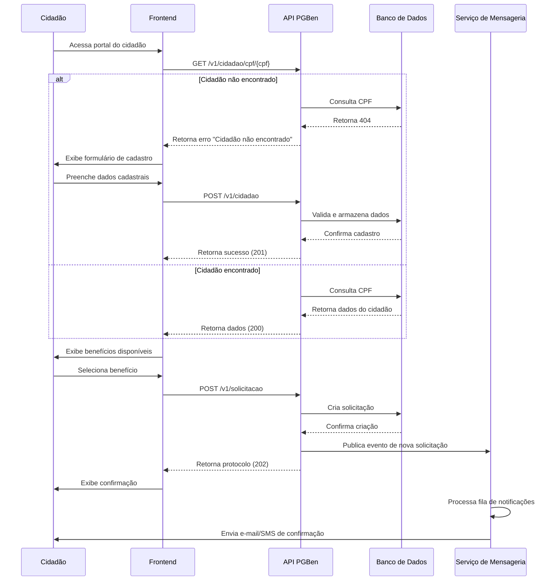
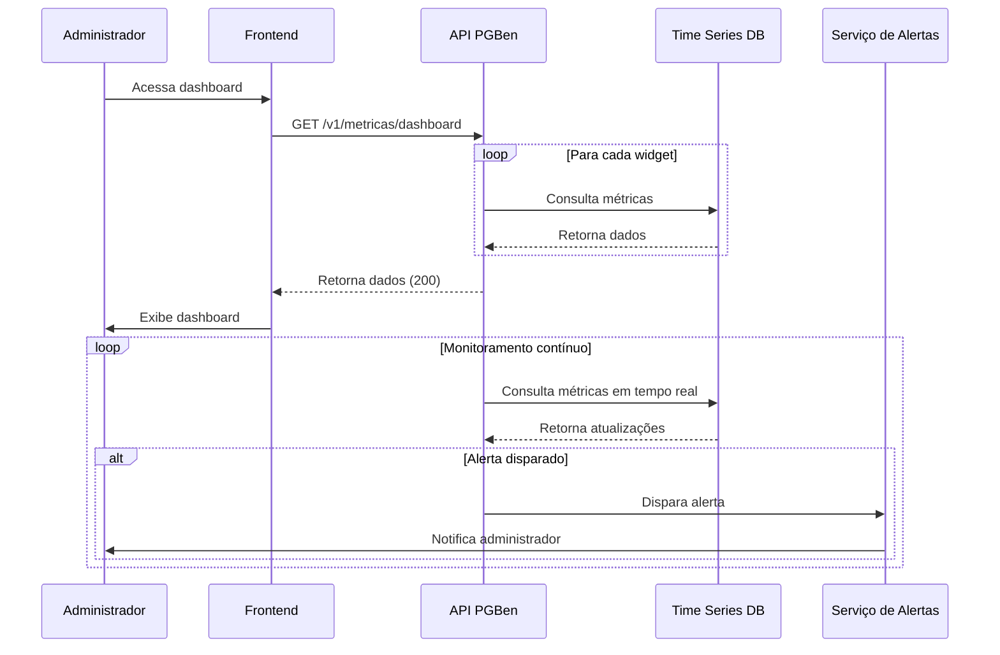
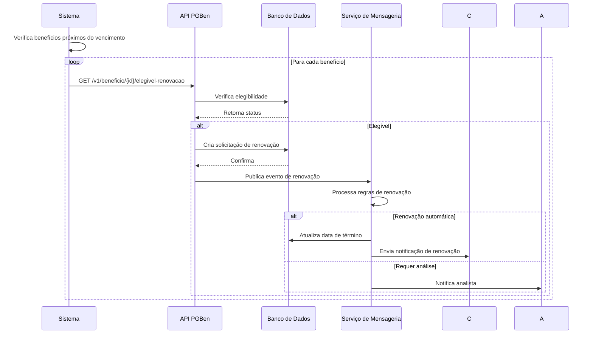

# Fluxos de Trabalho do PGBen

Este documento detalha os principais fluxos de negócio do sistema PGBen, apresentando sequências completas de operações e interações entre os diferentes componentes do sistema.

## Sumário

1. [Cadastro de Cidadão e Solicitação de Benefício](#1-cadastro-de-cidadão-e-solicitação-de-benefício)
2. [Aprovação de Solicitação](#2-aprovação-de-solicitação)
3. [Upload e Validação de Documentos](#3-upload-e-validação-de-documentos)
4. [Geração de Relatórios](#4-geração-de-relatórios)
5. [Monitoramento de Métricas](#5-monitoramento-de-métricas)
6. [Renovação de Benefício](#6-renovação-de-benefício)
7. [Cancelamento de Benefício](#7-cancelamento-de-benefício)

---

## 1. Cadastro de Cidadão e Solicitação de Benefício

### Visão Geral do Fluxo



### 1.1 Verificar se o cidadão já está cadastrado

### 1.1 Verificar se o cidadão já está cadastrado

```http
GET /v1/cidadao/cpf/123.456.789-00
Authorization: Bearer {token}
```

**Resposta (200 OK - Cidadão encontrado)**
```json
{
  "id": "550e8400-e29b-41d4-a716-446655440000",
  "nome": "Fulano de Tal",
  "cpf": "12345678900",
  "dataNascimento": "1980-01-01",
  "status": "ATIVO"
}
```

**Resposta (404 Not Found - Cidadão não encontrado)**
```json
{
  "statusCode": 404,
  "message": "Cidadão não encontrado",
  "errorCode": "NOT_FOUND_001"
}
```

### 1.2 Cadastrar novo cidadão (se necessário)

```http
POST /v1/cidadao
Authorization: Bearer {token}
Content-Type: application/json

{
  "nome": "Fulano de Tal",
  "cpf": "123.456.789-00",
  "dataNascimento": "1980-01-01",
  "email": "fulano@exemplo.com",
  "telefone": "11999998888",
  "endereco": {
    "logradouro": "Rua Exemplo",
    "numero": "123",
    "complemento": "Apto 101",
    "bairro": "Centro",
    "cidade": "São Paulo",
    "estado": "SP",
    "cep": "01001000"
  }
}
```

### 1.3 Listar benefícios disponíveis

```http
GET /v1/beneficio?status=ATIVO
Authorization: Bearer {token}
```

### 1.4 Criar solicitação de benefício

```http
POST /v1/solicitacao
Authorization: Bearer {token}
Content-Type: application/json

{
  "cidadaoId": "550e8400-e29b-41d4-a716-446655440000",
  "beneficioId": "660e8400-e29b-41d4-a716-446655441111",
  "unidadeId": "770e8400-e29b-41d4-a716-446655442222",
  "observacoes": "Necessidade urgente devido a situação de vulnerabilidade",
  "camposDinamicos": [
    {
      "campoId": "renda_familiar",
      "valor": "1200.50"
    },
    {
      "campoId": "membros_familia",
      "valor": "4"
    }
  ]
}
```

## 2. Aprovação de Solicitação

### Visão Geral do Fluxo

```mermaid
sequenceDiagram
    participant A as Analista
    participant FE as Frontend
    participant API as API PGBen
    participant DB as Banco de Dados
    participant MS as Serviço de Mensageria
    participant DS as Document Storage
    
    A->>FE: Acessa painel de aprovações
    FE->>API: GET /v1/solicitacao?status=PENDENTE
    API->>DB: Consulta solicitações
    DB-->>API: Retorna lista
    API-->>FE: Retorna dados (200)
    FE->>A: Exibe lista
    
    A->>FE: Seleciona solicitação para análise
    FE->>API: GET /v1/solicitacao/{id}
    API->>DB: Busca detalhes
    DB-->>API: Retorna dados
    
    loop Para cada documento
        API->>DS: GET /documentos/{documentoId}
        DS-->>API: Retorna documento
    end
    
    API-->>FE: Retorna dados completos (200)
    FE->>A: Exibe detalhes e documentos
    
    A->>FE: Aprova/Reprova
    FE->>API: PUT /v1/solicitacao/{id}/avaliar
    API->>DB: Atualiza status
    DB-->>API: Confirma atualização
    
    alt Aprovado
        API->>MS: Publica evento de aprovação
        MS->>MS: Agenda pagamento
        MS->>C: Envia notificação de aprovação
    else Reprovado
        API->>MS: Publica evento de reprovação
        MS->>C: Envia notificação com justificativa
    end
    
    API-->>FE: Retorna sucesso (200)
    FE->>A: Exibe confirmação

### 2.1 Listar solicitações pendentes

```http
GET /v1/solicitacao?status=PENDENTE&page=1&limit=10
Authorization: Bearer {token}
```

### 2.2 Avaliar solicitação

```http
PUT /v1/solicitacao/880e8400-e29b-41d4-a716-446655443333/avaliar
Authorization: Bearer {token}
Content-Type: application/json

{
  "status": "APROVADA",
  "observacoes": "Documentação em conformidade",
  "analistaId": "990e8400-e29b-41d4-a716-446655444444"
}
```

### 2.3 Notificar cidadão sobre aprovação

```http
POST /v1/notificacao
Authorization: Bearer {token}
Content-Type: application/json

{
  "destinatarioId": "550e8400-e29b-41d4-a716-446655440000",
  "titulo": "Solicitação Aprovada",
  "mensagem": "Sua solicitação de benefício foi aprovada. O valor será creditado em até 5 dias úteis.",
  "tipo": "APROVACAO_BENEFICIO",
  "dadosAdicionais": {
    "solicitacaoId": "880e8400-e29b-41d4-a716-446655443333",
    "beneficio": "Auxílio Emergencial",
    "valor": "R$ 600,00",
    "dataCredito": "2025-05-25"
  }
}
```

## 3. Upload e Validação de Documentos

### Visão Geral do Fluxo

```mermaid
sequenceDiagram
    participant C as Cidadão/Analista
    participant FE as Frontend
    participant API as API PGBen
    participant VS as Serviço de Validação
    participant DS as Document Storage
    participant DB as Banco de Dados
    
    C->>FE: Acessa área de documentos
    FE->>API: GET /v1/solicitacao/{id}/documentos
    API->>DB: Busca documentos
    DB-->>API: Retorna lista
    API-->>FE: Retorna (200)
    FE->>C: Exibe status dos documentos
    
    C->>FE: Faz upload de documento
    FE->>API: POST /v1/documento/upload
    API->>VS: Valida tipo e tamanho
    VS-->>API: Retorna validação
    
    alt Validação bem-sucedida
        API->>DS: Armazena documento
        DS-->>API: Retorna URL
        API->>DB: Registra metadados
        DB-->>API: Confirma
        
        API->>VS: Inicia validação assíncrona
        VS->>VS: Processa OCR/validações
        VS->>DB: Atualiza status
        
        API-->>FE: Retorna sucesso (201)
        FE->>C: Exibe confirmação
        
        VS->>C: Envia notificação se houver problemas
    else Validação falhou
        API-->>FE: Retorna erro (400)
        FE->>C: Exibe mensagem de erro
    end

### 3.1 Iniciar upload de documento

```http
POST /v1/documento/upload
Authorization: Bearer {token}
Content-Type: multipart/form-data

{
  "solicitacaoId": "880e8400-e29b-41d4-a716-446655443333",
  "tipoDocumento": "COMPROVANTE_RESIDENCIA",
  "file": "[arquivo]"
}
```

### 3.2 Validar documento

```http
PUT /v1/documento/aa0e8400-e29b-41d4-a716-446655445555/validar
Authorization: Bearer {token}
Content-Type: application/json

{
  "valido": true,
  "observacoes": "Documento válido e legível",
  "usuarioValidacaoId": "bb0e8400-e29b-41d4-a716-446655446666"
}
```

## 4. Geração de Relatórios

### Visão Geral do Fluxo

```mermaid
sequenceDiagram
    participant U as Usuário
    participant FE as Frontend
    participant API as API PGBen
    participant RP as Serviço de Relatórios
    participant DB as Banco de Dados
    participant FS as Armazenamento de Arquivos
    
    U->>FE: Acessa módulo de relatórios
    FE->>API: GET /v1/relatorios/tipos
    API-->>FE: Retorna opções (200)
    
    U->>FE: Configura parâmetros
    FE->>API: POST /v1/relatorios/gerar
    API->>RP: Envia solicitação
    RP->>RP: Valida parâmetros
    
    RP->>DB: Consulta dados
    DB-->>RP: Retorna dados
    
    RP->>RP: Formata relatório
    RP->>FS: Armazena relatório
    FS-->>RP: Retorna URL
    
    RP->>DB: Registra geração
    RP->>API: Retorna status e URL
    API-->>FE: Retorna (202) com ID
    
    FE->>API: GET /v1/relatorios/status/{id}
    alt Relatório pronto
        API-->>FE: Retorna URL (303)
        FE->>U: Oferece download
    else Em processamento
        API-->>FE: Retorna status (200)
        FE->>FE: Aguarda e consulta novamente
    end

### 4.1 Solicitar geração de relatório

```http
POST /v1/relatorios/beneficios-concedidos
Authorization: Bearer {token}
Content-Type: application/json

{
  "dataInicio": "2025-01-01",
  "dataFim": "2025-05-17",
  "formato": "PDF",
  "filtros": {
    "tipoBeneficioId": "660e8400-e29b-41d4-a716-446655441111",
    "unidadeId": "770e8400-e29b-41d4-a716-446655442222"
  }
}
```

### 4.2 Baixar relatório gerado

```http
GET /v1/relatorios/download/cc0e8400-e29b-41d4-a716-446655447777
Authorization: Bearer {token}
Accept: application/pdf
```

## 5. Monitoramento de Métricas

### Visão Geral do Fluxo



## 6. Renovação de Benefício

### Visão Geral do Fluxo



## 7. Cancelamento de Benefício

### Visão Geral do Fluxo

```mermaid
sequenceDiagram
    participant A as Analista
    participant FE as Frontend
    participant API as API PGBen
    participant DB as Banco de Dados
    participant MS as Serviço de Mensageria
    
    A->>FE: Inicia cancelamento
    FE->>API: GET /v1/beneficio/{id}
    API->>DB: Busca dados
    DB-->>API: Retorna dados
    API-->>FE: Retorna (200)
    
    FE->>A: Exibe confirmação
    A->>FE: Confirma cancelamento
    
    FE->>API: POST /v1/beneficio/{id}/cancelar
    API->>DB: Atualiza status
    DB-->>API: Confirma
    
    API->>MS: Publica evento de cancelamento
    
    MS->>MS: Para pagamentos futuros
    MS->>C: Envia notificação
    MS->>A: Confirma cancelamento
    
    API-->>FE: Retorna sucesso (200)
    FE->>A: Exibe confirmação

### 5.1 Obter métricas de desempenho

```http
GET /v1/metricas/desempenho?periodo=7d&agregacao=diaria
Authorization: Bearer {token}
```

### 5.2 Verificar anomalias

```http
GET /v1/metricas/anomalias?dataInicio=2025-05-10&dataFim=2025-05-17
Authorization: Bearer {token}
```

### 5.3 Obter dashboard de métricas

```http
GET /v1/metricas/dashboard
Authorization: Bearer {token}
```

## Fluxos Avançados

### Fluxo de Recuperação de Senha

1. Usuário solicita redefinição de senha
2. Sistema envia e-mail com token de redefinição
3. Usuário acessa link com token
4. Sistema valida token e permite cadastrar nova senha

### Fluxo de Atualização em Massa

1. Usuário faz upload de planilha com atualizações
2. Sistema processa em background
3. Usuário recebe notificação quando o processamento é concluído
4. Relatório com resultados é disponibilizado para download

## Melhores Práticas

1. **Tratamento de Erros**
   - Implemente retry com backoff exponencial para erros 5xx
   - Armazene IDs de transações para auditoria
   - Valide todos os dados antes de enviar para a API

2. **Performance**
   - Utilize paginação em consultas que podem retornar muitos itens
   - Considere usar campos de projeção para otimizar consultas
   - Implemente cache quando apropriado

3. **Segurança**
   - Nunca armazene tokens em código-fonte
   - Utilize HTTPS para todas as requisições
   - Implemente validação de entrada em ambos cliente e servidor

---

**Última atualização**: 17/05/2025  
**Versão deste documento**: 1.0.0
