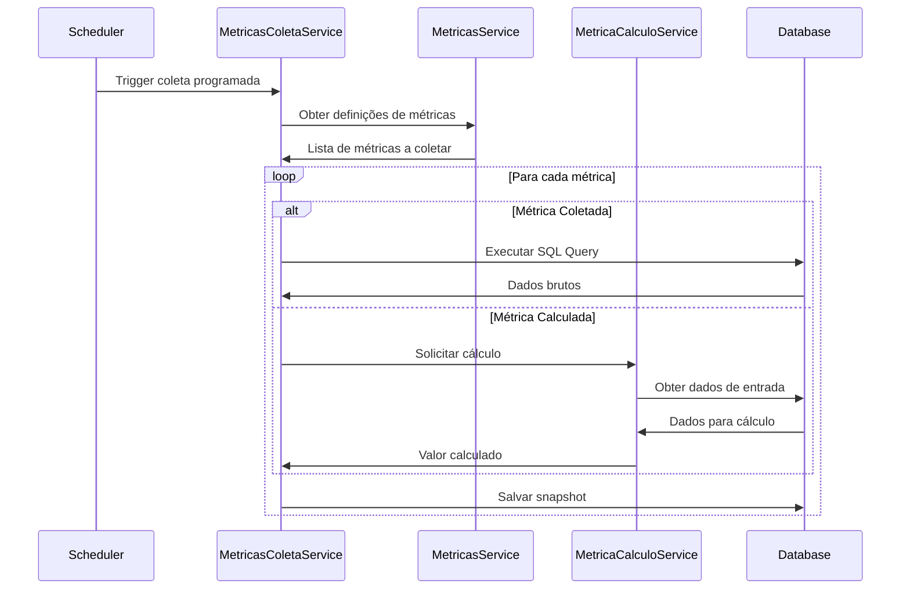
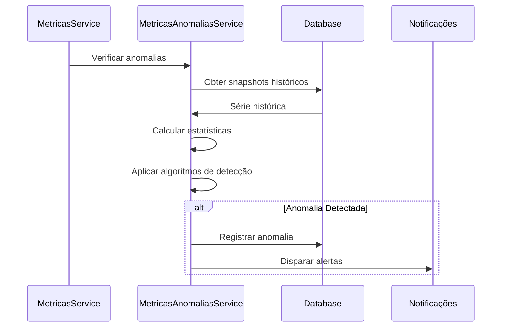

# Resumo Técnico do Módulo de Métricas

## Arquitetura

O módulo de métricas do PGBen foi projetado seguindo os princípios de arquitetura limpa e orientação a domínio, com separação clara de responsabilidades entre as camadas:

```
┌─────────────────┐     ┌─────────────────┐     ┌─────────────────┐
│   Controllers   │────▶│    Services     │────▶│   Repositories  │
└─────────────────┘     └─────────────────┘     └─────────────────┘
        │                       │                       │
        ▼                       ▼                       ▼
┌─────────────────┐     ┌─────────────────┐     ┌─────────────────┐
│      DTOs       │     │    Entities     │     │   Database      │
└─────────────────┘     └─────────────────┘     └─────────────────┘
```

### Componentes Principais

1. **Entidades**:
   - `MetricaDefinicao`: Define o conceito e estrutura de uma métrica
   - `MetricaSnapshot`: Armazena valores coletados ou calculados
   - `MetricaConfiguracao`: Configura comportamentos de coleta e alertas

2. **Serviços**:
   - `MetricasService`: Gerencia o ciclo de vida das definições de métricas
   - `MetricasColetaService`: Responsável pela coleta programada e reativa
   - `MetricaCalculoService`: Implementa algoritmos de cálculo para diferentes tipos
   - `MetricasCacheService`: Otimiza performance através de estratégias de cache
   - `MetricasAnomaliasService`: Detecta anomalias e analisa tendências

3. **Controladores**:
   - `MetricasDefinicaoController`: Endpoints para gerenciar definições
   - `MetricasValoresController`: Endpoints para consulta de valores
   - `MetricasAnaliseController`: Endpoints para análise de dados
   - `MetricasDashboardController`: Endpoints otimizados para dashboards
   - `MetricasExportacaoController`: Endpoints para exportação de dados

4. **DTOs**:
   - DTOs específicos para criação, atualização e consulta de métricas
   - Validação de dados de entrada através de decoradores

## Fluxos Principais

### Fluxo de Coleta de Métricas



### Fluxo de Detecção de Anomalias



## Estratégias de Otimização

### Caching

O módulo implementa uma estratégia de cache em múltiplas camadas:

1. **Cache de Definições**: Definições de métricas são cacheadas para reduzir consultas ao banco
2. **Cache de Valores**: Valores frequentemente acessados são cacheados com TTL configurável
3. **Cache de Agregações**: Agregações temporais (diária, semanal, mensal) são pré-calculadas

### Processamento Assíncrono

Para cálculos intensivos, o módulo utiliza processamento assíncrono:

1. Coletas programadas são executadas em background
2. Cálculos complexos são delegados a workers
3. Invalidação de cache é realizada de forma assíncrona

### Particionamento de Dados

Para métricas com grande volume de dados históricos:

1. Snapshots são particionados por período
2. Consultas são otimizadas para acessar apenas as partições relevantes
3. Dados antigos são automaticamente arquivados conforme política de retenção

## Extensibilidade

O módulo foi projetado para ser facilmente extensível:

1. **Novos Tipos de Métricas**: Implementação do padrão Strategy para diferentes algoritmos
2. **Novos Formatos de Exportação**: Estrutura plugável para adicionar formatos
3. **Novos Algoritmos de Análise**: Interface comum para algoritmos de detecção de anomalias

## Integração com Outros Módulos

O módulo de métricas se integra com outros componentes do sistema:

1. **Módulo de Auditoria**: Registro de operações sensíveis
2. **Módulo de Notificações**: Alertas sobre anomalias
3. **Módulo de Relatórios**: Geração de relatórios periódicos
4. **Módulo de Dashboard**: Alimentação de visualizações em tempo real

## Considerações de Segurança

1. **Controle de Acesso**: Endpoints protegidos por autenticação JWT e autorização baseada em papéis
2. **Validação de Entradas**: Todos os inputs são validados antes do processamento
3. **Sanitização de SQL**: Consultas SQL definidas pelo usuário são validadas e sanitizadas
4. **Rate Limiting**: Proteção contra sobrecarga por excesso de requisições

## Monitoramento

O módulo expõe suas próprias métricas para monitoramento:

1. **Prometheus**: Métricas de performance e utilização
2. **Logs Estruturados**: Eventos importantes são registrados em formato estruturado
3. **Rastreamento**: Integração com sistemas de tracing distribuído

## Configuração

O módulo é altamente configurável através de:

1. **Variáveis de Ambiente**: Configurações básicas
2. **Arquivo de Configuração**: Configurações avançadas
3. **Configuração Dinâmica**: Parâmetros ajustáveis em tempo de execução

## Testes

A cobertura de testes inclui:

1. **Testes Unitários**: Para lógica de negócio isolada
2. **Testes de Integração**: Para interações entre componentes
3. **Testes de Performance**: Para garantir escalabilidade
4. **Testes de Carga**: Para validar comportamento sob pressão
