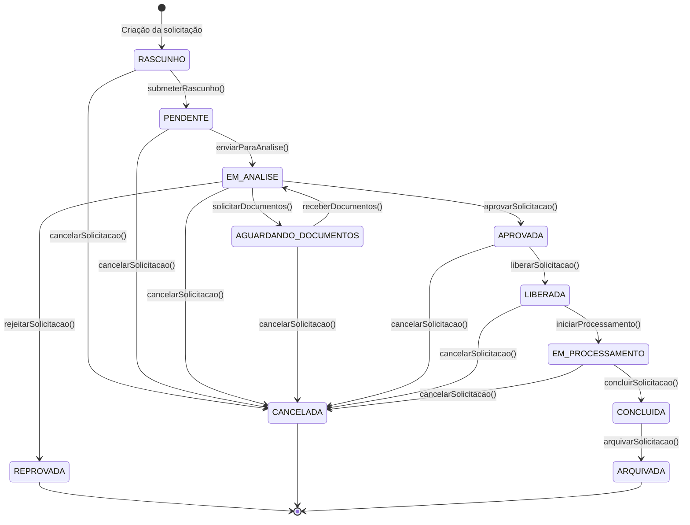
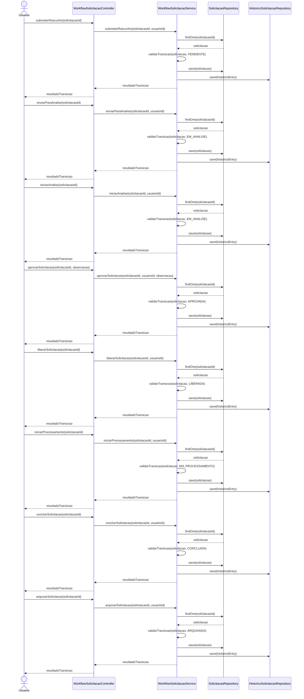
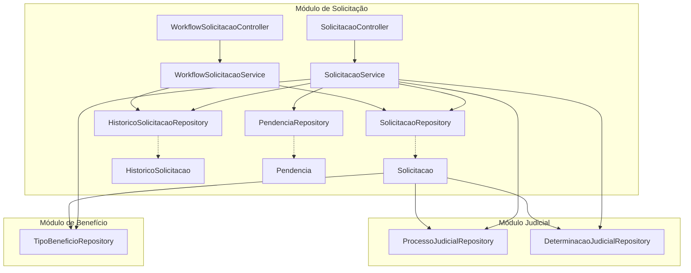
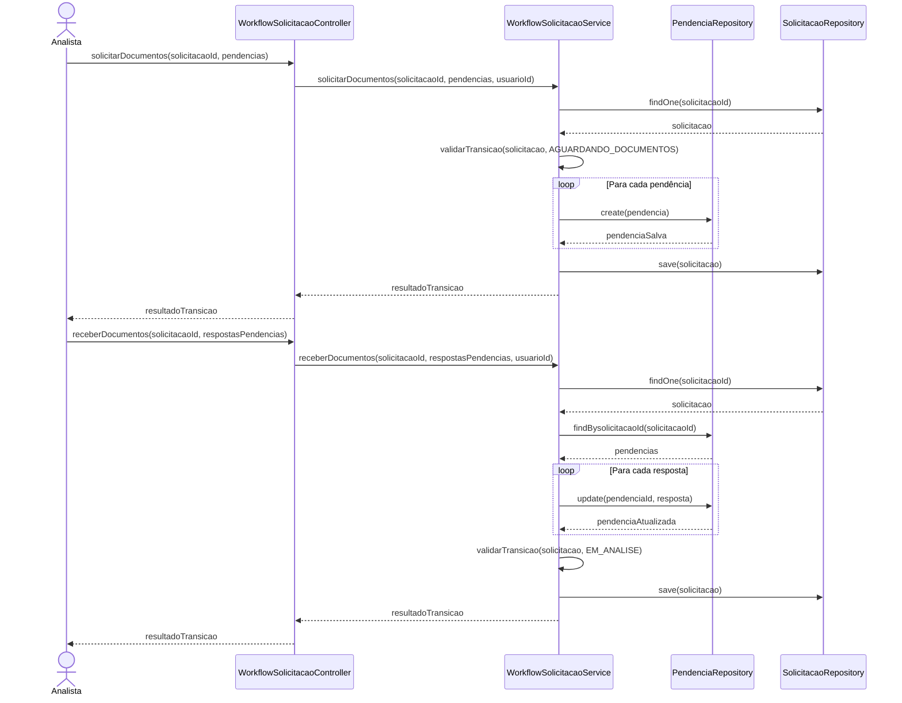
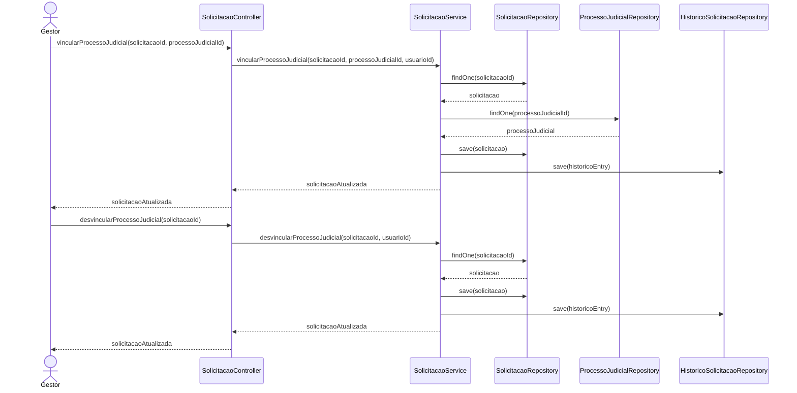
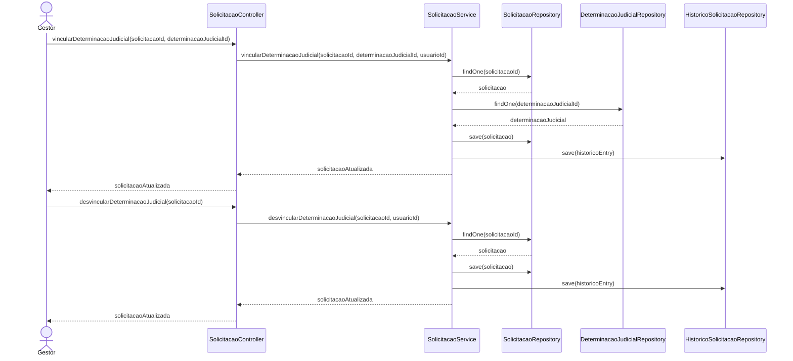

# DIAGRAMA DE FLUXO - MÓDULO DE SOLICITAÇÃO

## Diagrama de Estados e Transições

## Diagrama de Sequência - Fluxo Principal

## Diagrama de Componentes - Módulo de Solicitação

## Matriz de Transições de Estado

| Estado Atual | Estados Possíveis |
|--------------|-------------------|
| RASCUNHO | PENDENTE, CANCELADA |
| PENDENTE | EM_ANALISE, CANCELADA |
| EM_ANALISE | AGUARDANDO_DOCUMENTOS, APROVADA, REPROVADA, CANCELADA |
| AGUARDANDO_DOCUMENTOS | EM_ANALISE, CANCELADA |
| APROVADA | LIBERADA, CANCELADA |
| LIBERADA | EM_PROCESSAMENTO, CANCELADA |
| EM_PROCESSAMENTO | CONCLUIDA, CANCELADA |
| CONCLUIDA | ARQUIVADA |
| REPROVADA | - |
| CANCELADA | - |
| ARQUIVADA | - |

## Fluxo de Pendências

## Fluxo de Processos Judiciais

## Fluxo de Determinações Judiciais

