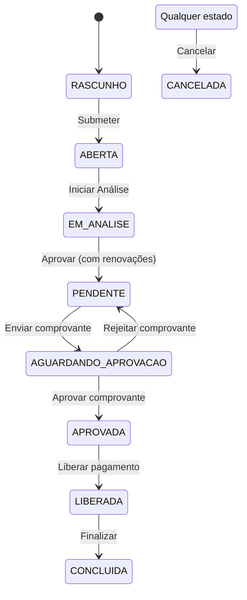

# Plano de Ação - Implementação de Melhorias e Correções

## 🎯 OBJETIVO

Implementar as funcionalidades ausentes e corrigir as pendências identificadas na análise de conformidade, com foco especial no fluxo de renovação automática do benefício de Aluguel Social, garantindo conformidade com a Especificação Técnica e legislação vigente.

**Garantir que a API desenvolvida para o Sistema de Gestão de Benefícios Eventuais (SOBE) da SEMTAS está 100% aderente às especificações antes do deployment em produção.**

## 📋 RESUMO DAS PENDÊNCIAS

### 1. Controle de Exclusividade de Papéis (C1)
- ❌ Validação para impedir que um cidadão seja beneficiário e membro de composição familiar simultaneamente
- ❌ Endpoint para verificar conflito de papéis
- ❌ Endpoint para conversão de papel (de membro para beneficiário)
- ❌ Histórico de conversões de papel com notificações automáticas

### 2. Determinações Judiciais (C2)
- ❌ Campos obrigatórios para processos judiciais não implementados
- ❌ Tramitação prioritária não configurada
- ❌ Prazos diferenciados não implementados
- ❌ Relatórios específicos para acompanhamento judicial ausentes

### 3. Workflow de Estados (C3)
- ❌ Estados RASCUNHO e ABERTA faltando
- ❌ Nomenclatura incorreta em alguns estados
- ⚠️ Transições de estado implementadas parcialmente
- ✅ Log de mudanças de estado implementado

### 4. Benefício Natalidade (C4)
- ⚠️ Valor fixo não explicitamente configurado
- ❌ Modalidade PIX não implementada
- ❌ Modalidade bens de consumo não implementada
- ❌ Termo de responsabilidade ausente
- ✅ Validações de prazo implementadas

### 5. Aluguel Social (C5)
- ✅ Valor fixo configurável implementado
- ✅ Prazo até 6 meses implementado
- ✅ Prorrogação por igual período implementada
- ❌ Timeline de pagamento até 15º dia útil não implementada
- ⚠️ Monitoramento mensal com visitas técnicas parcialmente implementado
- ❌ Pagamento retroativo para suspensão por não entrega de recibo não implementado
- ❌ Renovação automática mensal não implementada

### 6. Dados Obrigatórios (D1-D9)
- ⚠️ Campos de Cidadão/Beneficiário parcialmente implementados
- ⚠️ Dados de Endereço parcialmente implementados
- ⚠️ Dados Socioeconômicos parcialmente implementados
- ⚠️ Benefícios e Programas Sociais parcialmente implementados
- ⚠️ Composição Familiar parcialmente implementada
- ❌ Dados Bancários PIX não implementados
- ⚠️ Dados Socioprofissionais parcialmente implementados
- ❌ Dados Específicos por Benefício não implementados
- ❌ Identificação do Requerente não implementada

### 7. Integrações Externas (T1)
- ❌ Integração com Receita Federal não implementada
- ❌ Integração com CadÚnico não implementada
- ❌ Integração com sistema bancário (PIX) não implementada
- ❌ Integração com Correios (CEP) não implementada
- ❌ Integração com Meu SUS Digital não implementada

## 🚀 ESTRATÉGIA DE IMPLEMENTAÇÃO

### Princípios Orientadores
- **Foco no valor**: Priorizar itens com maior impacto para o beneficiário
- **Entrega incremental**: Implementar em fases testáveis
- **Qualidade**: Garantir cobertura de testes adequada
- **Documentação**: Manter documentação atualizada a cada entrega
- **Flexibilidade legislativa**: Garantir adaptação rápida a mudanças legais
- **Integração robusta**: Assegurar compatibilidade com sistemas externos

## 📅 CRONOGRAMA DETALHADO

### Sprint 1: Fundamentos (2 semanas)

#### 1.1 Modelo de Dados (3 dias)
- [ ] Adicionar campos para determinações judiciais
- [ ] Criar tabela `renovacao_aluguel_social`
- [ ] Adicionar campos de controle de parcelas
- [ ] Implementar constraints de unicidade de CPF

#### 1.2 Workflow Básico (4 dias)
- [ ] Implementar estados RASCUNHO e ABERTA
- [ ] Corrigir nomenclatura dos estados existentes
- [ ] Atualizar máquina de estados
- [ ] Implementar histórico de transições

#### 1.3 Controle de Acesso (3 dias)
- [ ] Implementar permissões para novos estados
- [ ] Criar roles específicas para aprovação
- [ ] Implementar validações de acesso

### Sprint 2: Fluxo de Renovação (2 semanas)

#### 2.1 Serviço de Renovação (5 dias)
- [ ] Criar `RenovacaoAluguelSocialService`
- [ ] Implementar geração automática de renovações
- [ ] Criar jobs agendados para vencimentos
- [ ] Implementar validação de período de carência

#### 2.2 Upload e Validação (3 dias)
- [ ] Implementar upload de comprovantes
- [ ] Criar validação de formato/tamanho
- [ ] Implementar pré-visualização de documentos

#### 2.3 Notificações (2 dias)
- [ ] Criar serviço de notificações
- [ ] Implementar templates de e-mail
- [ ] Criar disparos automáticos

### Sprint 3: Aprovação e Pagamento (2 semanas)

#### 3.1 Fluxo de Aprovação (4 dias)
- [ ] Criar interface de análise de comprovantes
- [ ] Implementar aprovação/reprovação
- [ ] Criar histórico de análises
- [ ] Implementar justificativas de reprovação

#### 3.2 Integração Financeira (4 dias)
- [ ] Implementar geração de ordens de pagamento
- [ ] Criar fluxo para pagamento retroativo
- [ ] Implementar conciliação bancária

#### 3.3 Relatórios (2 dias)
- [ ] Criar relatório de renovações
- [ ] Implementar dashboard de acompanhamento
- [ ] Gerar relatórios para auditoria

### Sprint 4: Testes e Ajustes (1 semana)

#### 4.1 Testes Automatizados (3 dias)
- [ ] Criar testes unitários
- [ ] Implementar testes de integração
- [ ] Realizar testes de carga

#### 4.2 Ajustes e Documentação (2 dias)
- [ ] Revisar e ajustar conforme testes
- [ ] Atualizar documentação da API
- [ ] Preparar guia do usuário

## 🔍 DETALHAMENTO TÉCNICO

### 1. Modelo de Dados - Renovação Aluguel Social

```sql
-- Tabela de controle de renovações
CREATE TABLE renovacao_aluguel_social (
    id UUID PRIMARY KEY,
    solicitacao_id UUID REFERENCES solicitacao_beneficio(id),
    parcela INTEGER NOT NULL,
    data_vencimento DATE NOT NULL,
    status VARCHAR(20) NOT NULL,
    comprovante_id UUID REFERENCES anexo(id),
    data_aprovacao TIMESTAMP,
    aprovado_por UUID REFERENCES usuario(id),
    created_at TIMESTAMP DEFAULT NOW(),
    updated_at TIMESTAMP DEFAULT NOW()
);

-- Adicionar colunas na tabela solicitacao_beneficio
ALTER TABLE solicitacao_beneficio 
ADD COLUMN tipo_solicitacao VARCHAR(20) DEFAULT 'inicial',
ADD COLUMN quantidade_parcelas INTEGER,
ADD COLUMN parcela_atual INTEGER DEFAULT 1;
```

### 2. Fluxo de Estados



### 3. Endpoints Principais

#### 3.1 Renovação de Aluguel Social

```
POST /api/renovacao-aluguel-social/gerar-renovacoes
{
    "solicitacao_id": "uuid",
    "quantidade_parcelas": 6,
    "valor_parcela": 600.00,
    "data_primeiro_vencimento": "2025-07-01"
}

POST /api/renovacao-aluguel-social/{id}/comprovante
Content-Type: multipart/form-data
{
    "arquivo": "file",
    "observacao": "Comprovante de aluguel"
}

POST /api/renovacao-aluguel-social/{id}/aprovar
{
    "aprovado": true,
    "justificativa": "Comprovante válido"
}

GET /api/renovacao-aluguel-social/beneficiario/{id}
```

### 4. Regras de Negócio

#### 4.1 Geração de Renovações
- Criar N parcelas conforme `quantidade_parcelas`
- Intervalo fixo de 30 dias entre parcelas
- Herdar dados do beneficiário e valores da solicitação original

#### 4.2 Validação de Comprovante
- Aceitar apenas PDF e imagens (JPG, PNG)
- Tamanho máximo de 5MB
- Validar dados mínimos (nome do locador, valor, período)

#### 4.3 Período de Carência
- Bloquear nova solicitação por 1 ano após última parcela
- Validar na criação de nova solicitação
- Permitir apenas visualização no período de carência

## 📊 CRITÉRIOS DE ACEITAÇÃO

### Funcionais
- [ ] Sistema gera automaticamente as renovações conforme configurado
- [ ] Notificações são enviadas nos prazos corretos
- [ ] Comprovantes são validados conforme regras
- [ ] Pagamentos são processados corretamente
- [ ] Período de carência é respeitado

### Não Funcionais
- [ ] Tempo de resposta médio < 2s
- [ ] Suporte a 1000 usuários concorrentes
- [ ] 95% de cobertura de testes
- [ ] Documentação da API atualizada
- [ ] Guia do administrador disponível

## ⏰ CRONOGRAMA DETALHADO

### Sprint 1: Fundamentos (2 semanas)
- **Dia 1-3**: Modelo de Dados
- **Dia 4-7**: Workflow Básico
- **Dia 8-10**: Controle de Acesso

### Sprint 2: Fluxo de Renovação (2 semanas)
- **Dia 1-5**: Serviço de Renovação
- **Dia 6-8**: Upload e Validação
- **Dia 9-10**: Notificações

### Sprint 3: Aprovação e Pagamento (2 semanas)
- **Dia 1-4**: Fluxo de Aprovação
- **Dia 5-8**: Integração Financeira
- **Dia 9-10**: Relatórios

### Sprint 4: Testes e Ajustes (1 semana)
- **Dia 1-3**: Testes Automatizados
- **Dia 4-5**: Ajustes e Documentação

## 📦 ENTREGÁVEIS

### Por Sprint
- **Sprint 1**: Modelo de dados e fluxo básico funcionando
- **Sprint 2**: Renovações automáticas e notificações
- **Sprint 3**: Fluxo completo de aprovação e pagamento
- **Sprint 4**: Sistema pronto para produção

### Documentação
- [ ] Especificação técnica
- [ ] Guia de implantação
- [ ] Manual do usuário
- [ ] API Documentation (Swagger/OpenAPI)

## 🚀 PRÓXIMOS PASSOS

1. **Revisão do Plano**
   - Validar cronograma com a equipe
   - Ajustar prioridades conforme necessidade
   - Definir métricas de acompanhamento

2. **Preparação do Ambiente**
   - Configurar ambiente de desenvolvimento
   - Preparar banco de dados de teste
   - Configurar ferramentas de CI/CD

3. **Kick-off**
   - Alinhar equipe sobre o plano
   - Definir cerimônias ágeis
   - Estabelecer canais de comunicação

## 📞 SUPORTE

Para dúvidas ou problemas:
- **Equipe Técnica**: #dev-pgben no Slack
- **Gestor do Projeto**: gestor@semtas.natal.rn.gov.br
- **Urgências**: (84) 99999-9999

---

**Última Atualização**: 24/05/2025  
**Versão do Plano**: 1.0  
**Responsável**: Equipe de Desenvolvimento PGBen