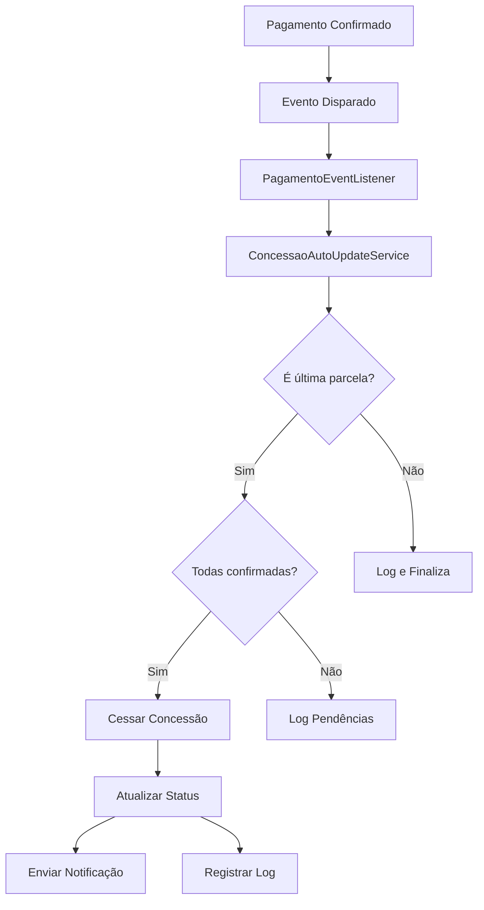

# Cessação Automática de Concessão

## Visão Geral

Esta funcionalidade implementa a cessação automática de concessões quando todas as parcelas de pagamento são confirmadas. O sistema monitora o status dos pagamentos e atualiza automaticamente o status da concessão para `CESSADO` quando apropriado.

## Arquitetura da Solução

### Componentes Principais

1. **ConcessaoAutoUpdateService** - Serviço dedicado para lógica de atualização automática
2. **PagamentoEventListener** - Listener de eventos para monitorar mudanças de status
3. **Integração com PagamentoService e ConfirmacaoService** - Pontos de entrada para verificações

### Fluxo de Funcionamento



## Implementação Técnica

### 1. ConcessaoAutoUpdateService

**Localização:** `src/modules/pagamento/services/concessao-auto-update.service.ts`

**Responsabilidades:**
- Verificar se uma concessão pode ser cessada
- Processar atualizações de status da concessão
- Obter estatísticas das parcelas
- Enviar notificações de cessação

**Métodos Principais:**

#### `verificarEAtualizarConcessao(pagamento: Pagamento)`
- Verifica se o pagamento é a última parcela
- Se for, verifica se todas as parcelas estão confirmadas
- Cessa a concessão se todas as condições forem atendidas

#### `processarAtualizacaoConcessao(pagamento: Pagamento)`
- Atualiza status da concessão para ATIVO quando primeira parcela é confirmada
- Usado pelo PagamentoService

#### `verificarFinalizacaoConcessao(pagamento: Pagamento)`
- Verifica se a concessão deve ser finalizada após confirmação
- Usado pelo PagamentoService

#### `podeSerCessada(concessaoId: string): Promise<boolean>`
- Verifica se todas as parcelas de uma concessão estão confirmadas
- Retorna true se a concessão pode ser cessada

#### `obterEstatisticasParcelas(concessaoId: string)`
- Retorna estatísticas das parcelas (total, confirmadas, pendentes, percentual)

### 2. Integração com Eventos

**Localização:** `src/modules/pagamento/listeners/pagamento-event.listener.ts`

O listener monitora eventos de mudança de status de pagamento e aciona a verificação automática:

```typescript
@OnEvent('pagamento.status.atualizado')
async handlePagamentoStatusAtualizado(pagamento: Pagamento) {
  await this.concessaoAutoUpdateService.verificarEAtualizarConcessao(pagamento);
}
```

### 3. Integração com Serviços Existentes

#### PagamentoService
- Integrado nos métodos de confirmação de pagamento
- Chama `processarAtualizacaoConcessao` e `verificarFinalizacaoConcessao`

#### ConfirmacaoService
- Integrado no processo de confirmação
- Chama `verificarEAtualizarConcessao` após confirmação

## Configuração e Dependências

### Dependências Adicionadas

1. **ConcessaoAutoUpdateService** adicionado aos providers do PagamentoModule
2. **Injeção de dependências** configurada com `forwardRef` para evitar dependências circulares

### Configuração do Módulo

```typescript
// pagamento.module.ts
providers: [
  // ... outros providers
  ConcessaoAutoUpdateService,
]
```

## Logs e Monitoramento

O sistema registra logs detalhados para auditoria:

- **Verificação de última parcela:** Log quando uma parcela é identificada como última
- **Estatísticas de parcelas:** Log do status atual das parcelas
- **Cessação de concessão:** Log quando uma concessão é cessada automaticamente
- **Erros:** Log de erros durante o processamento

Exemplo de logs:
```
[ConcessaoAutoUpdateService] Verificando se pagamento pag-123 é última parcela da concessão conc-456
[ConcessaoAutoUpdateService] Estatísticas da concessão conc-456: 3 total, 3 confirmadas, 0 pendentes (100% concluído)
[ConcessaoAutoUpdateService] Concessão conc-456 cessada automaticamente após confirmação de todas as parcelas
```

## Notificações

Quando uma concessão é cessada automaticamente, o sistema:

1. Envia notificação via NotificacaoService
2. Inclui informações sobre a concessão cessada
3. Registra a data e motivo do encerramento

## Testes

### Testes Unitários
**Localização:** `src/modules/pagamento/services/concessao-auto-update.service.spec.ts`

Cobertura de testes:
- ✅ Verificação de última parcela
- ✅ Cessação quando todas parcelas confirmadas
- ✅ Não cessação quando parcelas pendentes
- ✅ Obtenção de estatísticas
- ✅ Processamento de atualizações
- ✅ Tratamento de erros

### Testes de Integração
**Localização:** `test/integration/concessao-auto-cessacao.e2e-spec.ts`

Cobertura de testes:
- ✅ Fluxo completo de cessação automática
- ✅ Integração com eventos
- ✅ Verificação de estatísticas
- ✅ Cenários de não cessação

## Considerações de Performance

1. **Consultas Otimizadas:** Uso de consultas específicas para contar parcelas confirmadas
2. **Processamento Assíncrono:** Verificações executadas de forma assíncrona
3. **Cache de Resultados:** Estatísticas calculadas sob demanda
4. **Logs Estruturados:** Logs organizados para facilitar monitoramento

## Segurança

1. **Validação de Dados:** Verificação de existência de concessão e pagamentos
2. **Tratamento de Erros:** Captura e log de erros sem interromper fluxo principal
3. **Auditoria:** Logs detalhados para rastreabilidade
4. **Transações:** Operações de atualização em transações quando necessário

## Manutenção e Evolução

### Pontos de Extensão

1. **Regras de Cessação:** Facilmente extensível para novas regras de negócio
2. **Tipos de Notificação:** Suporte a diferentes canais de notificação
3. **Métricas:** Integração com sistemas de monitoramento
4. **Webhooks:** Possibilidade de adicionar webhooks para eventos de cessação

### Monitoramento Recomendado

1. **Taxa de Cessação Automática:** Percentual de concessões cessadas automaticamente
2. **Tempo de Processamento:** Tempo médio para processar verificações
3. **Erros de Processamento:** Monitoramento de falhas no processo
4. **Volume de Notificações:** Quantidade de notificações enviadas

## Troubleshooting

### Problemas Comuns

1. **Concessão não cessada automaticamente**
   - Verificar se todas as parcelas estão com status CONFIRMADO
   - Verificar logs do ConcessaoAutoUpdateService
   - Verificar se eventos estão sendo disparados corretamente

2. **Erros de dependência circular**
   - Verificar uso correto de `forwardRef` nas injeções
   - Verificar ordem de importação dos módulos

3. **Notificações não enviadas**
   - Verificar configuração do NotificacaoService
   - Verificar logs de erro durante envio

### Comandos de Diagnóstico

```bash
# Verificar logs do serviço
grep "ConcessaoAutoUpdateService" logs/application.log

# Verificar status das concessões
SELECT id, status, data_encerramento FROM concessoes WHERE status = 'CESSADO';

# Verificar parcelas pendentes
SELECT c.id, COUNT(p.id) as parcelas_pendentes 
FROM concessoes c 
JOIN pagamentos p ON c.id = p.concessao_id 
WHERE p.status != 'CONFIRMADO' 
GROUP BY c.id;
```

## Changelog

### v1.0.0 - Implementação Inicial
- ✅ Criação do ConcessaoAutoUpdateService
- ✅ Integração com sistema de eventos
- ✅ Integração com PagamentoService e ConfirmacaoService
- ✅ Implementação de testes unitários e de integração
- ✅ Sistema de logs e notificações
- ✅ Documentação completa