# ⚠️ MIGRADO: Sistema de Notificações - SSE → Ably

## IMPORTANTE - SISTEMA DESCONTINUADO

> **Este documento é mantido apenas para referência histórica. O sistema SSE foi completamente substituído pelo Ably.**
> 
> **📋 Para a nova implementação, consulte:** `ably-frontend-integration.md`

## ~~Visão Geral~~

~~Este documento explica como implementar Server-Sent Events (SSE) no frontend e como funciona o sistema de eventos de notificação entre módulos no Sistema SEMTAS.~~

**MIGRAÇÃO CONCLUÍDA**: O sistema de notificações em tempo real foi migrado de Server-Sent Events (SSE) para Ably, oferecendo:
- ✅ Maior confiabilidade de entrega
- ✅ Reconexão automática
- ✅ Melhor escalabilidade
- ✅ Suporte a múltiplos canais
- ✅ Recursos avançados de presença e histórico

## Arquitetura do Sistema de Notificações

### Fluxo de Eventos

```mermaid
graph TD
    A[Módulo Origem] --> B[EventEmitter2]
    B --> C[NotificationListener]
    C --> D[NotificationManagerService]
    D --> E[Processamento da Notificação]
    E --> F[Envio por Email]
    E --> G[Notificação SSE]
    G --> H[Frontend via SSE]
```



## 1. Implementação SSE no Frontend

### 1.1 Configuração Básica

```typescript
// services/sse.service.ts
export class SSEService {
  private eventSource: EventSource | null = null;
  private reconnectAttempts = 0;
  private maxReconnectAttempts = 5;
  private reconnectDelay = 1000;

  constructor(private authService: AuthService) {}

  connect(userId: string): Observable<any> {
    return new Observable(observer => {
      const token = this.authService.getToken();
      const url = `${environment.apiUrl}/notifications/sse/${userId}?token=${token}`;
      
      this.eventSource = new EventSource(url);

      this.eventSource.onopen = () => {
        console.log('SSE connection opened');
        this.reconnectAttempts = 0;
        observer.next({ type: 'connection', status: 'connected' });
      };

      this.eventSource.onmessage = (event) => {
        try {
          const data = JSON.parse(event.data);
          observer.next(data);
        } catch (error) {
          console.error('Error parsing SSE data:', error);
        }
      };

      this.eventSource.onerror = (error) => {
        console.error('SSE error:', error);
        this.handleReconnection(observer, userId);
      };

      // Cleanup function
      return () => {
        this.disconnect();
      };
    });
  }

  private handleReconnection(observer: any, userId: string) {
    if (this.reconnectAttempts < this.maxReconnectAttempts) {
      this.reconnectAttempts++;
      setTimeout(() => {
        console.log(`Reconnecting... Attempt ${this.reconnectAttempts}`);
        this.connect(userId).subscribe(observer);
      }, this.reconnectDelay * this.reconnectAttempts);
    } else {
      observer.error('Max reconnection attempts reached');
    }
  }

  disconnect() {
    if (this.eventSource) {
      this.eventSource.close();
      this.eventSource = null;
    }
  }
}
```

### 1.2 Componente de Notificações

```typescript
// components/notifications/notifications.component.ts
@Component({
  selector: 'app-notifications',
  template: `
    <div class="notifications-container">
      <div *ngFor="let notification of notifications" 
           class="notification" 
           [ngClass]="notification.type">
        <div class="notification-content">
          <h4>{{ notification.title }}</h4>
          <p>{{ notification.message }}</p>
          <small>{{ notification.timestamp | date:'short' }}</small>
        </div>
        <button (click)="markAsRead(notification.id)" 
                class="close-btn">&times;</button>
      </div>
    </div>
  `
})
export class NotificationsComponent implements OnInit, OnDestroy {
  notifications: Notification[] = [];
  private sseSubscription?: Subscription;

  constructor(
    private sseService: SSEService,
    private authService: AuthService,
    private notificationService: NotificationService
  ) {}

  ngOnInit() {
    const currentUser = this.authService.getCurrentUser();
    if (currentUser) {
      this.connectToSSE(currentUser.id);
      this.loadExistingNotifications();
    }
  }

  private connectToSSE(userId: string) {
    this.sseSubscription = this.sseService.connect(userId).subscribe({
      next: (data) => {
        if (data.type === 'notification') {
          this.addNotification(data.payload);
          this.showToast(data.payload);
        }
      },
      error: (error) => {
        console.error('SSE connection error:', error);
        this.showErrorToast('Conexão com notificações perdida');
      }
    });
  }

  private addNotification(notification: any) {
    this.notifications.unshift({
      id: notification.id,
      title: notification.titulo,
      message: notification.mensagem,
      type: notification.tipo,
      timestamp: new Date(notification.created_at),
      read: false
    });
  }

  private showToast(notification: any) {
    // Implementar toast notification
    // Pode usar bibliotecas como ngx-toastr
  }

  markAsRead(notificationId: string) {
    this.notificationService.markAsRead(notificationId).subscribe(() => {
      this.notifications = this.notifications.filter(n => n.id !== notificationId);
    });
  }

  ngOnDestroy() {
    if (this.sseSubscription) {
      this.sseSubscription.unsubscribe();
    }
    this.sseService.disconnect();
  }
}
```

### 1.3 Service de Notificações

```typescript
// services/notification.service.ts
@Injectable({
  providedIn: 'root'
})
export class NotificationService {
  private apiUrl = `${environment.apiUrl}/notifications`;

  constructor(private http: HttpClient) {}

  getNotifications(page = 1, limit = 20): Observable<any> {
    return this.http.get(`${this.apiUrl}?page=${page}&limit=${limit}`);
  }

  markAsRead(notificationId: string): Observable<any> {
    return this.http.patch(`${this.apiUrl}/${notificationId}/read`, {});
  }

  markAllAsRead(): Observable<any> {
    return this.http.patch(`${this.apiUrl}/read-all`, {});
  }

  getUnreadCount(): Observable<number> {
    return this.http.get<{count: number}>(`${this.apiUrl}/unread-count`)
      .pipe(map(response => response.count));
  }
}
```

## 2. Sistema de Eventos Entre Módulos

### 2.1 Configuração do EventEmitter2

O sistema utiliza EventEmitter2 para comunicação assíncrona entre módulos:

```typescript
// app.module.ts
@Module({
  imports: [
    EventEmitterModule.forRoot({
      wildcard: false,
      delimiter: '.',
      newListener: false,
      removeListener: false,
      maxListeners: 10,
      verboseMemoryLeak: false,
      ignoreErrors: false,
    }),
    // outros módulos...
  ],
})
export class AppModule {}
```

### 2.2 Eventos Disponíveis

```typescript
// events/notification.events.ts
export const NOTIFICATION_EVENTS = {
  USER_CREATED: 'user.created',
  USER_PASSWORD_RESET: 'user.password.reset',
  SOLICITACAO_CREATED: 'solicitacao.created',
  SOLICITACAO_APPROVED: 'solicitacao.approved',
  SOLICITACAO_REJECTED: 'solicitacao.rejected',
  DOCUMENTO_UPLOADED: 'documento.uploaded',
  BENEFICIO_APPROVED: 'beneficio.approved',
} as const;

export interface UserCreatedEvent {
  userId: string;
  email: string;
  nome: string;
  temporaryPassword?: string;
  createdBy: string;
}

export interface SolicitacaoStatusEvent {
  solicitacaoId: string;
  cidadaoId: string;
  status: string;
  observacoes?: string;
  updatedBy: string;
}
```

## 3. Exemplo Prático: Cadastro de Usuário

### 3.1 Módulo de Usuário - Emissor do Evento

```typescript
// modules/usuario/services/usuario.service.ts
@Injectable()
export class UsuarioService {
  constructor(
    @InjectRepository(Usuario)
    private usuarioRepository: Repository<Usuario>,
    private eventEmitter: EventEmitter2,
    private cryptoService: CryptoService
  ) {}

  async createUsuario(createUsuarioDto: CreateUsuarioDto, createdBy: string): Promise<Usuario> {
    // Gerar senha temporária se não fornecida
    const temporaryPassword = this.generateTemporaryPassword();
    const hashedPassword = await this.cryptoService.hashPassword(temporaryPassword);

    // Criar usuário
    const usuario = this.usuarioRepository.create({
      ...createUsuarioDto,
      senha: hashedPassword,
      status: StatusUsuario.ATIVO,
      primeiro_acesso: true,
      created_by: createdBy
    });

    const savedUsuario = await this.usuarioRepository.save(usuario);

    // Emitir evento para notificação
    this.eventEmitter.emit(NOTIFICATION_EVENTS.USER_CREATED, {
      userId: savedUsuario.id,
      email: savedUsuario.email,
      nome: savedUsuario.nome,
      temporaryPassword,
      createdBy
    } as UserCreatedEvent);

    return savedUsuario;
  }

  private generateTemporaryPassword(): string {
    return Math.random().toString(36).slice(-8).toUpperCase();
  }
}
```

### 3.2 Módulo de Notificação - Listener do Evento

```typescript
// modules/notificacao/listeners/user-notification.listener.ts
@Injectable()
export class UserNotificationListener {
  constructor(
    private notificationManagerService: NotificationManagerService,
    private emailService: EmailService,
    private templateService: TemplateService
  ) {}

  @OnEvent(NOTIFICATION_EVENTS.USER_CREATED)
  async handleUserCreated(event: UserCreatedEvent) {
    try {
      // 1. Enviar email de boas-vindas
      await this.sendWelcomeEmail(event);

      // 2. Criar notificação no sistema
      await this.createSystemNotification(event);

      // 3. Notificar administradores via SSE
      await this.notifyAdministrators(event);

    } catch (error) {
      console.error('Erro ao processar evento de usuário criado:', error);
      // Implementar retry ou dead letter queue
    }
  }

  private async sendWelcomeEmail(event: UserCreatedEvent) {
    const template = await this.templateService.getTemplate('USER_WELCOME');
    
    const emailData = {
      to: event.email,
      subject: 'Bem-vindo ao Sistema SEMTAS',
      template: template.conteudo,
      variables: {
        nome: event.nome,
        senha_temporaria: event.temporaryPassword,
        link_acesso: `${process.env.FRONTEND_URL}/login`,
        data_criacao: new Date().toLocaleDateString('pt-BR')
      }
    };

    await this.emailService.sendEmail(emailData);
  }

  private async createSystemNotification(event: UserCreatedEvent) {
    await this.notificationManagerService.createNotification({
      destinatario_id: event.userId,
      tipo: TipoNotificacao.SISTEMA,
      titulo: 'Conta criada com sucesso',
      mensagem: `Olá ${event.nome}, sua conta foi criada. Verifique seu email para acessar o sistema.`,
      canal: CanalNotificacao.SISTEMA,
      prioridade: PrioridadeNotificacao.ALTA
    });
  }

  private async notifyAdministrators(event: UserCreatedEvent) {
    const adminNotification = {
      tipo: TipoNotificacao.SISTEMA,
      titulo: 'Novo usuário cadastrado',
      mensagem: `Usuário ${event.nome} foi cadastrado no sistema`,
      canal: CanalNotificacao.SSE,
      prioridade: PrioridadeNotificacao.MEDIA,
      metadata: {
        userId: event.userId,
        createdBy: event.createdBy
      }
    };

    // Enviar para todos os administradores conectados via SSE
    await this.notificationManagerService.broadcastToRole(
      'ADMIN',
      adminNotification
    );
  }
}
```

### 3.3 Template de Email

```html
<!-- templates/user-welcome.html -->
<!DOCTYPE html>
<html>
<head>
    <meta charset="UTF-8">
    <title>Bem-vindo ao Sistema SEMTAS</title>
    <style>
        .container { max-width: 600px; margin: 0 auto; font-family: Arial, sans-serif; }
        .header { background-color: #2c5aa0; color: white; padding: 20px; text-align: center; }
        .content { padding: 20px; }
        .credentials { background-color: #f5f5f5; padding: 15px; border-radius: 5px; margin: 20px 0; }
        .button { background-color: #2c5aa0; color: white; padding: 12px 24px; text-decoration: none; border-radius: 5px; display: inline-block; }
    </style>
</head>
<body>
    <div class="container">
        <div class="header">
            <h1>Bem-vindo ao Sistema SEMTAS</h1>
        </div>
        <div class="content">
            <p>Olá <strong>{{nome}}</strong>,</p>
            
            <p>Sua conta foi criada com sucesso no Sistema de Gestão de Benefícios Eventuais da SEMTAS.</p>
            
            <div class="credentials">
                <h3>Suas credenciais de acesso:</h3>
                <p><strong>Email:</strong> {{email}}</p>
                <p><strong>Senha temporária:</strong> {{senha_temporaria}}</p>
            </div>
            
            <p><strong>Importante:</strong> Por segurança, você deverá alterar sua senha no primeiro acesso.</p>
            
            <p style="text-align: center; margin: 30px 0;">
                <a href="{{link_acesso}}" class="button">Acessar Sistema</a>
            </p>
            
            <p>Se você tiver dúvidas, entre em contato com o suporte técnico.</p>
            
            <hr>
            <p><small>Conta criada em: {{data_criacao}}</small></p>
        </div>
    </div>
</body>
</html>
```

## 4. Configuração de Monitoramento

### 4.1 Métricas de SSE

```typescript
// modules/monitoring/services/sse-metrics.service.ts
@Injectable()
export class SseMetricsService {
  private connectedClients = new Map<string, Date>();
  private messagesSent = 0;
  private errorsCount = 0;

  addClient(clientId: string) {
    this.connectedClients.set(clientId, new Date());
  }

  removeClient(clientId: string) {
    this.connectedClients.delete(clientId);
  }

  incrementMessagesSent() {
    this.messagesSent++;
  }

  incrementErrors() {
    this.errorsCount++;
  }

  getMetrics() {
    return {
      connectedClients: this.connectedClients.size,
      totalMessagesSent: this.messagesSent,
      totalErrors: this.errorsCount,
      averageConnectionTime: this.calculateAverageConnectionTime()
    };
  }

  private calculateAverageConnectionTime(): number {
    if (this.connectedClients.size === 0) return 0;
    
    const now = new Date();
    const totalTime = Array.from(this.connectedClients.values())
      .reduce((sum, connectTime) => sum + (now.getTime() - connectTime.getTime()), 0);
    
    return totalTime / this.connectedClients.size;
  }
}
```

## 5. Testes

### 5.1 Teste do Listener

```typescript
// modules/notificacao/listeners/__tests__/user-notification.listener.spec.ts
describe('UserNotificationListener', () => {
  let listener: UserNotificationListener;
  let notificationManagerService: jest.Mocked<NotificationManagerService>;
  let emailService: jest.Mocked<EmailService>;

  beforeEach(async () => {
    const module = await Test.createTestingModule({
      providers: [
        UserNotificationListener,
        {
          provide: NotificationManagerService,
          useValue: {
            createNotification: jest.fn(),
            broadcastToRole: jest.fn()
          }
        },
        {
          provide: EmailService,
          useValue: {
            sendEmail: jest.fn()
          }
        }
      ]
    }).compile();

    listener = module.get<UserNotificationListener>(UserNotificationListener);
    notificationManagerService = module.get(NotificationManagerService);
    emailService = module.get(EmailService);
  });

  it('should handle user created event', async () => {
    const event: UserCreatedEvent = {
      userId: '123',
      email: 'test@example.com',
      nome: 'Test User',
      temporaryPassword: 'TEMP123',
      createdBy: 'admin'
    };

    await listener.handleUserCreated(event);

    expect(emailService.sendEmail).toHaveBeenCalledWith(
      expect.objectContaining({
        to: event.email,
        subject: 'Bem-vindo ao Sistema SEMTAS'
      })
    );

    expect(notificationManagerService.createNotification).toHaveBeenCalled();
    expect(notificationManagerService.broadcastToRole).toHaveBeenCalledWith(
      'ADMIN',
      expect.any(Object)
    );
  });
});
```

## 6. Configuração de Produção

### 6.1 Nginx para SSE

```nginx
# nginx.conf
location /api/notifications/sse {
    proxy_pass http://backend;
    proxy_http_version 1.1;
    proxy_set_header Upgrade $http_upgrade;
    proxy_set_header Connection "upgrade";
    proxy_set_header Host $host;
    proxy_set_header X-Real-IP $remote_addr;
    proxy_set_header X-Forwarded-For $proxy_add_x_forwarded_for;
    proxy_set_header X-Forwarded-Proto $scheme;
    
    # SSE specific settings
    proxy_cache off;
    proxy_buffering off;
    proxy_read_timeout 24h;
    proxy_send_timeout 24h;
}
```

### 6.2 Variáveis de Ambiente

```env
# .env
SSE_HEARTBEAT_INTERVAL=30000
SSE_CONNECTION_TIMEOUT=300000
SSE_MAX_CONNECTIONS_PER_USER=3
NOTIFICATION_RETRY_ATTEMPTS=3
NOTIFICATION_RETRY_DELAY=5000
```

## Conclusão

Este sistema de notificações oferece:

1. **Comunicação em tempo real** via SSE
2. **Arquitetura desacoplada** usando eventos
3. **Múltiplos canais** (email, sistema, SSE)
4. **Monitoramento** e métricas
5. **Escalabilidade** e resiliência

O exemplo do cadastro de usuário demonstra como um evento simples pode disparar múltiplas ações de notificação de forma assíncrona e eficiente.