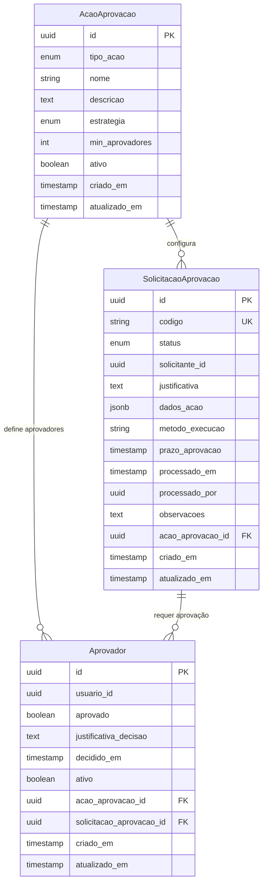
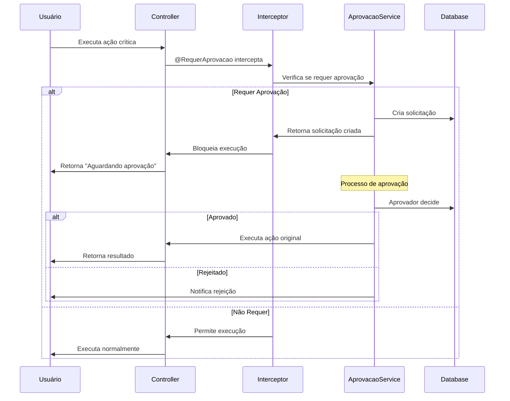

# Sistema de Aprovação v2 - PGBen

## 📋 Visão Geral

O Sistema de Aprovação v2 é uma versão simplificada e otimizada do sistema original de aprovação de ações críticas. Esta refatoração reduziu significativamente a complexidade arquitetural, mantendo todas as funcionalidades essenciais com melhor performance e facilidade de manutenção.

## 🎯 Principais Melhorias

### ✅ Arquitetura Simplificada
- **3 entidades** vs 6 entidades do sistema anterior
- **1 serviço principal** consolidado vs múltiplos serviços especializados
- **2 controllers** vs 4 controllers anteriores
- Remoção de complexidades desnecessárias (delegação, escalação automática, múltiplas estratégias)

### ✅ Performance Otimizada
- Menos joins entre tabelas
- Queries mais simples e eficientes
- Redução de overhead de processamento
- Cache natural através de menos relacionamentos

### ✅ Manutenibilidade
- Código mais limpo e focado
- Menos pontos de falha
- Debugging simplificado
- Testes mais diretos

## 🏗️ Arquitetura

### Estrutura do Módulo

```
src/modules/aprovacao-v2/
├── aprovacao.module.ts              # Módulo principal
├── controllers/
│   ├── aprovacao.controller.ts      # Gestão de solicitações
│   └── configuracao-aprovacao.controller.ts  # Configurações
├── decorators/
│   └── requer-aprovacao.decorator.ts # Decorator @RequerAprovacao
├── dtos/
│   ├── criar-acao-aprovacao.dto.ts
│   ├── criar-solicitacao.dto.ts
│   └── processar-aprovacao.dto.ts
├── entities/
│   ├── acao-aprovacao.entity.ts     # Configuração + Ação (consolidada)
│   ├── solicitacao-aprovacao.entity.ts # Solicitação simplificada
│   └── aprovador.entity.ts          # Aprovador simplificado
├── enums/
│   ├── tipo-acao-critica.enum.ts
│   ├── status-solicitacao.enum.ts
│   └── estrategia-aprovacao.enum.ts
├── interceptors/
│   └── aprovacao.interceptor.ts     # Interceptor simplificado
└── services/
    └── aprovacao.service.ts         # Serviço principal consolidado
```

### Diagrama de Entidades



## 🚀 Como Usar

### 1. Decorator @RequerAprovacao

O decorator é a forma mais simples de marcar métodos que requerem aprovação:

```typescript
import { RequerAprovacao } from '@modules/aprovacao-v2';
import { TipoAcaoCritica } from '@modules/aprovacao-v2/enums';

@Controller('solicitacoes')
export class SolicitacaoController {
  
  @RequerAprovacao({
    tipo: TipoAcaoCritica.CANCELAMENTO_SOLICITACAO,
    descricao: 'Cancelamento de solicitação de benefício',
    permitirAutoAprovacao: false
  })
  @Delete(':id/cancelar')
  async cancelarSolicitacao(
    @Param('id') id: string,
    @Body() dados: CancelarSolicitacaoDto,
    @GetUser() usuario: Usuario
  ) {
    // A lógica será interceptada automaticamente
    return this.solicitacaoService.cancelar(id, dados);
  }
}
```

### 2. Configuração de Ações

Antes de usar o decorator, configure a ação no sistema:

```typescript
// Criar configuração de aprovação
const configuracao = await this.aprovacaoService.criarConfiguracaoAcao({
  tipo_acao: TipoAcaoCritica.CANCELAMENTO_SOLICITACAO,
  nome: 'Cancelamento de Solicitação',
  descricao: 'Cancelamento de solicitação de benefício',
  estrategia: EstrategiaAprovacao.SIMPLES,
  min_aprovadores: 1,
  aprovadores_ids: ['uuid-coordenador-1', 'uuid-diretor-1']
});
```

### 3. Processamento de Aprovações

```typescript
// Aprovar uma solicitação
await this.aprovacaoService.processarAprovacao(
  solicitacaoId,
  aprovadorId,
  true, // aprovado
  'Aprovado conforme análise técnica'
);

// Rejeitar uma solicitação
await this.aprovacaoService.processarAprovacao(
  solicitacaoId,
  aprovadorId,
  false, // rejeitado
  'Documentação insuficiente'
);
```

## 📊 Fluxo de Aprovação



## 🔧 Tipos de Ação Disponíveis

```typescript
export enum TipoAcaoCritica {
  CANCELAMENTO_SOLICITACAO = 'cancelamento_solicitacao',
  SUSPENSAO_BENEFICIO = 'suspensao_beneficio',
  ALTERACAO_DADOS_CRITICOS = 'alteracao_dados_criticos',
  EXCLUSAO_REGISTRO = 'exclusao_registro',
  APROVACAO_EMERGENCIAL = 'aprovacao_emergencial'
}
```

## 📈 Estratégias de Aprovação

O sistema oferece 4 estratégias principais para diferentes cenários de aprovação:

```typescript
export enum EstrategiaAprovacao {
  SIMPLES = 'simples',                    // Qualquer aprovador pode aprovar
  MAIORIA = 'maioria',                    // Maioria dos aprovadores deve aprovar
  ESCALONAMENTO_SETOR = 'escalonamento_setor',  // Escalonamento hierárquico
  AUTOAPROVACAO_PERFIL = 'autoaprovacao_perfil' // Auto-aprovação baseada no perfil
}
```

### Resumo das Estratégias

| Estratégia | Quando Usar | Exemplo de Uso |
|------------|-------------|----------------|
| **SIMPLES** | Ações de baixo risco, processos ágeis | Cancelamento de solicitação por erro |
| **MAIORIA** | Decisões importantes, consenso parcial | Suspensão de benefício por irregularidade |
| **ESCALONAMENTO_SETOR** | Hierarquia organizacional, escalação automática | Alteração de dados críticos |
| **AUTOAPROVACAO_PERFIL** | Usuários com alta autoridade, emergências | Aprovação emergencial de benefício |

### Configuração Básica

```typescript
// Estratégia SIMPLES - Qualquer aprovador
{
  estrategia: EstrategiaAprovacao.SIMPLES,
  min_aprovadores: 1,
  aprovadores_ids: ['uuid-coord-1', 'uuid-coord-2']
}

// Estratégia MAIORIA - Consenso parcial
{
  estrategia: EstrategiaAprovacao.MAIORIA,
  min_aprovadores: 3,
  aprovadores_ids: ['uuid-1', 'uuid-2', 'uuid-3', 'uuid-4', 'uuid-5']
}

// Estratégia ESCALONAMENTO - Hierárquica
{
  estrategia: EstrategiaAprovacao.ESCALONAMENTO_SETOR,
  aprovadores_ids: ['uuid-analista', 'uuid-coord', 'uuid-diretor'],
  configuracao_escalonamento: {
    tempo_limite_nivel: 24, // horas
    nivel_maximo: 3
  }
}

// Estratégia AUTOAPROVACAO - Por perfil
{
  estrategia: EstrategiaAprovacao.AUTOAPROVACAO_PERFIL,
  perfis_autoaprovacao: ['DIRETOR_GERAL', 'COORDENADOR_EMERGENCIA'],
  condicoes_autoaprovacao: {
    valor_maximo: 5000,
    situacao_emergencia: true
  },
  aprovadores_fallback: ['uuid-diretor-regional']
}
```

> 📖 **Para documentação completa das estratégias com exemplos detalhados, consulte:** [Estratégias de Aprovação](./estrategias-aprovacao.md)

## 🔍 Status de Solicitação

```typescript
export enum StatusSolicitacao {
  PENDENTE = 'pendente',
  APROVADA = 'aprovada',
  REJEITADA = 'rejeitada',
  EXECUTADA = 'executada',
  EXPIRADA = 'expirada'
}
```

## 🧪 Testes

O módulo inclui testes abrangentes:

```bash
# Executar todos os testes do módulo
npm test -- "src/modules/aprovacao-v2"

# Executar testes específicos
npm test -- "aprovacao.service.spec.ts"
npm test -- "aprovacao.interceptor.spec.ts"
```

## 📝 Exemplos Práticos

### Exemplo 1: Suspensão de Benefício

```typescript
@RequerAprovacao({
  tipo: TipoAcaoCritica.SUSPENSAO_BENEFICIO,
  descricao: 'Suspensão de benefício por irregularidade'
})
@Patch(':id/suspender')
async suspenderBeneficio(
  @Param('id') id: string,
  @Body() dados: SuspenderBeneficioDto
) {
  return this.beneficioService.suspender(id, dados);
}
```

### Exemplo 2: Exclusão de Registro

```typescript
@RequerAprovacao({
  tipo: TipoAcaoCritica.EXCLUSAO_REGISTRO,
  descricao: 'Exclusão permanente de registro'
})
@Delete(':id')
async excluirRegistro(@Param('id') id: string) {
  return this.registroService.excluir(id);
}
```

## 🔒 Segurança

- **Validação de Permissões**: Integração com sistema ABAC existente
- **Auditoria Automática**: Todos os eventos são auditados
- **Contexto de Escopo**: Respeita unidades e escopos do usuário
- **Sanitização**: Dados de entrada são validados e sanitizados

## 📚 Documentação Adicional

1. **[Estratégias de Aprovação](./estrategias-aprovacao.md)** - Guia completo das estratégias com exemplos detalhados
2. **[Guia de Migração](../guia-migracao-aprovacao-v2.md)** - Como migrar do sistema anterior
3. **[API Reference](./api-reference.md)** - Documentação completa da API
4. **[Exemplos Avançados](./exemplos-avancados.md)** - Casos de uso complexos
5. **[Troubleshooting](./troubleshooting.md)** - Resolução de problemas comuns

## 🤝 Contribuição

Para contribuir com melhorias:

1. Siga os padrões de código estabelecidos
2. Inclua testes para novas funcionalidades
3. Atualize a documentação conforme necessário
4. Execute `npm run check` antes de commitar