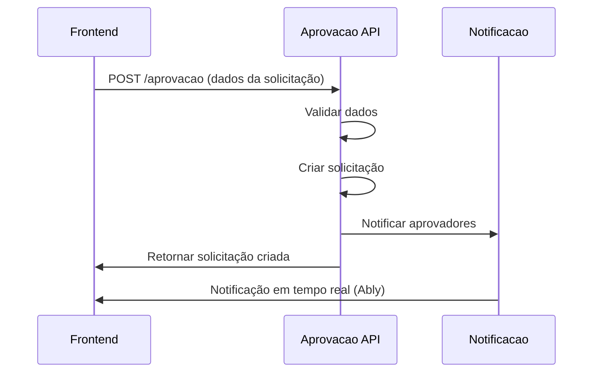
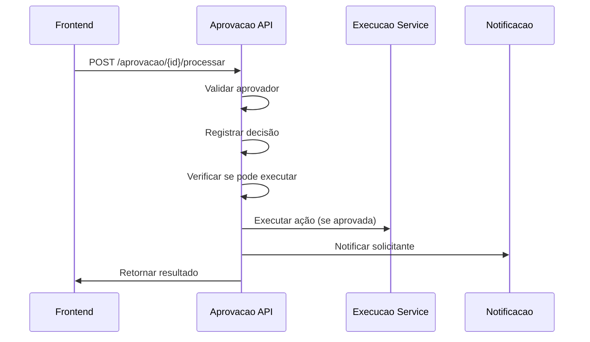

# Documentação Técnica - Módulo Aprovação v2

## Sumário

1. [Objetivo e Conceito](#objetivo-e-conceito)
2. [Arquitetura](#arquitetura)
3. [Integração com Outros Módulos](#integração-com-outros-módulos)
4. [Integração com o Frontend](#integração-com-o-frontend)
5. [Diagramas](#diagramas)
6. [FAQ (Perguntas Frequentes)](#faq-perguntas-frequentes)

---

## Objetivo e Conceito

### Finalidade Principal

O módulo **Aprovação v2** é um sistema robusto e flexível para gerenciar fluxos de aprovação de ações críticas no Sistema de Gestão de Benefícios Eventuais - Kit Enxoval da SEMTAS. Ele centraliza o controle de operações sensíveis que requerem validação hierárquica antes da execução.

### Objetivos Específicos

1. **Controle de Ações Críticas**: Interceptar e gerenciar operações que podem impactar significativamente o sistema ou os dados
2. **Flexibilidade de Estratégias**: Suportar múltiplas estratégias de aprovação (simples, maioria, escalonamento, auto-aprovação)
3. **Auditoria Completa**: Registrar todas as decisões e ações para compliance e rastreabilidade
4. **Notificações em Tempo Real**: Manter todos os stakeholders informados sobre o status das solicitações
5. **Execução Automática**: Executar automaticamente as ações aprovadas

### Conceitos Fundamentais

#### Ação Crítica
Operação que requer aprovação antes da execução, como:
- Cancelamento de solicitações
- Alteração de dados críticos
- Exclusão de registros
- Aprovação de pagamentos

#### Estratégias de Aprovação
- **SIMPLES**: Requer aprovação de um número mínimo de aprovadores
- **MAIORIA**: Requer aprovação da maioria dos aprovadores designados
- **ESCALONAMENTO_SETOR**: Escalona para aprovadores do setor específico
- **AUTOAPROVACAO_PERFIL**: Permite auto-aprovação para perfis específicos

#### Fluxo de Vida da Solicitação
1. **PENDENTE**: Aguardando aprovação
2. **APROVADA**: Aprovada e pronta para execução
3. **REJEITADA**: Rejeitada por um ou mais aprovadores
4. **EXECUTADA**: Ação executada com sucesso
5. **ERRO_EXECUCAO**: Falha na execução da ação

---

## Arquitetura

### Estrutura Geral

O módulo segue a arquitetura em camadas do NestJS com separação clara de responsabilidades:

```
src/modules/aprovacao-v2/
├── controllers/           # Camada de apresentação (APIs REST)
├── services/             # Camada de negócio
├── entities/             # Modelos de dados (TypeORM)
├── dtos/                 # Objetos de transferência de dados
├── enums/                # Enumerações e constantes
├── decorators/           # Decorators customizados
├── interceptors/         # Interceptadores de requisições
├── listeners/            # Listeners de eventos
└── aprovacao.module.ts   # Configuração do módulo
```

### Componentes Principais

#### 1. Entidades (Modelo de Dados)

**AcaoAprovacao**
- Configura tipos de ações que requerem aprovação
- Define estratégias e regras de aprovação
- Relaciona-se com aprovadores e solicitações

**SolicitacaoAprovacao**
- Representa uma solicitação de aprovação específica
- Contém dados da ação, justificativas e anexos
- Rastreia status e histórico de decisões

**Aprovador**
- Registra decisões individuais de aprovação
- Armazena justificativas e anexos da decisão
- Vincula usuários às configurações de aprovação

#### 2. Serviços (Lógica de Negócio)

**AprovacaoService**
- Serviço principal que centraliza toda a lógica de aprovação
- Gerencia criação, processamento e execução de solicitações
- Implementa diferentes estratégias de aprovação
- Coordena notificações e auditoria

**ExecucaoAcaoService**
- Responsável pela execução automática de ações aprovadas
- Realiza requisições HTTP para endpoints específicos
- Trata erros de execução e registra resultados

#### 3. Controladores (APIs)

**AprovacaoController**
- Gerencia solicitações de aprovação
- Endpoints para criar, listar e processar solicitações
- Controle de acesso baseado em permissões

**ConfiguracaoAprovacaoController**
- Gerencia configurações de ações críticas
- CRUD completo para configurações de aprovação
- Gerenciamento de aprovadores por configuração

#### 4. Interceptadores

**AprovacaoInterceptor**
- Intercepta requisições marcadas com `@RequerAprovacao`
- Verifica necessidade de aprovação
- Cria solicitações automaticamente
- Permite auto-aprovação quando configurado

#### 5. Listeners de Eventos

**AprovacaoAuditListener**
- Captura eventos do sistema de aprovação
- Registra auditoria detalhada de todas as operações
- Classifica eventos por nível de risco

**AprovacaoAblyListener**
- Envia notificações em tempo real via Ably
- Notifica solicitantes, aprovadores e administradores
- Substitui sistema SSE anterior

### Tecnologias Utilizadas

- **NestJS**: Framework principal
- **TypeScript**: Linguagem de programação
- **TypeORM**: ORM para banco de dados
- **PostgreSQL**: Banco de dados relacional
- **Class-validator**: Validação de DTOs
- **EventEmitter2**: Sistema de eventos
- **Ably**: Notificações em tempo real
- **Jest**: Testes unitários e integração

### Padrões de Design

1. **Repository Pattern**: Acesso a dados via repositórios TypeORM
2. **Observer Pattern**: Sistema de eventos para desacoplamento
3. **Strategy Pattern**: Diferentes estratégias de aprovação
4. **Decorator Pattern**: Marcação de métodos que requerem aprovação
5. **Interceptor Pattern**: Interceptação transparente de requisições

---

## Integração com Outros Módulos

### Módulos Integrados

#### 1. Módulo de Notificação
- **NotificacaoService**: Envio de notificações por email/SMS
- **AblyService**: Notificações em tempo real
- **NotificationOrchestratorService**: Orquestração de notificações

**Interface de Comunicação:**
```typescript
// Envio de notificação
await this.notificacaoService.enviarNotificacao({
  destinatario: usuarioId,
  tipo: 'APROVACAO_PENDENTE',
  dados: { solicitacaoId, codigo }
});
```

#### 2. Módulo de Auditoria
- **AuditEventEmitter**: Emissão de eventos de auditoria
- Registro automático de todas as operações
- Classificação por nível de risco

**Interface de Comunicação:**
```typescript
// Registro de auditoria
await this.auditEventEmitter.emitEntityCreated(
  'SolicitacaoAprovacao',
  solicitacaoId,
  { operation: 'CREATE', userId }
);
```

#### 3. Módulo de Usuário
- **UsuarioService**: Validação de usuários e permissões
- Verificação de perfis para auto-aprovação
- Obtenção de dados de aprovadores

#### 4. Módulo de Autenticação
- **JwtAuthGuard**: Proteção de rotas
- **PermissionGuard**: Controle de acesso baseado em permissões
- **RequiresPermission**: Decorator para permissões específicas

#### 5. SharedBullModule
- Processamento assíncrono de tarefas
- Execução de ações aprovadas em background
- Retry automático em caso de falhas

### Protocolos de Comunicação

1. **Eventos Síncronos**: Para operações críticas que requerem resposta imediata
2. **Eventos Assíncronos**: Para notificações e auditoria
3. **HTTP Requests**: Para execução de ações aprovadas
4. **WebSocket (Ably)**: Para notificações em tempo real

---

## Integração com o Frontend

### APIs Expostas

#### Aprovação Controller (`/v1/aprovacao`)

**POST /** - Criar Solicitação
```typescript
// Request
{
  "tipo_acao": "CANCELAMENTO_SOLICITACAO",
  "justificativa": "Solicitação duplicada",
  "dados_acao": { "solicitacao_id": "uuid" },
  "metodo_execucao": "DELETE /v1/solicitacoes/{id}",
  "prazo_aprovacao": "2024-01-15T10:00:00Z",
  "anexos": []
}

// Response
{
  "message": "Solicitação criada com sucesso",
  "data": {
    "id": "uuid",
    "codigo": "SOL-2024-001",
    "status": "PENDENTE"
  }
}
```

**GET /** - Listar Solicitações
```typescript
// Query Parameters
?status=PENDENTE&solicitante_id=uuid&tipo_acao=CANCELAMENTO_SOLICITACAO&page=1&limit=10

// Response
{
  "data": [
    {
      "id": "uuid",
      "codigo": "SOL-2024-001",
      "status": "PENDENTE",
      "tipo_acao": "CANCELAMENTO_SOLICITACAO",
      "solicitante": { "id": "uuid", "nome": "João" },
      "criado_em": "2024-01-10T10:00:00Z"
    }
  ],
  "total": 1,
  "page": 1,
  "limit": 10
}
```

**GET /:id** - Obter Detalhes
```typescript
// Response
{
  "data": {
    "id": "uuid",
    "codigo": "SOL-2024-001",
    "status": "PENDENTE",
    "justificativa": "Solicitação duplicada",
    "dados_acao": { "solicitacao_id": "uuid" },
    "aprovadores": [
      {
        "id": "uuid",
        "usuario": { "nome": "Maria" },
        "status": "PENDENTE"
      }
    ],
    "anexos": []
  }
}
```

**POST /:id/processar** - Processar Aprovação
```typescript
// Request
{
  "aprovado": true,
  "justificativa": "Aprovado conforme política",
  "anexos": []
}

// Response
{
  "message": "Aprovação processada com sucesso",
  "data": {
    "status": "APROVADA",
    "processado_em": "2024-01-10T11:00:00Z"
  }
}
```

#### Configuração Controller (`/v1/aprovacao/configuracoes`)

**POST /** - Criar Configuração
**GET /** - Listar Configurações
**GET /:id** - Obter Configuração
**PUT /:id** - Atualizar Configuração
**DELETE /:id** - Remover Configuração
**POST /:id/aprovadores** - Adicionar Aprovador
**GET /:id/aprovadores** - Listar Aprovadores
**DELETE /:id/aprovadores/:aprovadorId** - Remover Aprovador
**GET /verificar/:tipoAcao** - Verificar Necessidade de Aprovação

### Fluxos de Interação

#### 1. Fluxo de Criação de Solicitação


#### 2. Fluxo de Processamento


### Dados Trocados

#### Estruturas Principais

**SolicitacaoAprovacao**
```typescript
interface SolicitacaoAprovacao {
  id: string;
  codigo: string;
  status: StatusSolicitacao;
  solicitante_id: string;
  justificativa: string;
  dados_acao: Record<string, any>;
  metodo_execucao: string;
  prazo_aprovacao?: Date;
  anexos: Anexo[];
  aprovadores: Aprovador[];
  criado_em: Date;
  atualizado_em: Date;
}
```

**Aprovador**
```typescript
interface Aprovador {
  id: string;
  usuario_id: string;
  status: 'PENDENTE' | 'APROVADO' | 'REJEITADO';
  justificativa?: string;
  anexos: Anexo[];
  decidido_em?: Date;
}
```

---

## Diagramas

### Diagrama de Arquitetura

```
┌─────────────────────────────────────────────────────────────────┐
│                        FRONTEND                                 │
│  ┌─────────────────┐  ┌─────────────────┐  ┌─────────────────┐ │
│  │   Dashboard     │  │   Solicitações  │  │  Configurações  │ │
│  │   Aprovação     │  │   Pendentes     │  │   Aprovação     │ │
│  └─────────────────┘  └─────────────────┘  └─────────────────┘ │
└─────────────────────────────────────────────────────────────────┘
                                │
                                │ HTTP/REST + WebSocket
                                ▼
┌─────────────────────────────────────────────────────────────────┐
│                    MÓDULO APROVAÇÃO V2                         │
│                                                                 │
│  ┌─────────────────┐  ┌─────────────────┐  ┌─────────────────┐ │
│  │   Controllers   │  │  Interceptors   │  │   Decorators    │ │
│  │                 │  │                 │  │                 │ │
│  │ • Aprovacao     │  │ • Aprovacao     │  │ • @Requer       │ │
│  │ • Configuracao  │  │   Interceptor   │  │   Aprovacao     │ │
│  └─────────────────┘  └─────────────────┘  └─────────────────┘ │
│                                │                                │
│  ┌─────────────────┐  ┌─────────────────┐  ┌─────────────────┐ │
│  │    Services     │  │    Listeners    │  │    Entities     │ │
│  │                 │  │                 │  │                 │ │
│  │ • Aprovacao     │  │ • Audit         │  │ • AcaoAprovacao │ │
│  │ • ExecucaoAcao  │  │ • Ably          │  │ • Solicitacao   │ │
│  │                 │  │                 │  │ • Aprovador     │ │
│  └─────────────────┘  └─────────────────┘  └─────────────────┘ │
└─────────────────────────────────────────────────────────────────┘
                                │
                                │ Events & HTTP
                                ▼
┌─────────────────────────────────────────────────────────────────┐
│                    MÓDULOS INTEGRADOS                          │
│                                                                 │
│  ┌─────────────────┐  ┌─────────────────┐  ┌─────────────────┐ │
│  │   Notificação   │  │    Auditoria    │  │     Usuário     │ │
│  │                 │  │                 │  │                 │ │
│  │ • Email/SMS     │  │ • Logs          │  │ • Autenticação  │ │
│  │ • Ably/WebSocket│  │ • Compliance    │  │ • Permissões    │ │
│  └─────────────────┘  └─────────────────┘  └─────────────────┘ │
└─────────────────────────────────────────────────────────────────┘
```

### Diagrama de Sequência - Fluxo Completo

```
Usuário    Frontend    AprovacaoController    AprovacaoService    ExecucaoAcaoService    NotificacaoService
  │           │                │                     │                    │                     │
  │ Ação      │                │                     │                    │                     │
  │ Crítica   │                │                     │                    │                     │
  │──────────▶│                │                     │                    │                     │
  │           │ POST /aprovacao│                     │                    │                     │
  │           │───────────────▶│                     │                    │                     │
  │           │                │ criarSolicitacao()  │                    │                     │
  │           │                │────────────────────▶│                    │                     │
  │           │                │                     │ gerarCodigo()      │                     │
  │           │                │                     │───────────────────▶│                     │
  │           │                │                     │ salvarSolicitacao()│                     │
  │           │                │                     │───────────────────▶│                     │
  │           │                │                     │ notificarAprovadores()                   │
  │           │                │                     │─────────────────────────────────────────▶│
  │           │                │                     │                    │ enviarNotificacao() │
  │           │                │                     │                    │────────────────────▶│
  │           │ Solicitação    │                     │                    │                     │
  │           │ Criada         │                     │                    │                     │
  │◀──────────│◀───────────────│◀────────────────────│                    │                     │
  │           │                │                     │                    │                     │
  │           │                │                     │                    │                     │
  │ Aprovação │                │                     │                    │                     │
  │──────────▶│                │                     │                    │                     │
  │           │ POST /processar│                     │                    │                     │
  │           │───────────────▶│                     │                    │                     │
  │           │                │ processarAprovacao()│                    │                     │
  │           │                │────────────────────▶│                    │                     │
  │           │                │                     │ verificarAprovacao()                     │
  │           │                │                     │───────────────────▶│                     │
  │           │                │                     │ executarAcao()     │                     │
  │           │                │                     │────────────────────▶│                     │
  │           │                │                     │                    │ HTTP Request        │
  │           │                │                     │                    │────────────────────▶│
  │           │                │                     │ notificarSolicitante()                   │
  │           │                │                     │─────────────────────────────────────────▶│
  │           │ Ação           │                     │                    │                     │
  │           │ Executada      │                     │                    │                     │
  │◀──────────│◀───────────────│◀────────────────────│                    │                     │
```

### Diagrama de Estados

```
                    ┌─────────────┐
                    │   CRIADA    │
                    │  (inicial)  │
                    └─────────────┘
                           │
                           ▼
                    ┌─────────────┐
              ┌────▶│  PENDENTE   │◀────┐
              │     │             │     │
              │     └─────────────┘     │
              │            │            │
              │            ▼            │
              │     ┌─────────────┐     │
              │     │ PROCESSANDO │     │
              │     │             │     │
              │     └─────────────┘     │
              │            │            │
              │            ▼            │
              │    ┌─────────────┐      │
              │    │  APROVADA   │      │
              │    │             │      │
              │    └─────────────┘      │
              │            │            │
              │            ▼            │
              │    ┌─────────────┐      │
              │    │ EXECUTANDO  │      │
              │    │             │      │
              │    └─────────────┘      │
              │            │            │
              │            ▼            │
              │    ┌─────────────┐      │
              │    │ EXECUTADA   │      │
              │    │  (final)    │      │
              │    └─────────────┘      │
              │                         │
              │    ┌─────────────┐      │
              └────│ REJEITADA   │      │
                   │  (final)    │      │
                   └─────────────┘      │
                                        │
                   ┌─────────────┐      │
                   │ERRO_EXECUCAO│      │
                   │  (final)    │      │
                   └─────────────┘      │
                                        │
                   ┌─────────────┐      │
                   │ CANCELADA   │──────┘
                   │  (final)    │
                   └─────────────┘
```

---

## Esclarecimentos Técnicos Detalhados

### 1. Processamento e Prevenção de Solicitações Duplicadas

#### Fluxo de Processamento de Solicitações Aprovadas

Quando uma solicitação é **APROVADA**, o sistema executa automaticamente o seguinte fluxo:

1. **Atualização de Status**: A solicitação passa para `APROVADA`
2. **Execução Automática**: O `ExecucaoAcaoService` é acionado automaticamente
3. **Requisição HTTP**: A ação é executada via requisição HTTP para o endpoint configurado
4. **Atualização Final**: Status atualizado para `EXECUTADA` ou `ERRO_EXECUCAO`
5. **Notificação**: Solicitante é notificado do resultado

**Importante**: O solicitante **NÃO** precisa refazer a ação. A execução é automática e transparente.

#### Mecanismos de Prevenção de Duplicatas

O sistema implementa múltiplas camadas de proteção:

**1. Verificação no Interceptor (`AprovacaoInterceptor`)**:
- Verifica headers `x-solicitacao-aprovacao` ou query param `solicitacao_aprovacao`
- Se encontrada solicitação aprovada válida, permite execução direta
- Caso contrário, cria nova solicitação

**2. Validação no Pipeline (`AprovacaoValidationPipe`)**:
- Método `buscarSolicitacaoPendente()` verifica duplicatas
- Impede criação se já existe solicitação pendente para mesmo solicitante + tipo de ação
- Considera chave de contexto quando aplicável

**3. Verificação por Chave de Contexto**:
```typescript
// Exemplo: previne múltiplas solicitações para mesmo beneficiário
const chaveContexto = `beneficiario_${beneficiarioId}`;
const solicitacaoExistente = await this.buscarSolicitacaoPendente(
  solicitanteId, 
  tipoAcao, 
  chaveContexto
);
```

### 2. Configuração de Perfis de Autoaprovação

#### Suporte a Múltiplos Perfis

**Limitação Atual**: O campo `perfil_auto_aprovacao` na entidade `AcaoAprovacao` é do tipo `string`, suportando apenas **um perfil por configuração**.

**Solução Recomendada**: Para suportar múltiplos perfis (`['GESTOR', 'ADMIN', 'COORDENADOR']`), são necessárias as seguintes alterações:

```sql
-- Migração necessária
ALTER TABLE acao_aprovacao 
ALTER COLUMN perfil_auto_aprovacao TYPE TEXT[];
```

```typescript
// Atualização na entidade
@Column('text', { array: true, nullable: true })
perfil_auto_aprovacao?: string[];

// Lógica de verificação atualizada
criarAprovadoresAutoaprovacaoPerfil(solicitacao, perfisPermitidos) {
  const usuarioPossuiPerfil = perfisPermitidos.some(perfil => 
    solicitacao.solicitante.perfis.includes(perfil)
  );
  // ...
}
```

#### Persistência no Banco de Dados

Os perfis são configurados diretamente na tabela `acao_aprovacao`:
- **Campo**: `perfil_auto_aprovacao`
- **Tipo Atual**: `VARCHAR`
- **Tipo Recomendado**: `TEXT[]` (array de strings)
- **Configuração**: Via endpoints de configuração de ação crítica

### 3. Notificação e Distribuição de Solicitações

#### Métodos de Notificação

O sistema utiliza **múltiplos canais** de notificação:

**1. Notificações em Tempo Real (Ably)**:
```typescript
// Canal específico por usuário
const canal = `user:${aprovadorId}:aprovacoes`;
await this.ablyService.publish(canal, {
  tipo: 'NOVA_SOLICITACAO',
  solicitacao_id: solicitacao.id,
  codigo: solicitacao.codigo
});
```

**2. Notificações Internas (Sistema)**:
```typescript
// Via NotificacaoService
await this.notificacaoService.criarNotificacao({
  usuario_id: aprovadorId,
  tipo: 'APROVACAO_PENDENTE',
  titulo: 'Nova solicitação de aprovação',
  conteudo: `Solicitação ${codigo} aguarda sua análise`
});
```

**3. Eventos de Auditoria**:
- Registra todas as ações para rastreabilidade
- Permite integração com sistemas externos de monitoramento

#### Distribuição para Aprovadores

A distribuição varia conforme a **estratégia de aprovação**:

**SIMPLES**: Todos os aprovadores configurados recebem notificação
**MAIORIA**: Todos recebem, mas apenas quantidade mínima precisa aprovar
**ESCALONAMENTO_SETOR**: Usuários do setor específico com permissão adequada
**AUTOAPROVACAO_PERFIL**: Apenas o próprio solicitante (se possuir perfil)


## FAQ (Perguntas Frequentes)

### 1. Como adicionar um novo tipo de ação crítica?

**R:** Para adicionar um novo tipo de ação crítica:

1. Adicione o novo tipo no enum `TipoAcaoCritica`:
```typescript
export enum TipoAcaoCritica {
  // ... tipos existentes
  NOVO_TIPO_ACAO = 'NOVO_TIPO_ACAO'
}
```

2. Crie uma configuração de aprovação:
```typescript
const configuracao = await aprovacaoService.criarAcaoAprovacao({
  tipo_acao: TipoAcaoCritica.NOVO_TIPO_ACAO,
  nome: 'Nova Ação Crítica',
  estrategia: EstrategiaAprovacao.SIMPLES,
  min_aprovadores: 1
});
```

3. Implemente a lógica de execução no `ExecucaoAcaoService`

### 2. Como configurar auto-aprovação para um perfil específico?

**R:** Configure a estratégia `AUTOAPROVACAO_PERFIL`:

```typescript
@RequerAprovacao({
  tipo: TipoAcaoCritica.CANCELAMENTO_SOLICITACAO,
  estrategia: EstrategiaAprovacao.AUTOAPROVACAO_PERFIL,
  perfilAutoAprovacao: 'GESTOR'
})
async cancelarSolicitacao(id: string) {
  // Lógica do cancelamento
}
```

### 3. Como personalizar as notificações?

**R:** As notificações são gerenciadas pelos listeners. Para personalizar:

1. Modifique o `AprovacaoAblyListener` para alterar mensagens
2. Configure templates no módulo de notificação
3. Ajuste os tipos de notificação no enum `NotificationType`

### 4. Como implementar uma nova estratégia de aprovação?

**R:** Para implementar uma nova estratégia:

1. Adicione ao enum `EstrategiaAprovacao`
2. Implemente a lógica no método `criarAprovadoresComEstrategia()` do `AprovacaoService`
3. Atualize a validação no método `atualizarStatusSolicitacao()`

### 5. Como debugar problemas de execução de ações?

**R:** Para debugar problemas:

1. Verifique os logs do `ExecucaoAcaoService`
2. Analise o campo `erro_execucao` na solicitação
3. Verifique se o endpoint de execução está acessível
4. Confirme se os dados da ação estão corretos

### 6. Como configurar timeouts para aprovação?

**R:** Configure o campo `prazo_aprovacao` na solicitação:

```typescript
const solicitacao = await aprovacaoService.criarSolicitacao({
  tipo_acao: TipoAcaoCritica.CANCELAMENTO_SOLICITACAO,
  justificativa: 'Motivo',
  dados_acao: { id: 'uuid' },
  metodo_execucao: 'DELETE /endpoint',
  prazo_aprovacao: '2024-01-15T10:00:00Z' // Data limite
}, usuarioId);
```

### 7. Como integrar com sistemas externos?

**R:** Para integrar com sistemas externos:

1. Configure o `metodo_execucao` com a URL completa
2. Ajuste o `ExecucaoAcaoService` para suportar autenticação externa
3. Implemente retry e tratamento de erro específicos

### 8. Como monitorar performance do módulo?

**R:** Para monitorar performance:

1. Analise logs de auditoria para identificar gargalos
2. Monitore métricas de tempo de resposta das APIs
3. Acompanhe taxa de sucesso/falha das execuções
4. Configure alertas para solicitações em timeout

### 9. Como fazer backup das configurações?

**R:** Para backup das configurações:

1. Exporte dados das tabelas `acao_aprovacao` e `aprovador`
2. Use migrations para versionamento de configurações
3. Implemente scripts de importação/exportação

### 10. Como testar o módulo em desenvolvimento?

**R:** Para testar o módulo:

1. Execute os testes unitários: `npm test src/modules/aprovacao-v2`
2. Use o Swagger UI para testar APIs manualmente
3. Configure dados de teste com diferentes estratégias
4. Teste notificações com usuários de teste

---

**Documento gerado em:** Janeiro 2024  
**Versão:** 1.0  
**Autor:** Sistema de Documentação Técnica  
**Última atualização:** Janeiro 2024