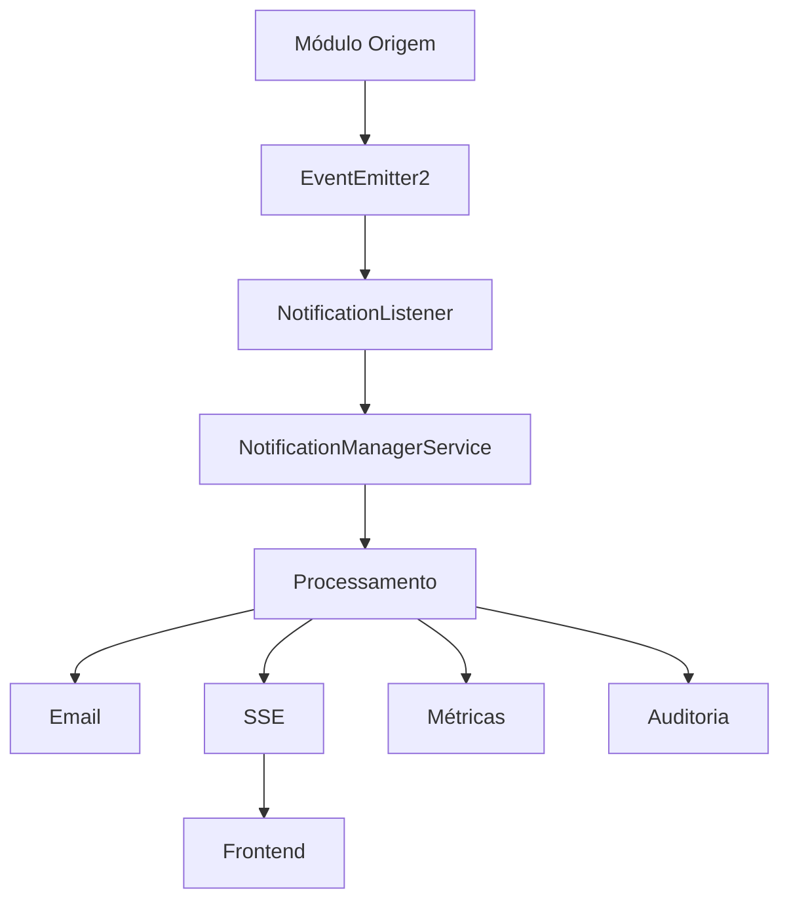

# Módulo de Notificação - Sistema SEMTAS

## 📋 Visão Geral

O Módulo de Notificação é um sistema robusto e escalável para gerenciamento de notificações em tempo real no Sistema SEMTAS. Utiliza Server-Sent Events (SSE) para comunicação bidirecional, oferecendo recursos avançados de resilência, rate limiting e monitoramento.

## 🏗️ Arquitetura

### Componentes Principais

```
📦 notificacao/
├── 🎮 controllers/          # Controladores REST e SSE
├── 🔧 services/             # Lógica de negócio e infraestrutura
├── 🛡️ guards/               # Proteção e autorização
├── 📡 listeners/            # Event listeners para integração
├── 🔌 interceptors/         # Interceptadores para métricas
├── 📊 interfaces/           # Contratos e tipos TypeScript
├── 🎯 events/               # Eventos de domínio
├── 📝 dtos/                 # Data Transfer Objects
└── 🧪 tests/                # Testes unitários e integração
```

### Fluxo de Dados



## 🚀 Recursos Implementados

### ✅ Sistema SSE Avançado
- **Multi-instância**: Suporte completo a ambientes distribuídos com Redis
- **Reconexão automática**: Sistema Last-Event-ID para recuperação de eventos perdidos
- **Heartbeat adaptativo**: Detecção inteligente de conexões mortas
- **Rate limiting**: Proteção contra abuso com sliding window
- **Circuit breakers**: Resilência para falhas de Redis e banco de dados
- **Graceful degradation**: Funcionamento mesmo com falhas parciais
- **Métricas avançadas**: Monitoramento completo de performance
- **Logging estruturado**: Auditoria detalhada de todas as operações

### 🔧 Serviços Core

| Serviço | Responsabilidade |
|---------|------------------|
| `SseService` | Gerenciamento principal de conexões SSE |
| `SseRedisService` | Sincronização entre instâncias |
| `SseEventStoreService` | Armazenamento e replay de eventos |
| `SseHeartbeatService` | Heartbeat adaptativo e detecção de conexões mortas |
| `SseRateLimiterService` | Rate limiting avançado com sliding window |
| `SseCircuitBreakerService` | Circuit breakers para resilência |
| `SseMetricsService` | Coleta e exposição de métricas |
| `SseHealthCheckService` | Health checks automáticos |
| `NotificationManagerService` | Orquestração de notificações |
| `TemplateRendererService` | Renderização de templates |

## 📡 API Endpoints

### SSE (Server-Sent Events)

```typescript
// Conexão SSE principal
GET /notificacao/sse
// Headers: Authorization: Bearer <token>
// Response: text/event-stream
```

### Gestão de Eventos

```typescript
// Replay de eventos perdidos
POST /notificacao/sse/replay
{
  "lastEventId": "event-123",
  "limit": 50
}

// Resposta de heartbeat
POST /notificacao/sse/heartbeat
{
  "connectionId": "conn-456",
  "sequence": 789,
  "timestamp": "2024-12-19T10:30:00Z"
}

// Estatísticas de conexão
GET /notificacao/sse/stats
```

### Rate Limiting

```typescript
// Estatísticas de rate limiting
GET /notificacao/sse/rate-limit/stats

// Reset de rate limit (admin)
POST /notificacao/sse/rate-limit/reset
{
  "userId": "user-123"
}
```

### Health Checks

```typescript
// Status geral do sistema SSE
GET /notificacao/sse/health

// Métricas detalhadas
GET /notificacao/sse/health/metrics
```

## 🔌 Integração com Outros Módulos

### Emitindo Notificações

```typescript
// Em qualquer serviço
import { EventEmitter2 } from '@nestjs/event-emitter';
import { NotificationCreatedEvent } from './events/notification-created.event';

@Injectable()
export class ExemploService {
  constructor(private eventEmitter: EventEmitter2) {}

  async criarSolicitacao(dados: any) {
    // Lógica de negócio...
    
    // Emitir notificação
    this.eventEmitter.emit(
      'notification.created',
      new NotificationCreatedEvent({
        destinatario_id: dados.usuarioId,
        tipo: 'INFO',
        titulo: 'Solicitação Criada',
        conteudo: 'Sua solicitação foi criada com sucesso',
        entidade_relacionada_id: solicitacao.id,
        entidade_tipo: 'solicitacao',
        link: `/solicitacoes/${solicitacao.id}`,
        priority: 'medium'
      })
    );
  }
}
```

### Criando Listeners Customizados

```typescript
// listeners/custom-notification.listener.ts
import { OnEvent } from '@nestjs/event-emitter';
import { Injectable } from '@nestjs/common';
import { NotificationCreatedEvent } from '../events/notification-created.event';

@Injectable()
export class CustomNotificationListener {
  @OnEvent('notification.created')
  async handleNotificationCreated(event: NotificationCreatedEvent) {
    // Lógica customizada
    console.log('Notificação criada:', event.payload);
    
    // Integração com sistema externo
    await this.enviarParaSistemaExterno(event.payload);
  }

  @OnEvent('notification.read')
  async handleNotificationRead(event: NotificationReadEvent) {
    // Atualizar métricas de engajamento
    await this.atualizarMetricas(event.payload);
  }
}
```

### Registrando o Listener

```typescript
// No módulo que usa notificações
@Module({
  imports: [NotificacaoModule],
  providers: [CustomNotificationListener],
})
export class MeuModulo {}
```

## 🛡️ Segurança e Rate Limiting

### Configuração de Rate Limiting

```typescript
// Perfis de rate limiting
const rateLimitProfiles = {
  default: {
    windowMs: 60000,      // 1 minuto
    maxRequests: 100,     // 100 conexões por minuto
    skipSuccessfulRequests: false
  },
  premium: {
    windowMs: 60000,
    maxRequests: 500,     // Usuários premium têm mais limite
    skipSuccessfulRequests: false
  },
  admin: {
    windowMs: 60000,
    maxRequests: 1000,    // Admins têm limite maior
    skipSuccessfulRequests: true
  }
};
```

### Guards de Proteção

```typescript
// Usando guards em endpoints
@UseGuards(JwtAuthGuard, SseRateLimitGuard, SseGuard)
@SseRateLimit({ profile: 'default' })
@Sse('')
async sseNotifications(@Request() req) {
  return this.sseService.createConnection(req.user.id, req);
}
```

## 📊 Monitoramento e Métricas

### Métricas Disponíveis

- **Conexões ativas**: Número de conexões SSE ativas por usuário/instância
- **Taxa de eventos**: Eventos enviados por segundo
- **Latência**: Tempo de resposta dos heartbeats
- **Rate limiting**: Requests bloqueados e permitidos
- **Circuit breakers**: Status e falhas dos circuit breakers
- **Saúde do sistema**: Status de Redis, banco de dados e serviços

### Endpoints de Métricas

```typescript
// Métricas Prometheus
GET /metrics

// Métricas específicas do SSE
GET /notificacao/sse/health/metrics

// Dashboard de saúde
GET /notificacao/sse/health
```

## 🔧 Configuração

### Variáveis de Ambiente

```bash
# Redis (para multi-instância)
REDIS_ENABLED=true
REDIS_HOST=localhost
REDIS_PORT=6379
REDIS_PASSWORD=pgben123

# SSE Configuration
SSE_HEARTBEAT_INTERVAL=30000
SSE_CONNECTION_TIMEOUT=300000
SSE_MAX_CONNECTIONS_PER_USER=5
SSE_EVENT_TTL=3600

# Rate Limiting
SSE_RATE_LIMIT_WINDOW=60000
SSE_RATE_LIMIT_MAX_REQUESTS=100

# Circuit Breakers
SSE_CIRCUIT_BREAKER_FAILURE_THRESHOLD=5
SSE_CIRCUIT_BREAKER_TIMEOUT=60000
```

### Configuração do Módulo

```typescript
// app.module.ts
@Module({
  imports: [
    NotificacaoModule,
    // outros módulos...
  ],
})
export class AppModule {}
```

## 🧪 Testes

### Executando Testes

```bash
# Testes unitários
npm run test src/modules/notificacao

# Testes de integração
npm run test:e2e -- --testNamePattern="SSE"

# Cobertura de testes
npm run test:cov src/modules/notificacao
```

### Exemplo de Teste

```typescript
// sse.service.spec.ts
describe('SseService', () => {
  let service: SseService;
  let redisService: jest.Mocked<SseRedisService>;

  beforeEach(async () => {
    const module = await Test.createTestingModule({
      providers: [
        SseService,
        {
          provide: SseRedisService,
          useValue: createMockRedisService(),
        },
      ],
    }).compile();

    service = module.get<SseService>(SseService);
    redisService = module.get(SseRedisService);
  });

  it('deve criar conexão SSE', async () => {
    const userId = 'user-123';
    const mockRequest = createMockRequest();
    
    const connection = await service.createConnection(userId, mockRequest);
    
    expect(connection).toBeDefined();
    expect(service.isUserConnectedLocally(userId)).toBe(true);
  });
});
```

## 🚀 Deploy e Produção

### Checklist de Deploy

- [ ] Configurar Redis em cluster para alta disponibilidade
- [ ] Configurar load balancer com sticky sessions
- [ ] Configurar monitoramento (Prometheus + Grafana)
- [ ] Configurar alertas para métricas críticas
- [ ] Testar failover de instâncias
- [ ] Validar rate limiting em produção
- [ ] Configurar backup de eventos críticos

### Configuração de Produção

```yaml
# docker-compose.prod.yml
version: '3.8'
services:
  app:
    environment:
      - REDIS_ENABLED=true
      - SSE_MAX_CONNECTIONS_PER_USER=10
      - SSE_RATE_LIMIT_MAX_REQUESTS=500
      - LOG_LEVEL=info
  
  redis:
    image: redis:7-alpine
    command: redis-server --appendonly yes
    volumes:
      - redis_data:/data
```

## 🔍 Troubleshooting

### Problemas Comuns

#### Conexões SSE não funcionam
```bash
# Verificar logs
docker logs pgben-server | grep SSE

# Verificar Redis
redis-cli ping

# Verificar health check
curl http://localhost:3000/notificacao/sse/health
```

#### Rate limiting muito restritivo
```typescript
// Ajustar configuração
SSE_RATE_LIMIT_MAX_REQUESTS=200
SSE_RATE_LIMIT_WINDOW=60000
```

#### Circuit breaker ativado
```bash
# Verificar status
curl http://localhost:3000/notificacao/sse/health/metrics

# Reset manual (se necessário)
curl -X POST http://localhost:3000/notificacao/sse/circuit-breaker/reset
```

## 📚 Documentação Adicional

- [Guia de Integração SSE Frontend](../../docs/integracoes/sse-frontend-integration.md)
- [Configuração de Monitoramento](../../docs/integracoes/sse-monitoring.md)
- [Implementação de Heartbeat](../../docs/integracoes/sse-heartbeat-frontend-implementation.md)
- [Plano de Melhorias SSE](../../docs/ADRs/plano-acao-melhorias-sse-notificacao.md)

## 🤝 Contribuição

### Adicionando Novos Recursos

1. Criar feature branch: `git checkout -b feature/nova-funcionalidade`
2. Implementar com testes
3. Atualizar documentação
4. Criar pull request

### Padrões de Código

- Seguir convenções TypeScript/NestJS
- Adicionar testes para novos recursos
- Documentar APIs com Swagger
- Usar logging estruturado
- Implementar tratamento de erros

---

**Versão**: 2.0  
**Última Atualização**: 2024-12-19  
**Responsável**: Equipe Backend SEMTAS