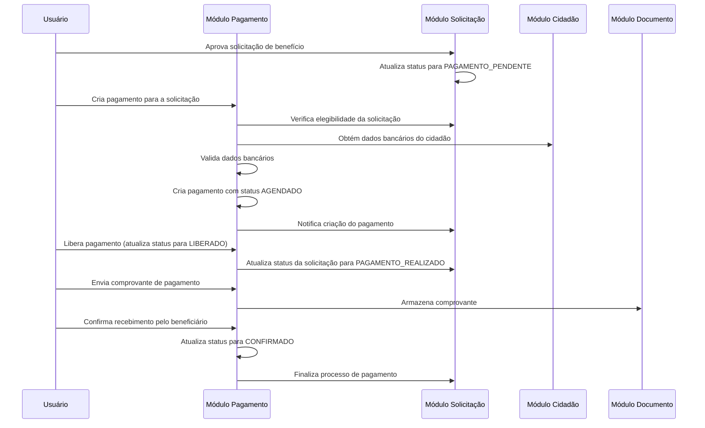
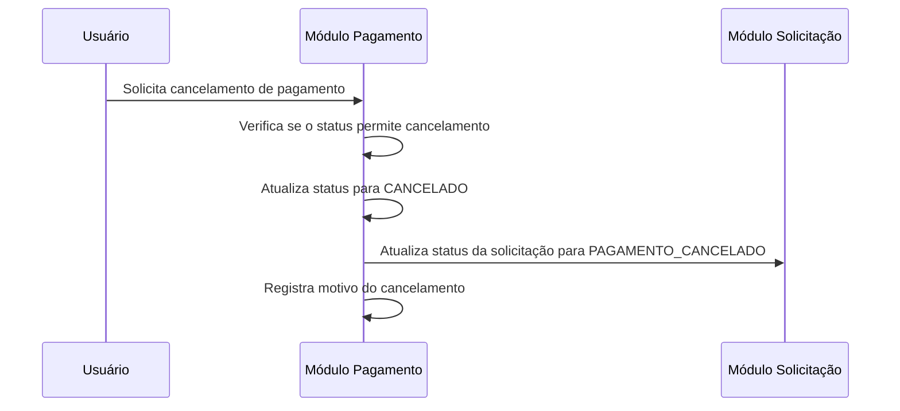

# Guia de Uso do Módulo de Pagamento

## Introdução

O Módulo de Pagamento/Liberação é responsável pela etapa final do fluxo de concessão de benefícios no sistema PGBen, controlando a liberação efetiva dos recursos para os beneficiários. Este guia descreve os principais fluxos de uso e operações disponíveis.

## Fluxos Principais

### 1. Fluxo de Pagamento Completo



### 2. Fluxo de Cancelamento de Pagamento



## Operações Disponíveis

### Pagamentos

1. **Criar Pagamento**
   - Endpoint: `POST /pagamentos/solicitacao/{solicitacaoId}`
   - Descrição: Cria um novo pagamento associado a uma solicitação aprovada.
   - Pré-condições: Solicitação deve estar com status `PAGAMENTO_PENDENTE`.

2. **Listar Pagamentos**
   - Endpoint: `GET /pagamentos`
   - Descrição: Lista pagamentos com suporte a filtros e paginação.
   - Filtros disponíveis: status, método de pagamento, solicitação, unidade, cidadão, período.

3. **Obter Detalhes do Pagamento**
   - Endpoint: `GET /pagamentos/{id}`
   - Descrição: Retorna os detalhes completos de um pagamento específico.

4. **Atualizar Status do Pagamento**
   - Endpoint: `PATCH /pagamentos/{id}/status`
   - Descrição: Atualiza o status de um pagamento seguindo as regras de transição.
   - Transições permitidas:
     - `AGENDADO` → `LIBERADO` ou `CANCELADO`
     - `LIBERADO` → `CONFIRMADO` ou `CANCELADO`

5. **Cancelar Pagamento**
   - Endpoint: `POST /pagamentos/{id}/cancelar`
   - Descrição: Cancela um pagamento, exigindo um motivo para o cancelamento.
   - Pré-condições: Pagamento não pode estar nos status `CONFIRMADO` ou `CANCELADO`.

6. **Listar Pagamentos Pendentes**
   - Endpoint: `GET /pagamentos/pendentes`
   - Descrição: Lista pagamentos com status `LIBERADO` que ainda não foram confirmados.

### Comprovantes

1. **Enviar Comprovante**
   - Endpoint: `POST /pagamentos/{pagamentoId}/comprovantes`
   - Descrição: Envia um comprovante para um pagamento.
   - Formatos aceitos: PDF, JPG, PNG.
   - Tamanho máximo: 5MB.

2. **Listar Comprovantes**
   - Endpoint: `GET /pagamentos/{pagamentoId}/comprovantes`
   - Descrição: Lista todos os comprovantes associados a um pagamento.

3. **Obter Comprovante**
   - Endpoint: `GET /comprovantes/{id}`
   - Descrição: Retorna os detalhes de um comprovante específico.

4. **Remover Comprovante**
   - Endpoint: `DELETE /comprovantes/{id}`
   - Descrição: Remove um comprovante, exigindo um motivo para a remoção.

### Confirmações de Recebimento

1. **Confirmar Recebimento**
   - Endpoint: `POST /pagamentos/confirmar-recebimento`
   - Descrição: Registra a confirmação de recebimento de um pagamento pelo beneficiário.
   - Pré-condições: Pagamento deve estar com status `LIBERADO`.

2. **Listar Confirmações**
   - Endpoint: `GET /pagamentos/{pagamentoId}/confirmacoes`
   - Descrição: Lista as confirmações de recebimento associadas a um pagamento.

## Regras de Negócio

### Transições de Status

- O status inicial de um pagamento é sempre `AGENDADO`.
- Status finais são `CONFIRMADO` e `CANCELADO`.
- Não é possível retornar de um status final para um status intermediário.
- Não é possível pular etapas (ex: ir diretamente de `AGENDADO` para `CONFIRMADO`).

### Validações

- Dados bancários são validados de acordo com as regras específicas de cada banco.
- Chaves PIX são validadas de acordo com o tipo (CPF, e-mail, telefone, aleatória).
- Solicitações só podem receber pagamentos se estiverem no status `PAGAMENTO_PENDENTE`.
- Pagamentos só podem ser confirmados se estiverem no status `LIBERADO`.

### Segurança

- Todas as operações são auditadas, registrando o usuário responsável e a data/hora.
- Dados sensíveis (CPF, dados bancários) são mascarados nos logs e respostas.
- Políticas de Row-Level Security (RLS) garantem que usuários só acessem pagamentos de suas unidades.

## Exemplos de Uso

### Criação de Pagamento

```json
POST /pagamentos/solicitacao/5f8d3b4e3b4f3b2d3c2e1d2f
{
  "valor": 500.00,
  "dataLiberacao": "2025-05-18T12:00:00.000Z",
  "metodoPagamento": "PIX",
  "infoBancariaId": "5f8d3b4e3b4f3b2d3c2e1d2f",
  "dadosBancarios": {
    "pixTipo": "CPF",
    "pixChave": "123.456.789-09"
  },
  "observacoes": "Pagamento referente ao benefício eventual de auxílio moradia"
}
```

### Atualização de Status

```json
PATCH /pagamentos/5f8d3b4e3b4f3b2d3c2e1d2f/status
{
  "status": "LIBERADO",
  "observacoes": "Pagamento liberado após verificação da documentação"
}
```

### Confirmação de Recebimento

```json
POST /pagamentos/confirmar-recebimento
{
  "pagamentoId": "5f8d3b4e3b4f3b2d3c2e1d2f",
  "dataConfirmacao": "2025-05-20T14:30:00.000Z",
  "metodoConfirmacao": "PRESENCIAL",
  "observacoes": "Beneficiário confirmou recebimento pessoalmente na unidade"
}
```

## Integração com Outros Módulos

O Módulo de Pagamento integra-se com os seguintes módulos:

1. **Módulo de Solicitação**
   - Verifica o status da solicitação antes de criar um pagamento
   - Atualiza o status da solicitação após liberação ou cancelamento do pagamento

2. **Módulo de Cidadão**
   - Obtém dados pessoais e bancários dos beneficiários

3. **Módulo de Documento**
   - Armazena e gerencia os comprovantes de pagamento

4. **Módulo de Auditoria**
   - Registra todas as operações sensíveis para fins de auditoria

## Tratamento de Erros

O módulo utiliza os seguintes códigos de erro HTTP:

- `400 Bad Request`: Dados inválidos ou incompletos
- `401 Unauthorized`: Autenticação necessária
- `403 Forbidden`: Usuário não tem permissão para a operação
- `404 Not Found`: Recurso não encontrado
- `409 Conflict`: Violação de regra de negócio (ex: transição de status inválida)
- `413 Payload Too Large`: Arquivo de comprovante muito grande
- `500 Internal Server Error`: Erro interno do servidor

Cada resposta de erro inclui:
- Código HTTP
- Mensagem descritiva
- Detalhes específicos do erro (quando aplicável)

## Considerações de Segurança

- Todos os endpoints requerem autenticação via JWT
- Dados sensíveis são mascarados nas respostas e logs
- Políticas de RLS garantem isolamento de dados entre unidades
- Todas as operações são auditadas
- Validações rigorosas são aplicadas para prevenir ataques de injeção

## Suporte e Contato

Para dúvidas ou suporte relacionados ao Módulo de Pagamento, entre em contato com a equipe de desenvolvimento do PGBen através do e-mail suporte@pgben.natal.rn.gov.br.
